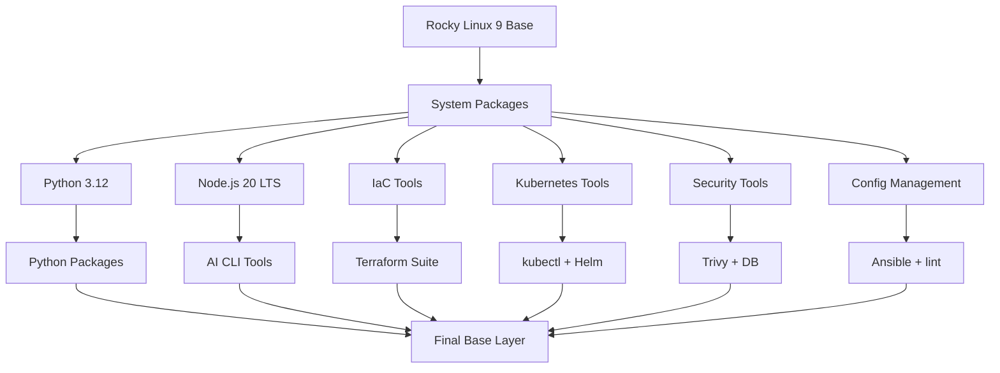
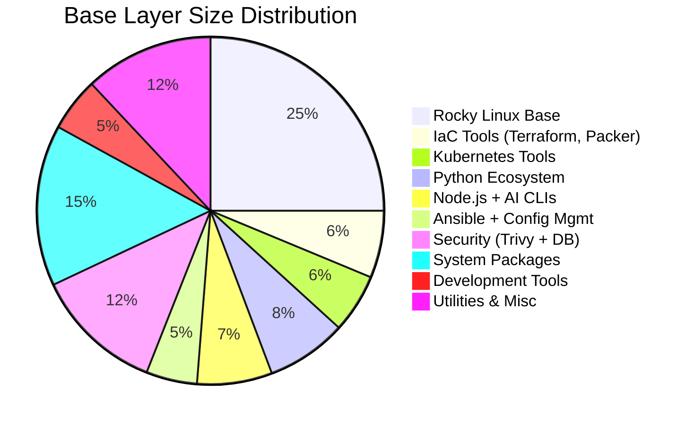

# Base Layer Architecture

The base layer provides a comprehensive DevOps toolkit built on Rocky Linux 9, serving as the foundation for all image variants (all-devops, aws-devops, gcp-devops).

---

## Design Philosophy

### Why Rocky Linux 9?

!!! success "Key Benefits"

    - **Enterprise-grade stability**: RHEL-compatible, production-ready
    - **Long-term support**: 10-year lifecycle (until 2032)
    - **Multi-architecture**: Native amd64 and arm64 support
    - **Package availability**: Rich ecosystem via dnf/yum
    - **Security**: SELinux support, regular security updates

**Alternatives considered**:

| Distro | Why Not Chosen |
|--------|----------------|
| Ubuntu | Shorter LTS cycles, less enterprise focus |
| Alpine | Musl libc compatibility issues with some tools |
| Debian | Older package versions in stable releases |

### Why Zsh as Default Shell?

- **Better UX**: Enhanced tab completion, syntax highlighting
- **Oh-My-Zsh ready**: Easy customisation for users
- **Backwards compatible**: Bash scripts still work
- **Interactive features**: Better history search, glob patterns

---

## Tool Categories

### Infrastructure as Code

| Tool | Version | Purpose | Size Impact |
|------|---------|---------|-------------|
| **Terraform** | Latest | Multi-cloud IaC | ~50 MB |
| **Terragrunt** | Latest | Terraform wrapper for DRY configs | ~20 MB |
| **TFLint** | Latest | Terraform linter | ~15 MB |
| **Packer** | Latest | Image building | ~40 MB |
| **tfswitch** | Latest | Terraform version manager | ~5 MB |

**Why these tools?**

- **Terraform**: Industry-standard IaC for cloud resources
- **Terragrunt**: Essential for managing multi-environment Terraform
- **TFLint**: Catch errors before deployment
- **Packer**: Build consistent machine images across clouds
- **tfswitch**: Support multiple Terraform versions per project

### Kubernetes Ecosystem

| Tool | Version | Purpose | Size Impact |
|------|---------|---------|-------------|
| **kubectl** | Latest | Kubernetes CLI | ~45 MB |
| **Helm** | 3.x | Package manager for Kubernetes | ~15 MB |
| **k9s** | Latest | Terminal UI for Kubernetes | ~30 MB |
| **kustomize** | Latest | Kubernetes configuration management | ~20 MB |

**Why these tools?**

- **kubectl**: Required for any Kubernetes interaction
- **Helm 3**: De facto standard for K8s package management
- **k9s**: Dramatically improves K8s troubleshooting speed
- **kustomize**: Configuration overlays without templating

### Configuration Management

| Tool | Version | Purpose | Size Impact |
|------|---------|---------|-------------|
| **Ansible** | Latest | Agentless automation | ~80 MB |
| **ansible-lint** | Latest | Playbook validation | ~15 MB |

**Why Ansible?**

- **Agentless**: SSH-based, no agents to manage
- **YAML-based**: Easy to read and write
- **Large module library**: Pre-built modules for common tasks
- **Cloud support**: Native AWS, GCP, Azure modules

### Security & Scanning

| Tool | Version | Purpose | Size Impact |
|------|---------|---------|-------------|
| **Trivy** | Latest | Vulnerability scanner | ~40 MB |
| **trivy-db** | Auto-updated | Vulnerability database | ~200 MB |

**Why Trivy?**

- **Multi-target**: Scans containers, filesystems, IaC configs
- **Fast**: Parallel scanning, efficient database
- **Comprehensive**: CVEs, misconfigurations, secrets
- **CI/CD friendly**: Exit codes, JSON output

### Development Tools

=== "Python Ecosystem"

    | Tool | Version | Purpose | Size Impact |
    |------|---------|---------|-------------|
    | **Python** | 3.12 | Scripting, automation | ~100 MB |
    | **pip** | Latest | Package manager | Included |
    | **pipx** | Latest | Isolated CLI tools | ~10 MB |

    **Pre-installed Python packages**:
    - `requests` - HTTP library
    - `pyyaml` - YAML parsing
    - `jinja2` - Templating

=== "Node.js Ecosystem"

    | Tool | Version | Purpose | Size Impact |
    |------|---------|---------|-------------|
    | **Node.js** | 20 LTS | JavaScript runtime | ~40 MB |
    | **npm** | Latest | Package manager | Included |
    | **npx** | Latest | Package runner | Included |

    **Why Node.js 20 LTS?**
    - Long-term support until 2026-04-30
    - Required for AI CLI tools (claude, codex, copilot)
    - Modern JavaScript features

=== "AI CLI Tools"

    | Tool | Provider | Purpose | Size Impact |
    |------|----------|---------|-------------|
    | **claude** | Anthropic | Code review, generation | ~25 MB |
    | **codex** | OpenAI | Code completion | ~20 MB |
    | **copilot** | GitHub | IDE integration | ~30 MB |
    | **gemini** | Google | Multi-modal AI | ~25 MB |

    **Total AI tooling**: ~100 MB (Node.js + CLIs)

### Version Control & CI/CD

| Tool | Version | Purpose | Size Impact |
|------|---------|---------|-------------|
| **Git** | Latest | Version control | ~30 MB |
| **gh** | Latest | GitHub CLI | ~20 MB |

**Why gh CLI?**

- **GitHub integration**: Issues, PRs, workflows from terminal
- **Authentication**: Manage tokens and SSH keys
- **CI/CD**: Trigger workflows, check status

### Utilities

| Tool | Version | Purpose | Size Impact |
|------|---------|---------|-------------|
| **jq** | Latest | JSON processor | ~2 MB |
| **yq** | Latest | YAML processor | ~5 MB |
| **Task** | Latest | Task runner (Makefile alternative) | ~10 MB |
| **vim** | Latest | Text editor | ~5 MB |
| **curl** | Latest | HTTP client | ~1 MB |
| **wget** | Latest | File downloader | ~1 MB |
| **unzip** | Latest | Archive extraction | ~1 MB |
| **tar** | Latest | Archive management | Included |
| **openssh-client** | Latest | SSH operations | ~10 MB |

---

## Installation Order

The tools are installed in a specific order to optimise Docker layer caching and minimise rebuild times:



### Layer Strategy

1. **System packages first**: Rarely change, heavily cached
2. **Runtime environments**: Python, Node.js (change quarterly)
3. **Core tools**: Terraform, kubectl, etc. (change monthly)
4. **Language packages**: pip/npm packages (change weekly)
5. **Final configuration**: User setup, entrypoint

**Benefits**:
- Faster rebuilds (cached layers reused)
- Smaller layer deltas (only changed tools rebuild)
- Predictable build times

---

## Size Breakdown

Total base layer size: **~2.0 GB**



### Optimisation Techniques

!!! tip "How We Keep Size Down"

    1. **Multi-stage builds**: Compile tools in builder stage, copy binaries
    2. **No build artifacts**: Remove compilers, headers after builds
    3. **Minimal dependencies**: Only install required packages
    4. **Single-layer cleanup**: Combine install + cleanup in one RUN command
    5. **Trivy DB sharing**: Reuse database across all variants

---

## Package Installation Details

### System Packages (dnf/yum)

**Categories installed**:

- **Core utilities**: `coreutils`, `findutils`, `grep`, `sed`, `awk`
- **Network tools**: `curl`, `wget`, `net-tools`, `bind-utils`
- **Archive tools**: `tar`, `gzip`, `bzip2`, `xz`, `unzip`
- **Development**: `gcc`, `g++`, `make`, `pkg-config` (build-time only)
- **Python deps**: `python3-devel`, `python3-pip`
- **SSL/TLS**: `ca-certificates`, `openssl`

**Cleanup strategy**:
```bash
dnf install -y <packages> && \
dnf clean all && \
rm -rf /var/cache/dnf/*
```

### Binary Downloads

Many tools are downloaded as pre-compiled binaries for efficiency:

| Tool | Source | Method |
|------|--------|--------|
| Terraform | releases.hashicorp.com | Direct binary download |
| kubectl | dl.k8s.io | Direct binary download |
| Helm | get.helm.sh | Install script |
| Trivy | GitHub releases | Binary download |
| k9s | GitHub releases | Binary download |
| gh | GitHub releases | Binary download |

**Benefits**:
- No compilation time
- Smaller final image (no build tools)
- Reproducible builds

---

## Configuration Files

### Shell Configuration

**`/root/.zshrc`**:
- Oh-My-Zsh framework
- Plugins: git, docker, terraform, kubectl
- Custom aliases for common operations
- Auto-completion enabled

### Tool Defaults

**Terraform**:
- Plugin cache enabled: `~/.terraform.d/plugin-cache`
- Provider mirror configured for faster downloads

**kubectl**:
- Context switching aliases: `kx`, `kn`
- Default namespace support

**Ansible**:
- Host key checking disabled (for automation)
- Coloured output enabled

---

## Entrypoint & CMD

### Default Entrypoint

```dockerfile
ENTRYPOINT ["/bin/zsh"]
CMD ["-l"]
```

**Why `-l` (login shell)?**
- Sources `/root/.zshrc` automatically
- Loads Oh-My-Zsh configuration
- Activates custom aliases and completions

### Override Examples

```bash
# Custom command
docker run --rm <image> terraform version

# Interactive bash instead of zsh
docker run -it --rm <image> /bin/bash

# Run script
docker run --rm <image> sh -c "terraform init && terraform plan"
```

---

## Environment Variables

### Built-in Variables

| Variable | Value | Purpose |
|----------|-------|---------|
| `PATH` | Includes all tool binaries | Ensure tools are executable |
| `TERM` | `xterm-256color` | Colour support in terminal |
| `LANG` | `en_US.UTF-8` | UTF-8 encoding |
| `TF_PLUGIN_CACHE_DIR` | `~/.terraform.d/plugin-cache` | Speed up Terraform |

### User-Configurable Variables

Users can set these at runtime:

- Cloud credentials (see [Authentication](../use-images/authentication.md))
- Tool-specific settings
- CI/CD environment variables

---

## Multi-Architecture Support

The base layer is built for both architectures:

| Architecture | Support Level | Notes |
|--------------|---------------|-------|
| **linux/amd64** | Full | x86_64, most common |
| **linux/arm64** | Full | Apple Silicon, AWS Graviton |

**Build strategy**:
- Docker Buildx with QEMU emulation
- Native builds on each architecture (faster)
- Manifest list for auto-selection

**Tool compatibility**:
- All tools have arm64 binaries
- No emulation needed at runtime
- Performance equivalent to native

---

## Security Hardening

!!! warning "Security Measures"

    1. **No root password**: Root account locked by default
    2. **Minimal attack surface**: Only required packages installed
    3. **Updated regularly**: Base image rebuilt weekly
    4. **Trivy scanning**: Self-scan during build process
    5. **No secrets**: No API keys or credentials baked in

### Recommended Practices

- Run as non-root user in production (use `--user` flag)
- Mount secrets as files, not environment variables
- Use read-only filesystem where possible
- Scan images before deployment

---

## Version Pinning Strategy

### Pinned Versions

**Rocky Linux**: Pinned to `9.x` (major version)
- Receives security updates
- No breaking changes within major version

**Node.js**: Pinned to `20.x` LTS
- LTS until 2026-04-30
- Stable, production-ready

### Latest Versions

Most tools use `latest` to ensure users get:
- Security fixes
- Bug fixes
- New features

**Trade-off**:
- ✅ Always up-to-date security
- ❌ Potential breaking changes (mitigated by semantic versioning)

### Version Lock Recommendations

For CI/CD, use specific image tags:
```bash
# Not recommended for production
ghcr.io/jinalshah/devops/images/all-devops:latest

# Recommended for production
ghcr.io/jinalshah/devops/images/all-devops:1.0.abc1234
```

---

## Next Steps

- [Cloud Layers](cloud-layers.md) - AWS and GCP additions
- [Image Comparison](comparison.md) - Tool matrix across variants
- [Building Images](../build-images/index.md) - Customise your own
