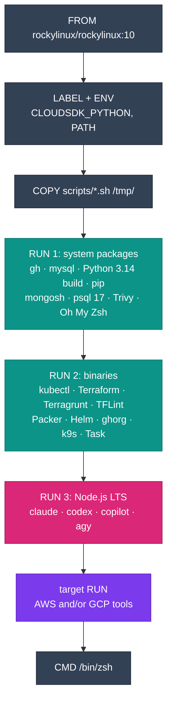

# Base Layer

The `base` stage is the foundation of every image. It is **not published** to any registry, but you can build it yourself:

```bash
docker build --target base -t devops-base:local .
```

It starts from `rockylinux/rockylinux:10`, runs as `root` (`HOME=/root`) and adds the whole shared toolkit.

---

## Dockerfile layer order


```mermaid
flowchart TB
  F["FROM rockylinux/rockylinux:10"] --> E["LABEL + ENV<br/>CLOUDSDK_PYTHON, PATH"]
  E --> C["COPY scripts/*.sh /tmp/"]
  C --> R1["RUN 1: system packages<br/>gh · mysql · Python 3.14 build · pip<br/>mongosh · psql 17 · Trivy · Oh My Zsh"]
  R1 --> R2["RUN 2: binaries<br/>kubectl · Terraform · Terragrunt · TFLint<br/>Packer · Helm · ghorg · k9s · Task"]
  R2 --> R3["RUN 3: Node.js LTS<br/>claude · codex · copilot · agy"]
  R3 --> T["target RUN<br/>AWS and/or GCP tools"]
  T --> CMD["CMD /bin/zsh"]

  classDef neutral fill:#334155,stroke:#1e293b,color:#fff
  classDef base fill:#0d9488,stroke:#0f766e,color:#fff
  classDef ai fill:#db2777,stroke:#9d174d,color:#fff
  classDef all fill:#7c3aed,stroke:#5b21b6,color:#fff
  class F,E,C,CMD neutral
  class R1,R2 base
  class R3 ai
  class T all
```

Each `RUN` ends by cleaning `/tmp`, `/var/tmp` and the pip cache (plus the yum cache, `__pycache__` directories or the npm cache, depending on the step), so the clean-up happens in the same layer as the install.

!!! info "Why `COPY` comes first"
    The helper scripts (`00-detect-arch.sh`, `10-zshrc.sh`, `20-bashrc.sh`) are copied before anything is installed, and the `scripts/*.sh` glob also picks up `update_tool_versions.sh`. Changing any `.sh` file in `scripts/` therefore invalidates the whole base and rebuilds everything.

---

## RUN 1: system packages and Python

=== ":lucide-package: yum packages"

    Installed from the Rocky and EPEL repositories, followed by a full `yum update`:

    `bash`, `bash-completion`, `bind-utils` (dig, nslookup, host), `bubblewrap`, `curl`, `findutils`, `fish`, `git`, `iputils`, `jq`, `less`, `lftp`, `make`, `nmap`, `nmap-ncat` (ncat), `openssh-clients`, `openssl`, `python3-pip`, `sqlite-devel`, `telnet`, `tree`, `vim`, `wget`, `unzip`, `zip`, `zsh`.

    Build dependencies for Python stay installed: `gcc`, `make`, `openssl-devel`, `bzip2-devel`, `libffi-devel`, `zlib-devel`. That is handy when a pip package needs to compile.

=== ":lucide-database: Extra repositories"

    | Repository | Provides |
    |------------|----------|
    | EPEL | `fish` and other extras |
    | GitHub CLI (`gh-cli.repo`) | `gh` |
    | MySQL Community 8.4 | `mysql` client |
    | MongoDB 8.0 | `mongodb-mongosh` |
    | PGDG (EL-10) | `postgresql17` (`psql`) |
    | Aqua Security | `trivy` |

    RHEL 10 dropped the `mysql` packages in favour of MariaDB, so the client comes from MySQL's own repository. The key inside the release RPM has expired, so the build imports `RPM-GPG-KEY-mysql-2025` explicitly. Both URLs are build args (`MYSQL_RELEASE_RPM_URL`, `MYSQL_GPG_KEY_URL`).

=== ":simple-python: Python 3.14"

    Python is compiled from source (`PYTHON_VERSION`, with `--enable-optimizations`) and registered with `alternatives` as `/usr/local/bin/python3`, which comes before `/usr/bin` on `PATH`.

    The distribution's `/usr/bin/python3` is left alone on purpose: on Rocky 10, `dnf` uses an unversioned `#!/usr/bin/python3` shebang and only works with the system interpreter. Switch back with `alternatives --config python3`.

    pip packages: `ansible`, `ansible-lint` (with `yamllint`), `jmespath`, `mkdocs-material`, `paramiko`, `pre-commit`, `zensical`.

    !!! warning "Overriding the version"
        You must pass **both** build args, e.g. `--build-arg PYTHON_VERSION=3.13.7 --build-arg PYTHON_VERSION_TO_USE=python3.13`. A short version such as `3.11` breaks the build.

=== ":simple-trivy: Trivy"

    Installed from Aqua's yum repository. **No vulnerability database is baked in**; Trivy downloads it on the first scan. Mount a cache volume (for example `-v trivy-cache:/root/.cache/trivy`) to avoid downloading it every time.

=== ":simple-zsh: Shell setup"

    - Oh My Zsh with the `candy` theme and its default plugins. The prompt looks like `root@<host> [HH:MM:SS] [/srv]` then `-> #` (`#` because you are root).
    - `scripts/10-zshrc.sh` and `scripts/20-bashrc.sh` add the same aliases to zsh and bash, plus `kubectl` and `aws` completion.

    | Alias | Expands to |
    |-------|------------|
    | `l`, `la`, `ll` | `ls -CF`, `ls -A`, `ls -alF` |
    | `tf`, `tfi`, `tfp`, `tfa`, `tfd` | `terraform`, `init`, `plan`, `apply`, `destroy` |
    | `tff`, `tfv`, `tfo` | `terraform fmt -recursive`, `validate`, `output` |
    | `k`, `ka`, `kd`, `kg`, `kl`, `kr` | `kubectl`, `apply`, `describe`, `get`, `logs`, `run` |
    | `aws-ssm <id>` | `aws ssm start-session --target <id>` |

---

## RUN 2: downloaded binaries

`00-detect-arch.sh` maps `uname -m` to each vendor's naming (`amd64`/`arm64`, `x86_64`, `arm`, `64bit`), so the same Dockerfile works on both architectures.

| Tool | Source | Version |
|------|--------|---------|
| kubectl | `stable.txt` from the legacy `storage.googleapis.com/kubernetes-release` bucket | Whatever that file names; the bucket stopped updating at v1.31.0 (current releases are on `dl.k8s.io`) |
| Terraform | `tfswitch --latest` (tfswitch stays in the image) | Latest at build time |
| Terragrunt | GitHub releases | Pinned per build, bumped automatically |
| TFLint | GitHub releases | Pinned per build, bumped automatically |
| Packer | `releases.hashicorp.com` | Pinned per build, bumped automatically |
| Helm 3 | `get-helm-3` script | Latest Helm 3 release at build time (not Helm 4) |
| ghorg | GitHub releases (plus a sample `~/.config/ghorg/conf.yaml`) | Pinned per build, bumped automatically |
| k9s | GitHub releases (RPM) | Pinned per build, bumped automatically |
| Task (go-task) | `taskfile.dev` install script | Latest at build time |

"Pinned per build, bumped automatically" means a Dockerfile `ARG` default that CI overrides with a repository variable. A daily workflow updates those variables to the newest releases; see [Cloud layers](cloud-layers.md#how-ci-builds-the-images).

The layer finishes by printing versions (`terraform version`, `kubectl version --client`, `trivy --version`, …), so a broken download fails the build.

---

## RUN 3: Node.js and AI agents

| Tool | How it is installed |
|------|---------------------|
| :simple-nodedotjs: Node.js LTS, npm, npx | NodeSource `setup_lts.x` (current LTS, not pinned) |
| :simple-claude: Claude Code (`claude`) | Native installer from `claude.ai/install.sh` |
| :lucide-bot: OpenAI Codex CLI (`codex`) | `npm install -g @openai/codex` |
| :simple-githubcopilot: GitHub Copilot CLI (`copilot`) | `npm install -g @github/copilot` |
| :simple-googlegemini: Google Antigravity CLI (`agy`) | Google's installer, into `/usr/local/bin` |

None of them are authenticated in the image. See [AI CLI setup](../tool-basics/ai-cli-setup.md).

---

## Environment and defaults

| Setting | Value |
|---------|-------|
| `CMD` | `["/bin/zsh"]` (no `ENTRYPOINT`) |
| User / home | `root` / `/root` |
| `ENV CLOUDSDK_PYTHON` | `python3` |
| `ENV PATH` | `/usr/lib/google-cloud-sdk/bin:/root/.local/bin:$PATH` |

That is the complete list of `ENV` settings. Anything else (cloud regions, credentials, pagers) is up to you at runtime.

```bash
# Run one command instead of the shell
docker run --rm ghcr.io/jinalshah/devops/images/all-devops:latest terraform version

# Use bash instead of zsh
docker run -it --rm ghcr.io/jinalshah/devops/images/all-devops:latest bash
```

---

## Not included

Install these yourself if you need them: kustomize (but `kubectl kustomize` and `kubectl apply -k` work), yq, pipx, the Docker CLI or daemon, redis-cli, terraform-docs, Go and Java.

---

## Next steps

- [Cloud layers](cloud-layers.md): what AWS and GCP add, and how CI builds everything
- [Image comparison](comparison.md): tool matrix across variants
- [Customisation](../build-images/customization.md): build your own variant
