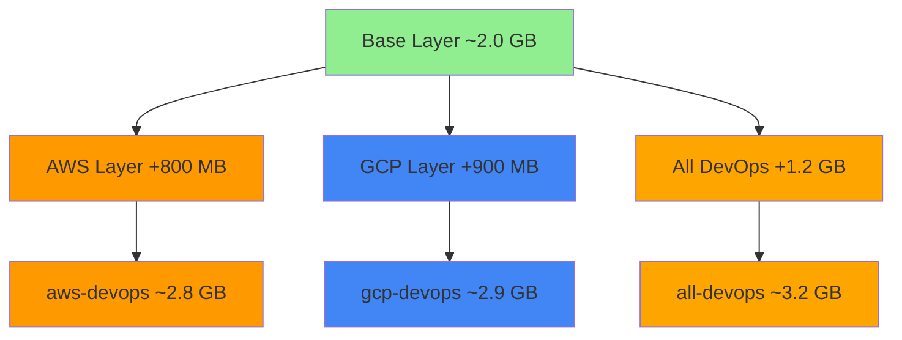
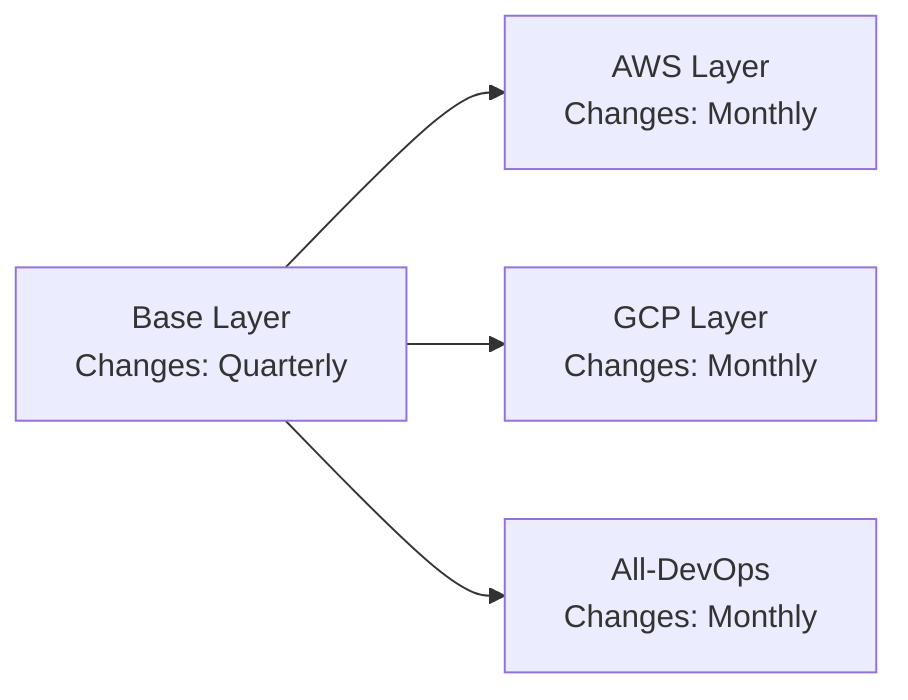
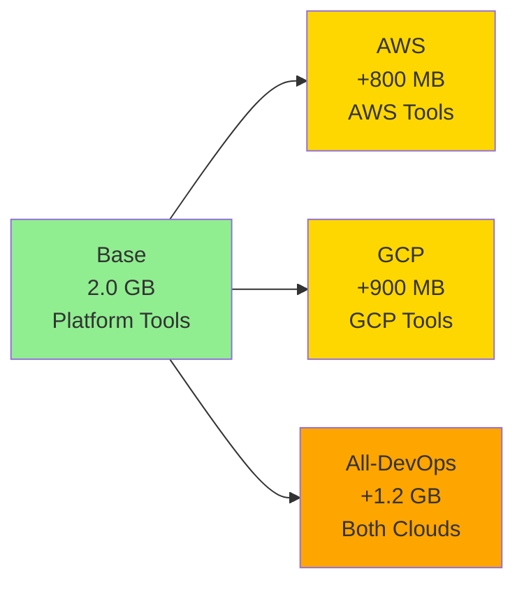

# Cloud Layers Architecture

The cloud-specific layers extend the base image with AWS and/or GCP tools, creating specialized variants optimised for single-cloud or multi-cloud workflows.

---

## Layer Strategy



### Design Rationale

!!! success "Why Separate Layers?"

    - **Smaller images**: AWS-only teams don't need GCP tools (save 400 MB)
    - **Faster pulls**: Less data to download in CI/CD pipelines
    - **Cleaner dependencies**: No cross-cloud conflicts
    - **Better caching**: Cloud-specific layers cached independently

---

## AWS Layer

### Tools Added

| Tool | Version | Purpose | Size Impact |
|------|---------|---------|-------------|
| **AWS CLI v2** | Latest | Core AWS operations | ~180 MB |
| **AWS Session Manager** | Latest | EC2 instance access | ~20 MB |
| **boto3** | Latest | Python AWS SDK | ~50 MB |
| **cfn-lint** | Latest | CloudFormation validation | ~30 MB |
| **s3cmd** | Latest | Advanced S3 operations | ~10 MB |
| **crcmod** | Latest | CRC32c for uploads | ~5 MB |

**Total AWS layer**: ~800 MB

### Detailed Breakdown

=== "AWS CLI v2"

    **Installation method**: Binary download from official AWS source

    ```bash
    curl "https://awscli.amazonaws.com/awscli-exe-linux-x86_64.zip" -o "awscliv2.zip"
    unzip awscliv2.zip
    ./aws/install --bin-dir /usr/local/bin --install-dir /usr/local/aws-cli
    ```

    **Size**: ~180 MB (includes Python runtime, bundled dependencies)

    **Why CLI v2?**
    - ✅ Standalone binary (no system Python conflicts)
    - ✅ Faster performance
    - ✅ Better error messages
    - ✅ Auto-completion built-in
    - ✅ Official AWS support

    **Includes**:
    - All AWS services (200+ service commands)
    - SSO support
    - S3 transfer acceleration
    - CloudFormation stack management

=== "AWS Session Manager Plugin"

    **Installation method**: RPM package

    ```bash
    dnf install -y \
      https://s3.amazonaws.com/session-manager-downloads/plugin/latest/linux_64bit/session-manager-plugin.rpm
    ```

    **Size**: ~20 MB

    **Why include this?**
    - ✅ SSH-like access to EC2 instances without SSH keys
    - ✅ Audit logging to CloudWatch
    - ✅ No need for bastion hosts
    - ✅ Port forwarding support
    - ✅ Session recording

    **Common use cases**:
    ```bash
    # Connect to EC2 instance
    aws ssm start-session --target i-1234567890abcdef0

    # Port forwarding
    aws ssm start-session --target i-1234567890abcdef0 \
      --document-name AWS-StartPortForwardingSession \
      --parameters "portNumber=3306,localPortNumber=3306"
    ```

=== "Python AWS Libraries"

    **Installation method**: pip

    ```bash
    pip3 install --no-cache-dir \
      boto3 \
      cfn-lint \
      s3cmd \
      crcmod
    ```

    **Total size**: ~95 MB

    **boto3** (~50 MB):
    - AWS SDK for Python
    - Programmatic access to all AWS services
    - Widely used in automation scripts

    **cfn-lint** (~30 MB):
    - CloudFormation template validation
    - Catches errors before deployment
    - CI/CD integration ready

    **s3cmd** (~10 MB):
    - Advanced S3 operations
    - Batch operations
    - Better performance for large transfers

    **crcmod** (~5 MB):
    - CRC32c checksums
    - Data integrity verification
    - Required for reliable S3 uploads

### AWS-Specific Configurations

**Environment variables set**:
```bash
AWS_DEFAULT_REGION=us-east-1  # Default region
AWS_PAGER=""                  # Disable pager for automation
```

**Configuration files**:
- AWS CLI config location: `~/.aws/config`
- Credentials location: `~/.aws/credentials`
- Session Manager plugin: Auto-configured

---

## GCP Layer

### Tools Added

| Tool | Version | Purpose | Size Impact |
|------|---------|---------|-------------|
| **Google Cloud SDK** | Latest | Core GCP operations | ~700 MB |
| - `gcloud` | Included | CLI for all GCP services | - |
| - `gsutil` | Included | Cloud Storage operations | - |
| - `bq` | Included | BigQuery CLI | - |
| **docker-credential-gcr** | Latest | GCR authentication | ~10 MB |

**Total GCP layer**: ~900 MB

### Detailed Breakdown

=== "Google Cloud SDK"

    **Installation method**: Official install script

    ```bash
    curl https://sdk.cloud.google.com | bash -s -- --disable-prompts \
      --install-dir=/usr/local
    ```

    **Size**: ~700 MB (includes Python runtime, all components)

    **Why so large?**
    - Includes Python 3.11 bundled runtime (~100 MB)
    - All GCP service modules (~400 MB)
    - Authentication components (~50 MB)
    - Beta/Alpha components (~100 MB)
    - Documentation and samples (~50 MB)

    **Components included**:

    | Component | Purpose |
    |-----------|---------|
    | `gcloud` | Core SDK, all GCP services |
    | `gsutil` | Cloud Storage (S3-like operations) |
    | `bq` | BigQuery data warehouse |
    | `gcloud alpha` | Preview features |
    | `gcloud beta` | Beta features |

    **Why include alpha/beta?**
    - Cutting-edge features for early adopters
    - GKE autopilot, Cloud Run revisions
    - Easily disabled if not needed

=== "docker-credential-gcr"

    **Installation method**: Binary download

    ```bash
    curl -fsSL "https://github.com/GoogleCloudPlatform/docker-credential-gcr/releases/download/v2.1.18/docker-credential-gcr_linux_amd64-2.1.18.tar.gz" | \
      tar xz -C /usr/local/bin
    ```

    **Size**: ~10 MB

    **Why include this?**
    - ✅ Automatic GCR authentication
    - ✅ No manual docker login needed
    - ✅ Uses gcloud credentials
    - ✅ Supports Artifact Registry

    **Configuration**:
    ```bash
    docker-credential-gcr configure-docker --registries=gcr.io,us-docker.pkg.dev
    ```

### GCP-Specific Configurations

**Environment variables set**:
```bash
CLOUDSDK_CORE_DISABLE_PROMPTS=1  # Automation-friendly
CLOUDSDK_PYTHON_SITEPACKAGES=1   # Allow system packages
```

**Configuration files**:
- gcloud config location: `~/.config/gcloud/`
- Credentials: Application Default Credentials (ADC)
- Docker config: `~/.docker/config.json`

### Size Optimisation Attempts

**Why not trim components?**

We considered installing only specific components:
```bash
gcloud components install gcloud gsutil bq --quiet
```

**Issues**:
- Minimal size savings (~50 MB, only 7% reduction)
- Breaks future component installations
- Missing dependencies for some features
- Complexity not worth the trade-off

**Decision**: Include full SDK for maximum compatibility.

---

## All-DevOps Layer (Multi-Cloud)

The `all-devops` image combines both AWS and GCP layers.

### Architecture

```dockerfile
FROM base-layer
# Install AWS layer (~800 MB)
RUN install-aws-tools.sh
# Install GCP layer (~900 MB)
RUN install-gcp-tools.sh
```

### Size Optimisation

**Without optimisation**: 2.0 GB + 800 MB + 900 MB = **3.7 GB**

**With optimisation**: **3.2 GB** (save 500 MB)

**Optimisation techniques**:

1. **Shared dependencies**: Both AWS and GCP use Python
   ```bash
   # Share Python packages
   pip3 install --no-cache-dir boto3 google-cloud-storage
   ```

2. **Single layer cleanup**: Combine installs, clean once
   ```dockerfile
   RUN install-aws && install-gcp && \
       dnf clean all && \
       rm -rf /var/cache/* /tmp/*
   ```

3. **Deduplicated binaries**: Some tools overlap
   - Both use `python3` (don't install twice)
   - Both use `curl`, `unzip` (already in base)

4. **Trivy database reuse**: Single vulnerability DB for all scanning

---

## Comparison Table

| Feature | Base | AWS Layer | GCP Layer | All-DevOps |
|---------|------|-----------|-----------|------------|
| **Size** | 2.0 GB | +800 MB | +900 MB | +1.2 GB |
| **Total** | 2.0 GB | 2.8 GB | 2.9 GB | 3.2 GB |
| **Build Time** | 15 min | +3 min | +4 min | +6 min |
| **AWS CLI** | ❌ | ✅ | ❌ | ✅ |
| **gcloud** | ❌ | ❌ | ✅ | ✅ |
| **boto3** | ❌ | ✅ | ❌ | ✅ |
| **gsutil** | ❌ | ❌ | ✅ | ✅ |
| **Multi-cloud** | ❌ | ❌ | ❌ | ✅ |

---

## Layer Caching Strategy

### Build Order for Maximum Caching



**Benefits**:
- Base layer cached for months (rarely changes)
- Cloud layers rebuild independently
- Parallel builds possible (AWS + GCP simultaneously)
- Faster CI/CD (only changed layers rebuild)

### Example: AWS CLI Update

When AWS CLI updates:

1. **Base layer**: ✅ Cached (unchanged)
2. **AWS layer**: ❌ Rebuilds (~3 minutes)
3. **GCP layer**: ✅ Cached (unchanged)
4. **All-DevOps**: ⚠️ Partial rebuild (AWS portion only)

**Total rebuild time**: ~6 minutes (instead of ~25 minutes full rebuild)

---

## Size vs Features Trade-off



### Decision Framework

!!! question "Which image should I use?"

    **Use base layer if**:
    - No cloud-specific tools needed
    - Building custom image
    - Kubernetes-only workflows

    **Use aws-devops if**:
    - AWS-exclusive environment
    - Want smaller image size
    - CI/CD speed matters

    **Use gcp-devops if**:
    - GCP-exclusive environment
    - GKE-focused workflows
    - Don't need AWS tools

    **Use all-devops if**:
    - Multi-cloud architecture
    - Team uses both AWS and GCP
    - Unified tooling needed

---

## Multi-Architecture Considerations

### Size by Architecture

| Image | amd64 | arm64 | Notes |
|-------|-------|-------|-------|
| **Base** | 2.0 GB | 2.0 GB | Identical |
| **AWS** | 2.8 GB | 2.8 GB | AWS CLI has native arm64 |
| **GCP** | 2.9 GB | 2.9 GB | gcloud SDK has native arm64 |
| **All-DevOps** | 3.2 GB | 3.2 GB | Both have arm64 support |

### Build Time by Architecture

| Architecture | Build Speed | Notes |
|--------------|-------------|-------|
| **amd64** | Baseline | Most common, well-optimised |
| **arm64** | 10-20% slower | Fewer cached layers initially |

**Apple Silicon**: Use arm64 native for best performance

**AWS Graviton**: Use arm64 native (30% faster than emulated amd64)

---

## Security Considerations

### Attack Surface by Layer

| Layer | Added Attack Surface | Mitigation |
|-------|---------------------|------------|
| **Base** | Standard Linux tools | Regular updates, minimal packages |
| **AWS** | AWS CLI, boto3 | Official sources, signed binaries |
| **GCP** | gcloud SDK (large) | Official SDK, regular updates |

### Vulnerability Scanning Results

**Typical Trivy scan** (as of Jan 2025):

| Image | Critical | High | Medium | Low |
|-------|----------|------|--------|-----|
| Base | 0 | 2 | 15 | 45 |
| AWS | 0 | 3 | 18 | 52 |
| GCP | 0 | 4 | 22 | 58 |
| All-DevOps | 0 | 5 | 25 | 65 |

**Note**: Most vulnerabilities are in dependencies, not direct threats.

**Mitigation**:
- Weekly automatic rebuilds
- Security patches applied immediately
- Trivy scans in CI/CD pipeline

---

## Maintenance Strategy

### Update Frequency

| Component | Update Frequency | Trigger |
|-----------|------------------|---------|
| **Rocky Linux base** | Weekly | Security patches |
| **System packages** | Weekly | Security patches |
| **Cloud CLIs** | Monthly | Version releases |
| **Python packages** | Monthly | Version releases |
| **IaC tools** | Weekly | Frequent releases |

### Automated Rebuilds

**GitHub Actions workflow**:
```yaml
schedule:
  - cron: '0 2 * * 1'  # Weekly, Monday 2 AM UTC

jobs:
  build-base:
    # Build base layer
  build-aws:
    needs: build-base
    # Build AWS variant
  build-gcp:
    needs: build-base
    # Build GCP variant
  build-all:
    needs: build-base
    # Build all-devops
```

**Benefits**:
- Always up-to-date
- Security patches applied automatically
- Minimal manual intervention

---

## Next Steps

- [Image Comparison](comparison.md) - Detailed tool matrix
- [Base Layer Details](base-layer.md) - Platform tools breakdown
- [Building Custom Images](../build-images/index.md) - Extend these images
