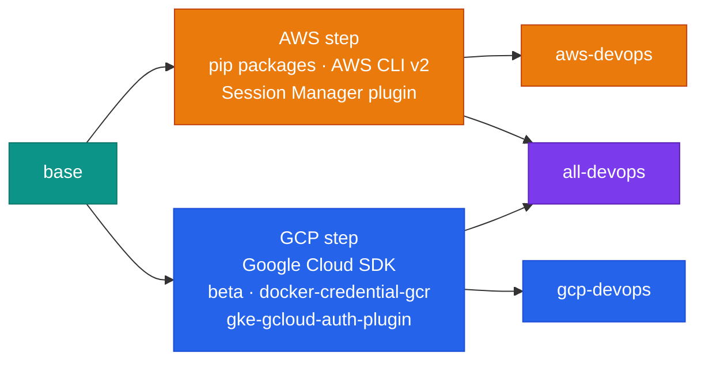
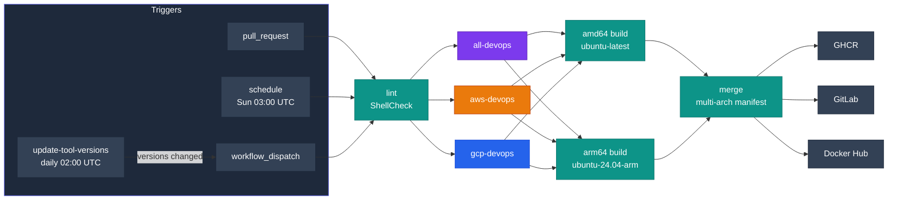

# Cloud Layers

Each published image is the shared [base](base-layer.md) plus **one extra `RUN`** that adds cloud tooling. `all-devops` runs the AWS and GCP steps together in that single layer.


```mermaid
flowchart LR
  B["base"] --> AWS["AWS step<br/>pip packages · AWS CLI v2<br/>Session Manager plugin"]
  B --> GCP["GCP step<br/>Google Cloud SDK<br/>beta · docker-credential-gcr<br/>gke-gcloud-auth-plugin"]
  AWS --> W["aws-devops"]
  GCP --> G["gcp-devops"]
  AWS --> A["all-devops"]
  GCP --> A

  classDef base fill:#0d9488,stroke:#0f766e,color:#fff
  classDef all fill:#7c3aed,stroke:#5b21b6,color:#fff
  classDef aws fill:#ea7a0c,stroke:#c2410c,color:#fff
  classDef gcp fill:#2563eb,stroke:#1d4ed8,color:#fff
  class B base
  class AWS,W aws
  class GCP,G gcp
  class A all
```

Every cloud layer sources `/usr/local/lib/detect-arch.sh` first, so downloads pick the right file for amd64 or arm64.

---

## :fontawesome-brands-aws: AWS layer

In <span class="di-pill di-pill--aws">aws-devops</span> and <span class="di-pill di-pill--all">all-devops</span>.

| Tool | Installed from |
|------|----------------|
| **AWS CLI v2** | Official zip: `awscli-exe-linux-$(uname -m).zip` |
| **Session Manager plugin** | Official RPM for the host arch (`linux_64bit` or `linux_arm64`) |
| **pip packages** | `boto3`, `cfn-lint`, `s3cmd`, `crcmod`, `pytest`, `requests`, `bs4`, `lxml` |

=== "AWS CLI v2"

    The self-contained v2 installer bundles its own Python, so it never clashes with the image's Python 3.14. Tab completion is wired up through `aws_completer` in both zsh and bash.

=== "Session Manager"

    Lets you open shells and port forwards to EC2 instances without SSH keys or bastions:

    ```bash
    aws ssm start-session --target i-1234567890abcdef0

    # or with the built-in alias
    aws-ssm i-1234567890abcdef0
    ```

=== "Python packages"

    - `boto3`: the AWS SDK for Python
    - `cfn-lint`: CloudFormation template linter
    - `s3cmd`: alternative S3 command-line client
    - `crcmod`: fast CRC32c checksums
    - `pytest`, `requests`, `bs4` (Beautiful Soup), `lxml`: testing, HTTP and HTML/XML parsing helpers for scripts

The layer sets **no** AWS environment variables. Choose your own region and profile with `AWS_REGION`, `AWS_PROFILE` or `~/.aws/config` at runtime.

---

## :simple-googlecloud: GCP layer

In <span class="di-pill di-pill--gcp">gcp-devops</span> and <span class="di-pill di-pill--all">all-devops</span>.

```bash
# What the Dockerfile does (simplified)
wget google-cloud-sdk-${GCLOUD_VERSION}-linux-${GCLOUD_ARCH_VALUE}.tar.gz
tar -zxf google-cloud-sdk.tar.gz -C /usr/lib/
/usr/lib/google-cloud-sdk/install.sh --rc-path=/root/.zshrc --command-completion=true --path-update=true --quiet
gcloud components install beta docker-credential-gcr gke-gcloud-auth-plugin --quiet
gcloud config set core/disable_usage_reporting true
```

| Component | What it gives you |
|-----------|-------------------|
| `gcloud` | The core CLI, installed in `/usr/lib/google-cloud-sdk` |
| `gsutil`, `bq` | Cloud Storage and BigQuery CLIs (bundled with the SDK) |
| `beta` | `gcloud beta …` commands |
| `docker-credential-gcr` | Docker credential helper for GCR and Artifact Registry (a gcloud component) |
| `gke-gcloud-auth-plugin` | Required by kubectl for GKE, so `gcloud container clusters get-credentials` just works |

The SDK version is pinned by `GCLOUD_VERSION`, which the daily workflow bumps to the latest release. `gcloud alpha` is **not** installed; add it with `gcloud components install alpha` if you need it.

The only related environment settings are the base image's `CLOUDSDK_PYTHON=python3` and the SDK `bin` directory on `PATH`.

!!! tip "Service-account auth"
    gcloud ignores `GOOGLE_APPLICATION_CREDENTIALS` for its own commands. Use `gcloud auth activate-service-account --key-file=...`. The env var is for client libraries and Terraform. See [Authentication](../use-images/authentication.md).

---

## How CI builds the images


```mermaid
flowchart LR
  subgraph Triggers
    PR["pull_request"]
    S["schedule<br/>Sun 03:00 UTC"]
    M["workflow_dispatch"]
    U["update-tool-versions<br/>daily 02:00 UTC"]
  end
  U -- "versions changed" --> M
  PR & S & M --> L["lint<br/>ShellCheck"]
  L --> JA["all-devops"]
  L --> JW["aws-devops"]
  L --> JG["gcp-devops"]
  JA & JW & JG --> BA["amd64 build<br/>ubuntu-latest"]
  JA & JW & JG --> BR["arm64 build<br/>ubuntu-24.04-arm"]
  BA & BR --> MF["merge<br/>multi-arch manifest"]
  MF --> GH["GHCR"]
  MF --> GL["GitLab"]
  MF --> DH["Docker Hub"]

  classDef neutral fill:#334155,stroke:#1e293b,color:#fff
  classDef base fill:#0d9488,stroke:#0f766e,color:#fff
  classDef all fill:#7c3aed,stroke:#5b21b6,color:#fff
  classDef aws fill:#ea7a0c,stroke:#c2410c,color:#fff
  classDef gcp fill:#2563eb,stroke:#1d4ed8,color:#fff
  class PR,S,M,U,GH,GL,DH neutral
  class L,BA,BR,MF base
  class JA all
  class JW aws
  class JG gcp
  style Triggers fill:#1e293b,stroke:#6366f1,color:#fff
```

1. **Triggers**: `image-builder.yml` runs on pull requests, manual dispatch and every Sunday at 03:00 UTC. Separately, `update-tool-versions.yml` runs daily at 02:00 UTC, bumps the version repo variables (gcloud, Packer, Terragrunt, TFLint, ghorg, k9s, Python) and dispatches `image-builder.yml` if anything changed.
2. **Lint**: ShellCheck on `scripts/*.sh`.
3. **Three image jobs** run in parallel, each calling the reusable `build-image.yml` with its target.
4. **Native builds**: a matrix builds amd64 on `ubuntu-latest` and arm64 on `ubuntu-24.04-arm` at the same time. No QEMU. Each pushes `1.0.<sha>-amd64` / `-arm64` to all three registries, with a GitHub Actions layer cache per target and architecture.
5. **Merge**: `docker buildx imagetools create` joins them into the multi-arch `1.0.<sha>` tag (plus `latest` on `main`) in each registry.

!!! info "Tags are refreshed"
    `1.0.<sha>` is a per-commit tag, stable for a given commit but refreshed by scheduled rebuilds. For true reproducibility pin by digest (`image@sha256:...`), which you can get with `docker buildx imagetools inspect <ref>`.

---

## Next steps

- [Image comparison](comparison.md): the full tool matrix and sizes
- [Base layer](base-layer.md): everything shared by all images
- [Multi-platform builds](../build-images/multi-platform-images.md): build both architectures yourself
