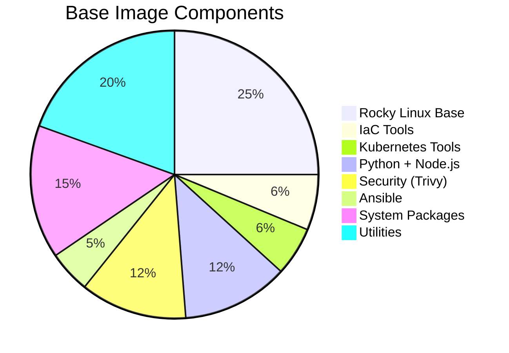
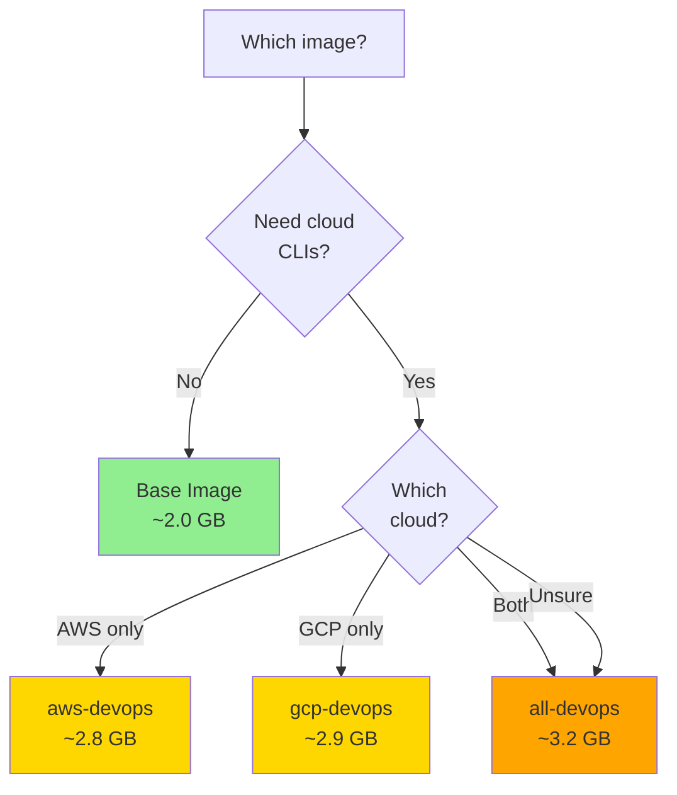

# Image Comparison Matrix

Complete comparison of all image variants with detailed tool versions, sizes, and use case recommendations.

---

## Quick Comparison

| Spec | Base | aws-devops | gcp-devops | all-devops |
|------|------|------------|------------|------------|
| **Size** | ~2.0 GB | ~2.8 GB (+800 MB) | ~2.9 GB (+900 MB) | ~3.2 GB (+1.2 GB) |
| **Build Time** | 15 min | 18 min | 19 min | 21 min |
| **Platform Tools** | ✅ Full | ✅ Full | ✅ Full | ✅ Full |
| **AWS Tools** | ❌ None | ✅ Full | ❌ None | ✅ Full |
| **GCP Tools** | ❌ None | ❌ None | ✅ Full | ✅ Full |
| **Use Case** | Platform-only | AWS workflows | GCP workflows | Multi-cloud |

---

## Complete Tool Matrix

### Infrastructure as Code

| Tool | Base | aws-devops | gcp-devops | all-devops | Version | Purpose |
|------|------|------------|------------|------------|---------|---------|
| **Terraform** | ✅ | ✅ | ✅ | ✅ | Latest | Multi-cloud IaC |
| **Terragrunt** | ✅ | ✅ | ✅ | ✅ | Latest | Terraform wrapper |
| **TFLint** | ✅ | ✅ | ✅ | ✅ | Latest | Terraform linter |
| **Packer** | ✅ | ✅ | ✅ | ✅ | Latest | Image builder |
| **tfswitch** | ✅ | ✅ | ✅ | ✅ | Latest | TF version manager |

**All variants include**: Full Terraform ecosystem for infrastructure as code.

---

### Kubernetes Tools

| Tool | Base | aws-devops | gcp-devops | all-devops | Version | Purpose |
|------|------|------------|------------|------------|---------|---------|
| **kubectl** | ✅ | ✅ | ✅ | ✅ | Latest | Kubernetes CLI |
| **Helm** | ✅ | ✅ | ✅ | ✅ | 3.x | K8s package manager |
| **k9s** | ✅ | ✅ | ✅ | ✅ | Latest | Terminal UI for K8s |
| **kustomize** | ✅ | ✅ | ✅ | ✅ | Latest | K8s config management |

**All variants include**: Complete Kubernetes toolchain for cluster management.

---

### Configuration Management

| Tool | Base | aws-devops | gcp-devops | all-devops | Version | Purpose |
|------|------|------------|------------|------------|---------|---------|
| **Ansible** | ✅ | ✅ | ✅ | ✅ | Latest | Configuration automation |
| **ansible-lint** | ✅ | ✅ | ✅ | ✅ | Latest | Playbook validation |

**All variants include**: Ansible for agentless configuration management.

---

### Security & Scanning

| Tool | Base | aws-devops | gcp-devops | all-devops | Version | Purpose |
|------|------|------------|------------|------------|---------|---------|
| **Trivy** | ✅ | ✅ | ✅ | ✅ | Latest | Vulnerability scanner |
| **trivy-db** | ✅ | ✅ | ✅ | ✅ | Auto-updated | Vuln database |

**All variants include**: Trivy for container and IaC security scanning.

---

### AWS-Specific Tools

| Tool | Base | aws-devops | gcp-devops | all-devops | Version | Purpose |
|------|------|------------|------------|------------|---------|---------|
| **AWS CLI v2** | ❌ | ✅ | ❌ | ✅ | Latest | AWS operations |
| **AWS Session Manager** | ❌ | ✅ | ❌ | ✅ | Latest | EC2 access |
| **boto3** | ❌ | ✅ | ❌ | ✅ | Latest | Python AWS SDK |
| **cfn-lint** | ❌ | ✅ | ❌ | ✅ | Latest | CloudFormation linter |
| **s3cmd** | ❌ | ✅ | ❌ | ✅ | Latest | S3 operations |
| **crcmod** | ❌ | ✅ | ❌ | ✅ | Latest | CRC verification |

**Available in**: `aws-devops`, `all-devops` only

!!! tip "AWS Workflows"
    Choose `aws-devops` for AWS-only projects to save 400 MB compared to `all-devops`.

---

### GCP-Specific Tools

| Tool | Base | aws-devops | gcp-devops | all-devops | Version | Purpose |
|------|------|------------|------------|------------|---------|---------|
| **gcloud** | ❌ | ❌ | ✅ | ✅ | Latest | GCP CLI |
| **gsutil** | ❌ | ❌ | ✅ | ✅ | Latest | Cloud Storage |
| **bq** | ❌ | ❌ | ✅ | ✅ | Latest | BigQuery CLI |
| **docker-credential-gcr** | ❌ | ❌ | ✅ | ✅ | Latest | GCR auth |

**Available in**: `gcp-devops`, `all-devops` only

!!! tip "GCP Workflows"
    Choose `gcp-devops` for GCP-only projects to save 300 MB compared to `all-devops`.

---

### Development Tools

| Tool | Base | aws-devops | gcp-devops | all-devops | Version | Purpose |
|------|------|------------|------------|------------|---------|---------|
| **Python** | ✅ | ✅ | ✅ | ✅ | 3.12 | Scripting |
| **pip** | ✅ | ✅ | ✅ | ✅ | Latest | Python packages |
| **pipx** | ✅ | ✅ | ✅ | ✅ | Latest | Isolated CLIs |
| **Node.js** | ✅ | ✅ | ✅ | ✅ | 20 LTS | JavaScript runtime |
| **npm** | ✅ | ✅ | ✅ | ✅ | Latest | Node packages |

**All variants include**: Python 3.12 and Node.js 20 LTS for scripting and automation.

---

### AI CLI Tools

| Tool | Base | aws-devops | gcp-devops | all-devops | Provider | Purpose |
|------|------|------------|------------|------------|----------|---------|
| **claude** | ✅ | ✅ | ✅ | ✅ | Anthropic | Code review, generation |
| **codex** | ✅ | ✅ | ✅ | ✅ | OpenAI | Code completion |
| **copilot** | ✅ | ✅ | ✅ | ✅ | GitHub | IDE integration |
| **gemini** | ✅ | ✅ | ✅ | ✅ | Google | Multi-modal AI |

**All variants include**: Complete AI CLI toolkit for AI-assisted DevOps workflows.

!!! success "Unique Feature"
    All images include AI CLI tools for code review, generation, and troubleshooting.

---

### Version Control & CI/CD

| Tool | Base | aws-devops | gcp-devops | all-devops | Version | Purpose |
|------|------|------------|------------|------------|---------|---------|
| **Git** | ✅ | ✅ | ✅ | ✅ | Latest | Version control |
| **gh** | ✅ | ✅ | ✅ | ✅ | Latest | GitHub CLI |

**All variants include**: Git and GitHub CLI for version control workflows.

---

### Utilities

| Tool | Base | aws-devops | gcp-devops | all-devops | Version | Purpose |
|------|------|------------|------------|------------|---------|---------|
| **jq** | ✅ | ✅ | ✅ | ✅ | Latest | JSON processor |
| **yq** | ✅ | ✅ | ✅ | ✅ | Latest | YAML processor |
| **Task** | ✅ | ✅ | ✅ | ✅ | Latest | Task runner |
| **vim** | ✅ | ✅ | ✅ | ✅ | Latest | Text editor |
| **curl** | ✅ | ✅ | ✅ | ✅ | Latest | HTTP client |
| **wget** | ✅ | ✅ | ✅ | ✅ | Latest | Downloader |
| **zsh** | ✅ | ✅ | ✅ | ✅ | Latest | Default shell |

**All variants include**: Essential command-line utilities.

---

## Size Breakdown by Category

### Base Image (~2.0 GB)



### AWS Layer (+800 MB)

| Component | Size | Percentage |
|-----------|------|------------|
| AWS CLI v2 (with Python runtime) | 180 MB | 22.5% |
| boto3 Python SDK | 50 MB | 6.3% |
| cfn-lint | 30 MB | 3.8% |
| AWS Session Manager Plugin | 20 MB | 2.5% |
| s3cmd + crcmod | 15 MB | 1.9% |
| Dependencies & overhead | 505 MB | 63.0% |
| **Total** | **800 MB** | **100%** |

### GCP Layer (+900 MB)

| Component | Size | Percentage |
|-----------|------|------------|
| Google Cloud SDK (bundled Python) | 700 MB | 77.8% |
| - gcloud core | 400 MB | - |
| - Python runtime | 100 MB | - |
| - Beta/Alpha components | 100 MB | - |
| - Documentation | 50 MB | - |
| - Other components | 50 MB | - |
| docker-credential-gcr | 10 MB | 1.1% |
| Dependencies & overhead | 190 MB | 21.1% |
| **Total** | **900 MB** | **100%** |

### All-DevOps (+1.2 GB)

**Not simply AWS + GCP** (would be 1.7 GB)

**Optimisations**:
- Shared Python runtime: Save ~50 MB
- Shared dependencies: Save ~100 MB
- Single-layer cleanup: Save ~150 MB

**Actual addition**: 1.2 GB (save 500 MB through optimisation)

---

## Performance Comparison

### Build Times

| Image | Cold Build | Warm Build (cached base) | Multi-arch Build |
|-------|------------|-------------------------|------------------|
| **Base** | 15 min | 15 min | 30 min |
| **aws-devops** | 18 min | 3 min | 35 min |
| **gcp-devops** | 19 min | 4 min | 38 min |
| **all-devops** | 21 min | 6 min | 42 min |

**Notes**:
- Warm builds benefit from cached base layer
- Multi-arch builds run sequentially (amd64, then arm64)
- Can parallelize multi-arch builds with multiple runners

### Pull Times (1 Gbps network)

| Image | amd64 | arm64 |
|-------|-------|-------|
| **Base** | ~16 seconds | ~16 seconds |
| **aws-devops** | ~22 seconds | ~22 seconds |
| **gcp-devops** | ~23 seconds | ~23 seconds |
| **all-devops** | ~26 seconds | ~26 seconds |

**Factors affecting pull time**:
- Network speed
- Registry location (GHCR generally faster from GitHub Actions)
- Layer caching (subsequent pulls are faster)

### Startup Times

| Image | Interactive Shell | One-off Command |
|-------|------------------|----------------|
| **Base** | ~1.2 seconds | ~0.8 seconds |
| **aws-devops** | ~1.5 seconds | ~1.0 seconds |
| **gcp-devops** | ~1.6 seconds | ~1.1 seconds |
| **all-devops** | ~1.8 seconds | ~1.2 seconds |

**Note**: Startup times measured on M2 MacBook Pro (arm64). Times may vary by host.

---

## Use Case Recommendations

### Platform-Only Workflows

!!! example "Choose Base Image If"
    - Building your own custom image
    - Kubernetes-only (no cloud CLIs needed)
    - CI/CD for platform tools only
    - Want smallest possible image

**Typical usage**:
```bash
# Base is a local Dockerfile target (not a published registry image)
docker build --target base -t devops-base:local .
docker run -it --rm devops-base:local
```

---

### AWS-Centric Workflows

!!! example "Choose aws-devops If"
    - AWS-exclusive infrastructure
    - CloudFormation or Terraform on AWS
    - EKS cluster management
    - EC2 automation with Session Manager
    - Python scripts using boto3

**Typical usage**:
```bash
docker pull ghcr.io/jinalshah/devops/images/aws-devops:latest
```

**Benefits over all-devops**:
- 400 MB smaller (13% reduction)
- Faster pulls and builds
- No unused GCP tools

---

### GCP-Centric Workflows

!!! example "Choose gcp-devops If"
    - GCP-exclusive infrastructure
    - GKE cluster management
    - Cloud Run or Cloud Functions deployments
    - Cloud Storage operations
    - BigQuery workflows

**Typical usage**:
```bash
docker pull ghcr.io/jinalshah/devops/images/gcp-devops:latest
```

**Benefits over all-devops**:
- 300 MB smaller (9% reduction)
- Faster pulls and builds
- No unused AWS tools

---

### Multi-Cloud Workflows

!!! example "Choose all-devops If"
    - Hybrid cloud architecture (AWS + GCP)
    - Team uses multiple cloud providers
    - Cross-cloud disaster recovery
    - Cloud migration projects
    - Need both AWS and GCP CLIs

**Typical usage**:
```bash
docker pull ghcr.io/jinalshah/devops/images/all-devops:latest
```

**Trade-offs**:
- Largest image (3.2 GB)
- Complete toolset for both clouds
- Unified image across teams

---

## Architecture Support

### Multi-Architecture Matrix

| Image | linux/amd64 | linux/arm64 | Notes |
|-------|-------------|-------------|-------|
| **Base** | ✅ Full | ✅ Full | Identical functionality |
| **aws-devops** | ✅ Full | ✅ Full | AWS CLI has native arm64 |
| **gcp-devops** | ✅ Full | ✅ Full | gcloud SDK has native arm64 |
| **all-devops** | ✅ Full | ✅ Full | Both clouds fully supported |

**Docker automatically selects** the correct architecture based on your platform.

**Manifest list**:
```bash
docker manifest inspect ghcr.io/jinalshah/devops/images/all-devops:latest
```

Shows available architectures for automatic selection.

---

## Registry Availability

### Image Availability by Registry

| Registry | Base | aws-devops | gcp-devops | all-devops |
|----------|------|------------|------------|------------|
| **GHCR** (ghcr.io) | ✅ | ✅ | ✅ | ✅ |
| **GitLab** (registry.gitlab.com) | ✅ | ✅ | ✅ | ✅ |
| **Docker Hub** (docker.io) | ✅ | ✅ | ✅ | ✅ |

**Recommended**: Use GHCR (GitHub Container Registry) for:
- No rate limits on public images
- Better performance from GitHub Actions
- Built-in security scanning

---

## Decision Tree



---

## Cost Considerations

### Storage Costs

Assuming $0.10/GB/month for container registry storage:

| Image | Storage Cost | Annual Cost |
|-------|--------------|-------------|
| **Base** | $0.20/month | $2.40/year |
| **aws-devops** | $0.28/month | $3.36/year |
| **gcp-devops** | $0.29/month | $3.48/year |
| **all-devops** | $0.32/month | $3.84/year |

**For 10 developers** pulling daily:
- Bandwidth: ~10 GB/day per image
- Monthly bandwidth: ~300 GB
- Bandwidth cost: ~$30/month (varies by registry)

**Optimisation tip**: Use smaller images (aws-devops or gcp-devops) to reduce bandwidth costs.

### CI/CD Pipeline Costs

**GitHub Actions** (2,000 free minutes/month):

| Image | Pull Time | Builds/Month | Minutes Used |
|-------|-----------|--------------|--------------|
| **aws-devops** | 22s | 100 | 37 minutes |
| **gcp-devops** | 23s | 100 | 38 minutes |
| **all-devops** | 26s | 100 | 43 minutes |

**Savings**: Using aws-devops vs all-devops saves ~6 minutes/month per 100 builds.

---

## Migration Guide

### From Docker Hub to GHCR

**Old**:
```bash
docker pull js01/all-devops:latest
```

**New**:
```bash
docker pull ghcr.io/jinalshah/devops/images/all-devops:latest
```

**CI/CD update**:
```yaml
# .github/workflows/ci.yml
container:
  image: ghcr.io/jinalshah/devops/images/all-devops:1.0.abc1234
```

### From all-devops to Cloud-Specific

**Step 1**: Determine cloud usage
```bash
# Check if AWS CLI is used
grep -r "aws " .github/

# Check if gcloud is used
grep -r "gcloud " .github/
```

**Step 2**: Update image
```yaml
# If only AWS found
container:
  image: ghcr.io/jinalshah/devops/images/aws-devops:1.0.abc1234

# If only GCP found
container:
  image: ghcr.io/jinalshah/devops/images/gcp-devops:1.0.abc1234
```

**Step 3**: Test and measure
- Verify all workflows pass
- Measure pull time improvement
- Monitor build duration

---

## Next Steps

- [Base Layer Details](base-layer.md) - Tool breakdown
- [Cloud Layer Details](cloud-layers.md) - AWS and GCP additions
- [Building Images](../build-images/index.md) - Customise your own
- [Use Images Guide](../use-images/index.md) - Get started
