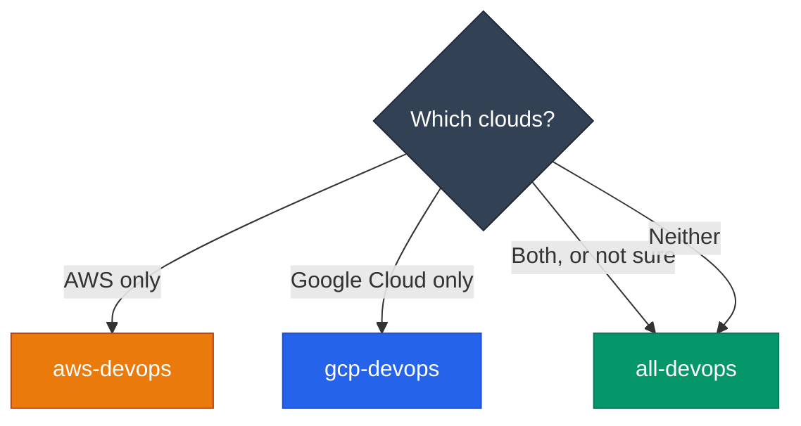

# Image Comparison

All three images share the same base toolkit. The only difference is which cloud CLIs sit on top.

## At a glance

| | <span class="di-pill di-pill--all">all-devops</span> | <span class="di-pill di-pill--aws">aws-devops</span> | <span class="di-pill di-pill--gcp">gcp-devops</span> |
|---|:---:|:---:|:---:|
| **Shared base toolkit** | ✅ | ✅ | ✅ |
| **AWS tools** | ✅ | ✅ | — |
| **Google Cloud tools** | ✅ | — | ✅ |
| **Compressed download** | ~1.6 GB | ~1.55 GB | ~1.5 GB |
| **Unpacked (amd64)** | ~5.0 GB | ~4.6 GB | ~4.6 GB |
| **Best for** | Multi-cloud and platform teams | AWS-only work | GCP-only work |

!!! info "Size isn't a big factor"
    The base is most of each image, so picking a single-cloud image saves only about 0.05 to 0.1 GB of download. Choose by the tools you need.

## Tool matrix

### Shared by every image

| Category | Tools | <span class="di-pill di-pill--all">all</span> | <span class="di-pill di-pill--aws">aws</span> | <span class="di-pill di-pill--gcp">gcp</span> |
|----------|-------|:---:|:---:|:---:|
| :simple-terraform: IaC | Terraform, tfswitch, Terragrunt, TFLint, Packer | ✅ | ✅ | ✅ |
| :simple-kubernetes: Kubernetes | kubectl, Helm 3, k9s | ✅ | ✅ | ✅ |
| :simple-ansible: Automation | Ansible, ansible-lint, pre-commit, Task | ✅ | ✅ | ✅ |
| :simple-trivy: Security | Trivy | ✅ | ✅ | ✅ |
| :lucide-bot: AI agents | `claude`, `codex`, `copilot`, `agy` | ✅ | ✅ | ✅ |
| :simple-python: Languages | Python 3.14, Node.js LTS (npm, npx) | ✅ | ✅ | ✅ |
| :simple-github: Git | git, `gh`, ghorg | ✅ | ✅ | ✅ |
| :lucide-database: Databases | `mongosh`, `psql` 17, `mysql` 8.4 | ✅ | ✅ | ✅ |
| :lucide-terminal: Shells & utilities | zsh, bash, fish, jq, curl, wget, nmap, ncat, dig, vim | ✅ | ✅ | ✅ |

### Cloud-specific

| Tool | Purpose | <span class="di-pill di-pill--all">all</span> | <span class="di-pill di-pill--aws">aws</span> | <span class="di-pill di-pill--gcp">gcp</span> |
|------|---------|:---:|:---:|:---:|
| AWS CLI v2 | AWS operations | ✅ | ✅ | — |
| Session Manager plugin | Shell and port forwarding to EC2 | ✅ | ✅ | — |
| boto3 | AWS SDK for Python | ✅ | ✅ | — |
| cfn-lint | CloudFormation linter | ✅ | ✅ | — |
| s3cmd, crcmod | S3 client, CRC32c helper | ✅ | ✅ | — |
| pytest, requests, bs4, lxml | Scripting helpers | ✅ | ✅ | — |
| gcloud (+ `beta`) | Google Cloud operations | ✅ | — | ✅ |
| gsutil, bq | Cloud Storage and BigQuery | ✅ | — | ✅ |
| docker-credential-gcr | Registry auth helper | ✅ | — | ✅ |
| gke-gcloud-auth-plugin | kubectl auth for GKE | ✅ | — | ✅ |

### Not in any image

kustomize (use `kubectl kustomize` or `kubectl apply -k`), yq, pipx, `gcloud alpha`, the Docker CLI/daemon, Go and Java. Install them in a derived image if you need them.

## Decision tree


```mermaid
flowchart TD
  Q{"Which clouds?"} -->|AWS only| W["aws-devops"]
  Q -->|Google Cloud only| G["gcp-devops"]
  Q -->|Both, or not sure| A["all-devops"]
  Q -->|Neither| A

  classDef neutral fill:#334155,stroke:#1e293b,color:#fff
  classDef all fill:#059669,stroke:#047857,color:#fff
  classDef aws fill:#ea7a0c,stroke:#c2410c,color:#fff
  classDef gcp fill:#2563eb,stroke:#1d4ed8,color:#fff
  class Q neutral
  class A all
  class W aws
  class G gcp
```

Need no cloud CLIs at all? Any image works, or build the unpublished base yourself with `docker build --target base -t devops-base:local .`.

<div class="grid cards" markdown>

-   :lucide-layers:{ .lg .middle } __all-devops__

    ---

    Both clouds in one image. The safe default for platform teams, migrations and mixed estates.

    [:octicons-arrow-right-24: Guide](../use-images/all-devops.md)

-   :fontawesome-brands-aws:{ .lg .middle } __aws-devops__

    ---

    EKS, CloudFormation, Session Manager and boto3 scripting, with no Google Cloud SDK.

    [:octicons-arrow-right-24: Guide](../use-images/aws-devops.md)

-   :simple-googlecloud:{ .lg .middle } __gcp-devops__

    ---

    GKE, Cloud Storage, BigQuery and Artifact Registry, with no AWS tooling.

    [:octicons-arrow-right-24: Guide](../use-images/gcp-devops.md)

</div>

## Architectures and registries

| | linux/amd64 | linux/arm64 |
|---|:---:|:---:|
| <span class="di-pill di-pill--all">all-devops</span> | ✅ | ✅ |
| <span class="di-pill di-pill--aws">aws-devops</span> | ✅ | ✅ |
| <span class="di-pill di-pill--gcp">gcp-devops</span> | ✅ | ✅ |

Both architectures are built natively and in parallel, then merged into one multi-arch tag, so Docker pulls the right one automatically. Check with:

```bash
docker buildx imagetools inspect ghcr.io/jinalshah/devops/images/all-devops:latest
```

The three images are published to all three registries. The base is not published anywhere.

| Registry | Image path |
|----------|------------|
| :simple-github: GHCR (recommended) | `ghcr.io/jinalshah/devops/images/<image>` |
| :simple-gitlab: GitLab | `registry.gitlab.com/jinal-shah/devops/images/<image>` |
| :simple-docker: Docker Hub | `js01/<image>` |

## Switching images

Moving from `all-devops` to a single-cloud image is just a tag change. Check what your pipelines actually call first:

```bash
grep -rE "\baws |gcloud |gsutil |bq " .github/ .gitlab-ci.yml 2>/dev/null
```

```yaml
container:
  image: ghcr.io/jinalshah/devops/images/aws-devops:latest
```

For reproducible pipelines, pin by digest (`image@sha256:...`), because `1.0.<sha>` tags are refreshed by scheduled rebuilds.

## Next steps

- [Base layer](base-layer.md): what every image shares
- [Cloud layers](cloud-layers.md): AWS and GCP additions, and the CI pipeline
- [Build your own](../build-images/index.md)
