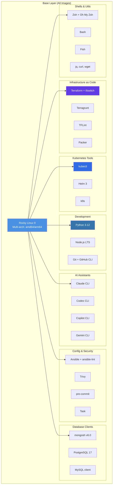
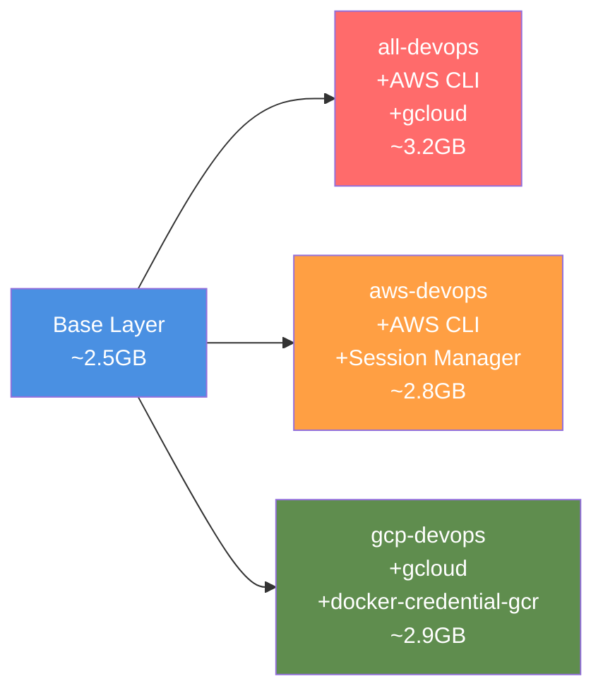
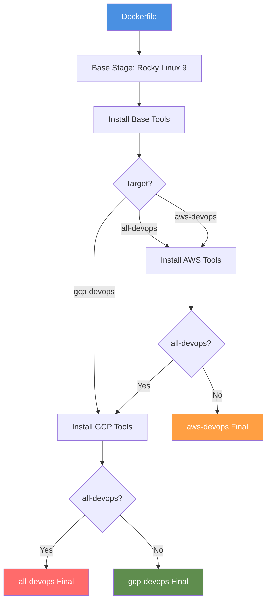

# Architecture & Design

## Overview

The DevOps Images are built on a layered architecture, starting from a common base layer and extending with cloud-specific tools. All images are multi-architecture, supporting both **amd64** and **arm64** platforms.

## Base Layer Architecture

All images start from a common base layer built on Rocky Linux 9:

## Image Variants

From the base layer, three specialized variants are built:

## Design Philosophy

### Why Rocky Linux 9?

- **Enterprise-grade stability**: RHEL-compatible, production-ready
- **Long-term support**: Extended lifecycle for security updates
- **Multi-architecture support**: Native amd64 and arm64 builds
- **Package ecosystem**: Robust RPM ecosystem for DevOps tools

### Why Zsh as Default?

- **Developer productivity**: Better autocomplete and syntax highlighting
- **Oh My Zsh**: Rich plugin ecosystem for cloud tools
- **Compatibility**: Bash scripts still work in Zsh
- **Modern defaults**: Better interactive experience

### Multi-Architecture Strategy

All images are built for both **amd64** (x86_64) and **arm64** (aarch64) architectures, ensuring compatibility with:

- **Intel/AMD machines**: Traditional x86_64 servers and workstations
- **Apple Silicon**: M1/M2/M3 Mac devices (arm64 native)
- **AWS Graviton**: ARM-based EC2 instances
- **Cloud development**: Consistent experience across platforms

## Tool Categories

### Infrastructure as Code (IaC)

| Tool | Version Strategy | Purpose |
|------|------------------|---------|
| **Terraform** | tfswitch (multi-version) | Infrastructure provisioning |
| **Terragrunt** | Latest stable | Terraform wrapper for DRY configs |
| **TFLint** | Latest | Terraform linting and validation |
| **Packer** | Latest | Image building automation |

### Kubernetes & Container Orchestration

| Tool | Version | Purpose |
|------|---------|---------|
| **kubectl** | Latest stable | Kubernetes cluster management |
| **Helm 3** | Latest | Kubernetes package manager |
| **k9s** | Latest | Terminal UI for Kubernetes |

### Cloud Provider CLIs

| Tool | Availability | Purpose |
|------|--------------|---------|
| **AWS CLI v2** | all-devops, aws-devops | AWS service management |
| **AWS Session Manager** | all-devops, aws-devops | EC2 instance access |
| **gcloud** | all-devops, gcp-devops | GCP service management |
| **docker-credential-gcr** | all-devops, gcp-devops | GCR authentication |

### Configuration Management

| Tool | Purpose |
|------|---------|
| **Ansible** | Configuration automation |
| **ansible-lint** | Playbook validation |
| **pre-commit** | Git hook framework |
| **Task** | Modern task runner (Make alternative) |

### Security & Scanning

| Tool | Purpose |
|------|---------|
| **Trivy** | Vulnerability scanning for containers and IaC |

### AI-Powered Development

All images include four AI CLI assistants for code generation, review, and troubleshooting:

| Tool | Provider | Best For |
|------|----------|----------|
| **Claude CLI** | Anthropic | Code review, architecture, long context |
| **Codex CLI** | OpenAI | Code generation, quick snippets |
| **Copilot CLI** | GitHub | IDE integration, GitHub workflows |
| **Gemini CLI** | Google | GCP-specific tasks, multi-modal |

### Development Tools

| Tool | Version | Purpose |
|------|---------|---------|
| **Python 3** | 3.12 | Scripting, tooling |
| **Node.js** | LTS | JavaScript tooling |
| **Git** | Latest | Version control |
| **GitHub CLI (gh)** | Latest | GitHub automation |

### Database Clients

| Client | Version | Purpose |
|--------|---------|---------|
| **mongosh** | v6.0 | MongoDB shell |
| **psql** | PostgreSQL 17 | PostgreSQL client |
| **mysql** | Latest | MySQL client |

### Network & Utilities

- **dig, nslookup** - DNS troubleshooting
- **ncat, telnet** - Network connectivity testing
- **curl, wget** - HTTP clients
- **jq** - JSON processing
- **tree** - Directory visualisation
- **vim, less** - Text editors/pagers

## Build Process

### Multi-Stage Build Strategy

### Layer Optimization

The build process is optimized for layer caching:

1. **Base OS packages** - Changes rarely
2. **Binary downloads** - Version updates occasionally
3. **Python/Node packages** - Moderate update frequency
4. **Configuration files** - Most frequently changed

This ordering minimizes rebuild time and maximizes cache hits.

## Size Comparison

Approximate compressed image sizes:

| Image | Size | Base + Cloud Tools | Use Case |
|-------|------|-------------------|----------|
| **base** | ~2.5GB | Base only | Single-cloud or custom |
| **all-devops** | ~3.2GB | AWS + GCP | Multi-cloud teams |
| **aws-devops** | ~2.8GB | AWS only | AWS-first teams |
| **gcp-devops** | ~2.9GB | GCP only | GCP-first teams |

!!! tip "Size Optimisation"
    If you only need a subset of tools, consider building a custom image. See [Build Images > Customisation](../build-images/customisation.md) for details.

## Next Steps

- [Choose the right image](../choosing-an-image.md) for your use case
- [Understand base layer tools](base-layer.md) in detail
- [Explore cloud-specific additions](cloud-layers.md)
- [Compare all variants](comparison.md) side-by-side
