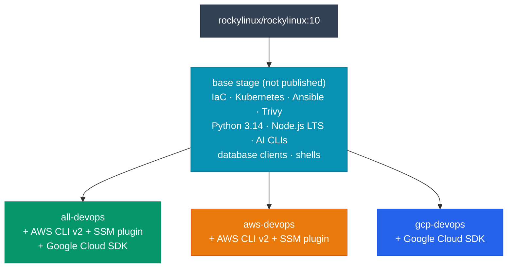

# Architecture & Design

One Dockerfile, one shared `base` stage and three published targets. Every image is built natively for **amd64** and **arm64**, then stitched into a single multi-arch tag.

  
<strong>1</strong>Dockerfile

  
<strong>3</strong>published targets

  
<strong>2</strong>native architectures

  
<strong>3</strong>registries

## The layer cake

```mermaid
flowchart TB
  R["rockylinux/rockylinux:10"] --> B["base stage (not published)<br/>IaC · Kubernetes · Ansible · Trivy<br/>Python 3.14 · Node.js LTS · AI CLIs<br/>database clients · shells"]
  B --> A["all-devops<br/>+ AWS CLI v2 + SSM plugin<br/>+ Google Cloud SDK"]
  B --> W["aws-devops<br/>+ AWS CLI v2 + SSM plugin"]
  B --> G["gcp-devops<br/>+ Google Cloud SDK"]

  classDef neutral fill:#334155,stroke:#1e293b,color:#fff
  classDef base fill:#0891b2,stroke:#0e7490,color:#fff
  classDef all fill:#059669,stroke:#047857,color:#fff
  classDef aws fill:#ea7a0c,stroke:#c2410c,color:#fff
  classDef gcp fill:#2563eb,stroke:#1d4ed8,color:#fff
  class R neutral
  class B base
  class A all
  class W aws
  class G gcp
```

Each target is a single extra `RUN` on top of `base`, followed by `CMD ["/bin/zsh"]`. There is no `ENTRYPOINT` and no multi-stage builder: what gets installed stays installed.

-   :lucide-layers:{ .lg .middle } __Base layer__

    ---

    Everything every image shares: the OS and build tools, Python, Node.js, IaC, Kubernetes, AI agents and database clients.

    [:octicons-arrow-right-24: Base layer](base-layer.md)

-   :lucide-cloud:{ .lg .middle } __Cloud layers__

    ---

    What the AWS and GCP layers add, how they are installed, and how the CI pipeline builds and publishes them.

    [:octicons-arrow-right-24: Cloud layers](cloud-layers.md)

-   :lucide-scale:{ .lg .middle } __Comparison__

    ---

    Side-by-side tool matrix, real sizes and a quick decision tree.

    [:octicons-arrow-right-24: Compare images](comparison.md)

## Design choices

-   :simple-rockylinux:{ .lg .middle } __Rocky Linux 10__

    ---

    RHEL-compatible, long support lifecycle, RPM repositories for almost every tool here, and official images for both amd64 and arm64.

-   :simple-zsh:{ .lg .middle } __Zsh by default__

    ---

    Oh My Zsh with the `candy` theme, kubectl and AWS completion, and handy aliases (`k`, `kg`, `tfp`, `aws-ssm`…). Bash and fish are there too.

-   :lucide-cpu:{ .lg .middle } __Native multi-arch__

    ---

    amd64 and arm64 are built on native GitHub runners in parallel, so Apple Silicon and Graviton users get a real arm64 image with no emulation.

-   :lucide-refresh-cw:{ .lg .middle } __Always fresh__

    ---

    Rebuilt every Sunday, plus whenever the daily version check finds a new Terragrunt, TFLint, Packer, k9s, ghorg, gcloud or Python release.

## What's in every image

| Category | Tools |
|----------|-------|
| :simple-terraform: **Infrastructure as code** | Terraform (via tfswitch), Terragrunt, TFLint, Packer |
| :simple-kubernetes: **Kubernetes** | kubectl, Helm 3, k9s |
| :simple-ansible: **Automation** | Ansible, ansible-lint, pre-commit, Task (go-task) |
| :simple-trivy: **Security** | Trivy (the vulnerability DB downloads on first scan) |
| :lucide-bot: **AI coding agents** | Claude Code (`claude`), OpenAI Codex CLI (`codex`), GitHub Copilot CLI (`copilot`), Google Antigravity CLI (`agy`) |
| :simple-python: **Languages** | Python 3.14 (compiled from source), Node.js LTS with npm and npx |
| :simple-github: **Git** | git, GitHub CLI (`gh`), ghorg |
| :lucide-database: **Database clients** | `mongosh` (MongoDB 8.0 repo), `psql` 17, `mysql` 8.4 |
| :lucide-network: **Network & utilities** | dig, nslookup, nmap, ncat, telnet, curl, wget, lftp, jq, tree, vim, less, zip/unzip |
| :lucide-terminal: **Shells** | zsh (default), bash, fish |

Cloud CLIs are the only difference between images:

| Tool | all-devops | aws-devops | gcp-devops |
|------|:---:|:---:|:---:|
| AWS CLI v2 + Session Manager plugin | ✅ | ✅ | — |
| boto3, cfn-lint, s3cmd | ✅ | ✅ | — |
| gcloud, gsutil, bq | ✅ | — | ✅ |
| `docker-credential-gcr`, `gke-gcloud-auth-plugin` | ✅ | — | ✅ |

## How the Dockerfile is ordered

Docker rebuilds everything after the first changed instruction, so the order matters:

1. `COPY scripts/*.sh /tmp/`: every `.sh` file in `scripts/` comes in **first**, so editing any of them invalidates the whole base.
2. System packages, Python build, pip packages, database clients, Trivy and Oh My Zsh (one big `RUN`).
3. Downloaded binaries: kubectl, Terraform, Terragrunt, TFLint, Packer, Helm, ghorg, k9s, Task.
4. Node.js LTS and the four AI CLIs.
5. The per-target cloud `RUN`.

The full breakdown is on the [base layer](base-layer.md#dockerfile-layer-order) page.

## Sizes

These are measured from GHCR. The three images are within 0.5 GB of each other because the shared base makes up most of each one.

| Image | Compressed download | Unpacked on disk (amd64) |
|-------|---------------------|--------------------------|
| all-devops | ~1.6 GB | ~5.0 GB |
| aws-devops | ~1.55 GB | ~4.6 GB |
| gcp-devops | ~1.5 GB | ~4.6 GB |

arm64 downloads are about 0.05 to 0.1 GB smaller.

!!! tip "Need something slimmer?"
    Build your own variant from the same Dockerfile. See [Customisation](../build-images/customization.md).

## Next steps

- [Choose the right image](../choosing-an-image.md)
- [Base layer in detail](base-layer.md)
- [Cloud layers and the CI pipeline](cloud-layers.md)
- [Compare the images side by side](comparison.md)
