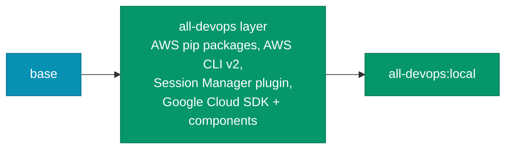

# Build: all-devops

<span class="di-pill di-pill--all">all-devops</span> is the `base` stage plus a single cloud layer that installs **both** the AWS and Google Cloud tooling.



## Build

```bash
docker build --target all-devops -t all-devops:local .
```

Build arguments used by this layer: `GCLOUD_VERSION` (Google Cloud SDK). Every [base build argument](index.md#build-arguments) applies too. For example:

```bash
docker build --target all-devops \
  --build-arg GCLOUD_VERSION=501.0.0 \
  --build-arg PYTHON_VERSION=3.14.7 \
  --build-arg PYTHON_VERSION_TO_USE=python3.14 \
  -t all-devops:custom .
```

## Verify

```bash
docker run --rm all-devops:local bash -c '
  terraform version && aws --version && session-manager-plugin --version &&
  gcloud --version | head -1 && gke-gcloud-auth-plugin --version && trivy --version | head -1'
```

## Run

```bash
docker run -it --rm \
  -v "$PWD":/srv -w /srv \
  -v ~/.aws:/root/.aws \
  -v ~/.config/gcloud:/root/.config/gcloud \
  all-devops:local
```

See [Using all-devops](../use-images/all-devops.md) for everyday usage.
