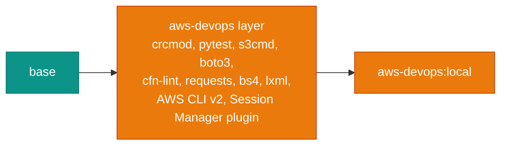

# Build: aws-devops

<span class="di-pill di-pill--aws">aws-devops</span> is the `base` stage plus an AWS layer. It has no Google Cloud SDK.



## Build

```bash
docker build --target aws-devops -t aws-devops:local .
```

The AWS layer has no version build arguments: the AWS CLI and Session Manager plugin always come from the latest official packages for the build architecture. The [base build arguments](index.md#build-arguments) still apply.

## Verify

```bash
docker run --rm aws-devops:local bash -c '
  aws --version && session-manager-plugin --version &&
  cfn-lint --version && terragrunt --version'
```

## Run

```bash
docker run -it --rm \
  -v "$PWD":/srv -w /srv \
  -v ~/.aws:/root/.aws \
  aws-devops:local
```

See [Using aws-devops](../use-images/aws-devops.md) for everyday usage.
