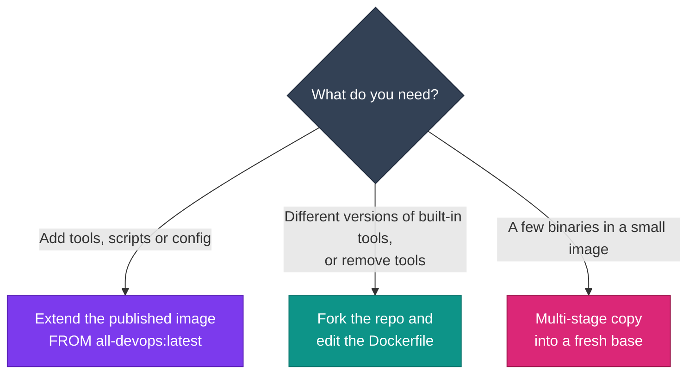

# Customising the images

Add your own tools, scripts and defaults on top of the published images, so your team gets one image with everything it needs.

## Pick an approach



<div class="grid cards" markdown>

-   :lucide-package-plus:{ .lg .middle } __Extend (recommended)__

    ---

    A few lines of Dockerfile, a build that takes minutes, and you pick up upstream updates on each rebuild. You can't make the image smaller this way.

-   :lucide-git-branch:{ .lg .middle } __Fork__

    ---

    Full control over every step and [build argument](index.md#build-arguments), at the cost of a long cold build and merging upstream changes yourself.

-   :lucide-package:{ .lg .middle } __Multi-stage copy__

    ---

    The smallest result, but only for self-contained binaries. See [Optimisation](optimization.md#what-works-for-a-smaller-image).

</div>

## Things to know about the base

- The images run as `root` with `HOME=/root`, and the default command is `zsh`. The final stages set `SHELL ["/bin/bash", "-c"]`, which child images inherit.
- `python3` is Python 3.14, built from source in `/usr/local`. Use `python3 -m pip install …` so packages land in that interpreter.
- `dnf` works, and EPEL is already enabled.
- `/usr/local/lib/detect-arch.sh` exports `ARCH_VALUE` (`amd64` or `arm64`) and a `get_arch_value <arm-name> <x86-name>` helper. Use it so your downloads work on both architectures.

!!! warning "Don't hard-code `amd64`"
    The published images are multi-arch. A download URL with `linux_amd64` in it gives Apple Silicon and ARM runners a binary they can't run. Every example below picks the right architecture automatically.

## Quick recipes

=== ":simple-python: Python packages"

    ```dockerfile
    FROM ghcr.io/jinalshah/devops/images/all-devops:latest

    RUN python3 -m pip install --no-cache-dir \
          ruff==0.8.4 \
          black==24.10.0
    ```

=== ":simple-nodedotjs: npm packages"

    ```dockerfile
    FROM ghcr.io/jinalshah/devops/images/all-devops:latest

    RUN npm install -g prettier@3 cdktf-cli && \
        rm -rf /root/.npm
    ```

=== ":simple-rockylinux: dnf packages"

    ```dockerfile
    FROM ghcr.io/jinalshah/devops/images/all-devops:latest

    RUN dnf install -y httpd-tools tcpdump && \
        dnf clean all && rm -rf /var/cache/dnf
    ```

=== ":lucide-cpu: Arch-aware binary"

    ```dockerfile
    FROM ghcr.io/jinalshah/devops/images/all-devops:latest

    ARG GO_VERSION=1.23.4
    RUN . /usr/local/lib/detect-arch.sh && \
        curl -fsSL "https://go.dev/dl/go${GO_VERSION}.linux-${ARCH_VALUE}.tar.gz" \
          | tar -C /usr/local -xz
    ENV PATH="/usr/local/go/bin:${PATH}"
    ```

=== ":simple-googlecloud: gcloud components"

    For <span class="di-pill di-pill--gcp">gcp-devops</span> and <span class="di-pill di-pill--all">all-devops</span>. For example, `alpha` isn't installed by default:

    ```dockerfile
    FROM ghcr.io/jinalshah/devops/images/gcp-devops:latest

    RUN gcloud components install alpha --quiet && \
        rm -rf /usr/lib/google-cloud-sdk/.install/.backup
    ```

## Complete examples

=== ":lucide-wrench: Team linting image"

    ```dockerfile
    FROM ghcr.io/jinalshah/devops/images/all-devops:latest

    # Python and Node.js linters
    RUN python3 -m pip install --no-cache-dir black pylint mypy checkov && \
        npm install -g prettier markdownlint-cli && rm -rf /root/.npm

    # hadolint names its assets x86_64 / arm64
    ARG HADOLINT_VERSION=2.12.0
    RUN . /usr/local/lib/detect-arch.sh && \
        HADOLINT_ARCH="$(get_arch_value arm64 x86_64)" && \
        curl -fsSL -o /usr/local/bin/hadolint \
          "https://github.com/hadolint/hadolint/releases/download/v${HADOLINT_VERSION}/hadolint-Linux-${HADOLINT_ARCH}" && \
        chmod +x /usr/local/bin/hadolint

    LABEL org.opencontainers.image.title="acme-devops-lint"
    ```

=== ":lucide-shield-check: Security tooling"

    Trivy is already included. This adds SBOM and policy tools:

    ```dockerfile
    FROM ghcr.io/jinalshah/devops/images/all-devops:latest

    RUN python3 -m pip install --no-cache-dir checkov bandit

    # The Anchore install scripts detect the architecture themselves
    RUN curl -sSfL https://raw.githubusercontent.com/anchore/syft/main/install.sh | sh -s -- -b /usr/local/bin && \
        curl -sSfL https://raw.githubusercontent.com/anchore/grype/main/install.sh | sh -s -- -b /usr/local/bin
    ```

=== ":lucide-pin: Pinned versions"

    An `ARG` declared **before** `FROM` is only visible in `FROM` lines. Declare it again after `FROM` to use it in `RUN` and `LABEL`.

    ```dockerfile
    ARG BASE_IMAGE=ghcr.io/jinalshah/devops/images/all-devops:latest
    FROM ${BASE_IMAGE}

    ARG TERRAFORM_VERSION=1.9.8
    ARG PACKER_VERSION=1.11.2

    # tfswitch is in the image; this replaces the latest Terraform with a pinned one
    RUN tfswitch "${TERRAFORM_VERSION}" && terraform version

    RUN . /usr/local/lib/detect-arch.sh && \
        curl -fsSL -o /tmp/packer.zip \
          "https://releases.hashicorp.com/packer/${PACKER_VERSION}/packer_${PACKER_VERSION}_linux_${ARCH_VALUE}.zip" && \
        unzip -o -q /tmp/packer.zip -d /usr/local/bin && rm /tmp/packer.zip

    COPY requirements.txt /tmp/requirements.txt
    RUN python3 -m pip install --no-cache-dir -r /tmp/requirements.txt && rm /tmp/requirements.txt

    LABEL audit.terraform="${TERRAFORM_VERSION}" \
          audit.packer="${PACKER_VERSION}"
    ```

=== ":lucide-code: Extra languages"

    ```dockerfile
    FROM ghcr.io/jinalshah/devops/images/all-devops:latest

    # Go (arch-aware)
    ARG GO_VERSION=1.23.4
    RUN . /usr/local/lib/detect-arch.sh && \
        curl -fsSL "https://go.dev/dl/go${GO_VERSION}.linux-${ARCH_VALUE}.tar.gz" | tar -C /usr/local -xz
    ENV PATH="/usr/local/go/bin:/root/.cargo/bin:${PATH}"

    # Rust (rustup detects the architecture)
    RUN curl --proto '=https' --tlsv1.2 -sSf https://sh.rustup.rs | sh -s -- -y --profile minimal

    # Ruby and Java 21 from the Rocky Linux 10 repositories
    RUN dnf install -y ruby java-21-openjdk-devel && dnf clean all && rm -rf /var/cache/dnf
    ENV JAVA_HOME=/usr/lib/jvm/java-21-openjdk

    RUN go version && rustc --version && ruby --version && java -version
    ```

Pin every version you add (`package==1.2.3`, `tool@1.2.3`, `ARG X_VERSION`) so rebuilds only change what you meant to change.

## Scripts, config and defaults

=== ":lucide-file-code: Scripts"

    ```dockerfile
    FROM ghcr.io/jinalshah/devops/images/all-devops:latest

    COPY --chmod=755 scripts/ /opt/acme/bin/
    ENV PATH="/opt/acme/bin:${PATH}"
    ```

=== ":lucide-settings: Config files"

    ```dockerfile
    FROM ghcr.io/jinalshah/devops/images/all-devops:latest

    COPY configs/.terraformrc  /root/.terraformrc
    COPY configs/.ansible.cfg  /root/.ansible.cfg
    COPY configs/.gitconfig    /root/.gitconfig

    # Oh My Zsh loads every *.zsh file in its custom directory
    COPY configs/acme.zsh /root/.oh-my-zsh/custom/acme.zsh
    ```

=== ":lucide-sliders-horizontal: Environment defaults"

    ```dockerfile
    FROM ghcr.io/jinalshah/devops/images/all-devops:latest

    ENV AWS_DEFAULT_REGION=eu-west-2 \
        CLOUDSDK_CORE_PROJECT=acme-prod \
        TF_PLUGIN_CACHE_DIR=/root/.terraform.d/plugin-cache
    RUN mkdir -p /root/.terraform.d/plugin-cache
    ```

!!! danger "Never bake in secrets"
    Anything in `ENV`, `ARG` or a copied file can be read by anyone who can pull the image. Pass credentials at runtime with `-e` or mounts, or use `RUN --mount=type=secret` for build-time secrets.

## Test your image

```bash title="test-custom-image.sh"
#!/usr/bin/env bash
set -euo pipefail
IMAGE="$1"

docker run --rm "$IMAGE" bash -c '
  set -e
  terraform version
  kubectl version --client
  hadolint --version
  python3 -c "import checkov"
  command -v acme-deploy
'
echo "All checks passed for $IMAGE"
```

Scan it with the Trivy that's already in the image, talking to your host's Docker daemon:

```bash
docker run --rm -v /var/run/docker.sock:/var/run/docker.sock \
  ghcr.io/jinalshah/devops/images/all-devops:latest \
  trivy image --severity HIGH,CRITICAL acme/devops:latest
```

## Build and publish in CI

A weekly rebuild picks up the upstream image's refreshed tools. Recording the base in a label makes it easy to see what you built on.

```yaml title=".github/workflows/custom-image.yml"
name: Custom DevOps image

on:
  push:
    branches: [main]
  schedule:
    - cron: "0 4 * * 1"   # Mondays 04:00 UTC, after the upstream Sunday rebuild
  workflow_dispatch:

permissions:
  contents: read
  packages: write

jobs:
  build:
    runs-on: ubuntu-latest
    steps:
      - uses: actions/checkout@v4
      - uses: docker/setup-qemu-action@v3
      - uses: docker/setup-buildx-action@v3
      - uses: docker/login-action@v3
        with:
          registry: ghcr.io
          username: ${{ github.actor }}
          password: ${{ secrets.GITHUB_TOKEN }}
      - uses: docker/build-push-action@v6
        with:
          context: .
          platforms: linux/amd64,linux/arm64
          pull: true
          push: true
          tags: |
            ghcr.io/${{ github.repository_owner }}/devops-custom:latest
            ghcr.io/${{ github.repository_owner }}/devops-custom:${{ github.sha }}
          labels: |
            org.opencontainers.image.base.name=ghcr.io/jinalshah/devops/images/all-devops:latest
```

This uses QEMU to build arm64 on an amd64 runner, which is simple but slow. The upstream project builds each architecture natively instead; see [Multi-platform images](multi-platform-images.md).

## Troubleshooting

??? question "A pip package won't install"
    `pip search` no longer works (PyPI disabled the API). List the published versions instead:

    ```bash
    docker run --rm ghcr.io/jinalshah/devops/images/all-devops:latest \
      python3 -m pip index versions checkov
    ```

    Then pin one that exists, or install from Git: `python3 -m pip install "git+https://github.com/org/pkg.git@v1.2.3"`.

??? question "`exec format error` when running a tool I added"
    You downloaded a binary for the wrong architecture. Use `ARCH_VALUE` or `get_arch_value` from `/usr/local/lib/detect-arch.sh`, as in the examples above.

??? question "My `ARG` is empty inside `RUN`"
    It was declared before `FROM`. Add `ARG NAME` (no value needed) again after the `FROM` line.

??? question "The custom image is bigger than expected"
    Clean caches in the same `RUN` (`dnf clean all`, `--no-cache-dir`, `rm -rf /root/.npm`) and check `docker history <image>`. See [Optimisation](optimization.md).

## Next steps

- [Building images](index.md)
- [Optimisation](optimization.md)
- [Multi-platform images](multi-platform-images.md)
