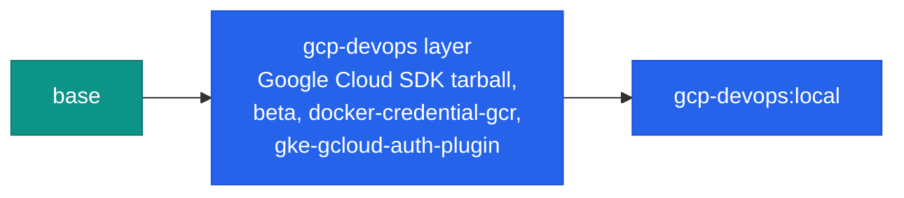

# Build: gcp-devops

<span class="di-pill di-pill--gcp">gcp-devops</span> is the `base` stage plus a Google Cloud layer. It has no AWS tooling.



## Build

```bash
docker build --target gcp-devops -t gcp-devops:local .
```

`GCLOUD_VERSION` picks the SDK release (default `501.0.0`; CI uses a newer one from a repository variable). The tarball is downloaded for the build architecture, so the version must exist for both `x86_64` and `arm` if you build multi-platform.

```bash
docker build --target gcp-devops --build-arg GCLOUD_VERSION=501.0.0 -t gcp-devops:custom .
```

## Verify

```bash
docker run --rm gcp-devops:local bash -c '
  gcloud --version && gke-gcloud-auth-plugin --version &&
  kubectl version --client && helm version --short'
```

## Run

```bash
docker run -it --rm \
  -v "$PWD":/srv -w /srv \
  -v ~/.config/gcloud:/root/.config/gcloud \
  -v ~/.kube:/root/.kube \
  gcp-devops:local
```

See [Using gcp-devops](../use-images/gcp-devops.md) for everyday usage, including GKE.
