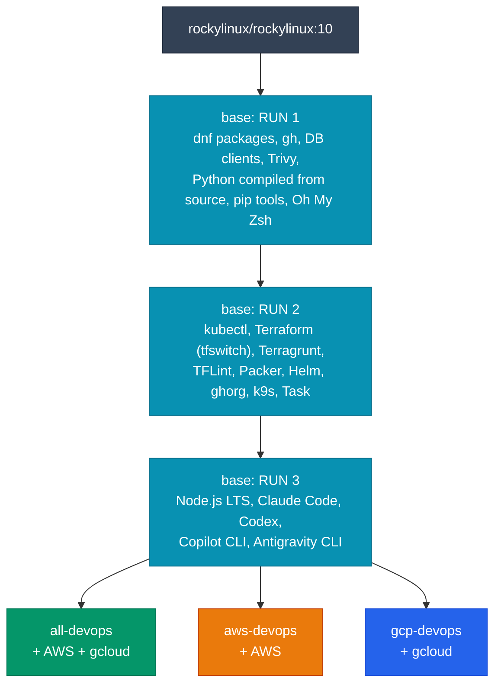

# Building the images

Most people should just pull the published images. Build them yourself when you want to change tool versions, add or remove tools, or produce images for your own registry.

<div class="grid cards" markdown>

-   :lucide-download:{ .lg .middle } __Pull if…__

    ---

    - the standard toolset is enough
    - you want multi-arch images that are rebuilt automatically
    - you don't want a long compile on every machine

    ```bash
    docker pull ghcr.io/jinalshah/devops/images/all-devops:latest
    ```

-   :lucide-hammer:{ .lg .middle } __Build if…__

    ---

    - you need different tool or Python versions
    - you want to add internal tools or remove some
    - you publish to your own registry

    [:octicons-arrow-right-24: Or extend the published image](customization.md)

</div>

## How the Dockerfile is organised

One `Dockerfile` with a shared `base` stage and three targets. Each target is a single stage on top of `base`; there's no separate builder stage.



Because the three targets share `base`, building a second target after the first reuses the cached base layers and only runs the small cloud layer.

## Prerequisites

- Docker with **BuildKit**, the default builder since Docker Engine 23 and in Docker Desktop. `docker buildx version` confirms it.
- Plenty of disk space: the finished image is about 5 GB unpacked, and the build cache adds more on top.
- A clone of the repository: `git clone https://github.com/jinalshah/devops-images && cd devops-images`

!!! info "Cold builds are slow"
    Python is compiled from source with `--enable-optimizations`, which dominates a cold build. Expect a cold build to take tens of minutes; later builds are much faster once the base layers are cached.

## Build a target

=== ":lucide-layers: all-devops"

    ```bash
    docker build --target all-devops -t all-devops:local .
    ```

=== ":fontawesome-brands-aws: aws-devops"

    ```bash
    docker build --target aws-devops -t aws-devops:local .
    ```

=== ":simple-googlecloud: gcp-devops"

    ```bash
    docker build --target gcp-devops -t gcp-devops:local .
    ```

=== ":lucide-box: base only"

    ```bash
    docker build --target base -t devops-base:local .
    ```

    `base` isn't published, but it's handy for testing shared tooling.

To build every target in turn (the base is built once and reused):

```bash
for target in all-devops aws-devops gcp-devops; do
  docker build --target "$target" -t "$target:local" .
done
```

Docker builds for your machine's architecture by default. On Apple Silicon or an ARM host you get a native `linux/arm64` image. For both architectures, see [Multi-platform images](multi-platform-images.md).

## Build arguments

These are exactly the `ARG`s declared at the top of the `Dockerfile`. CI overrides the first eight from repository variables, which a daily workflow bumps to the latest releases.

| Arg | Default | Used for |
|-----|---------|----------|
| `GCLOUD_VERSION` | `501.0.0` | Google Cloud SDK tarball (all-devops, gcp-devops) |
| `PACKER_VERSION` | `1.11.2` | Packer |
| `TERRAGRUNT_VERSION` | `0.68.14` | Terragrunt |
| `TFLINT_VERSION` | `0.50.3` | TFLint |
| `GHORG_VERSION` | `1.9.10` | ghorg |
| `K9S_VERSION` | `0.32.7` | k9s |
| `PYTHON_VERSION` | `3.14.7` | Full Python version compiled from source |
| `PYTHON_VERSION_TO_USE` | `python3.14` | Interpreter registered as the default `python3`; must match `PYTHON_VERSION` |
| `MONGODB_VERSION` | `8.0` | MongoDB repository series for `mongosh` |
| `MONGODB_REPO_PATH` | `/etc/yum.repos.d/mongodb-org-${MONGODB_VERSION}.repo` | Where the MongoDB repo file is written |
| `MYSQL_RELEASE_RPM_URL` | `https://repo.mysql.com/mysql84-community-release-el10-3.noarch.rpm` | MySQL 8.4 community repository for the `mysql` client |
| `MYSQL_GPG_KEY_URL` | `https://repo.mysql.com/RPM-GPG-KEY-mysql-2025` | Current MySQL signing key |

Terraform, kubectl, Helm, Task, Node.js and the AI CLIs have no build arg; they always install the latest release at build time.

=== ":lucide-sliders-horizontal: Override a few"

    ```bash
    docker build --target all-devops \
      --build-arg TERRAGRUNT_VERSION=0.68.14 \
      --build-arg K9S_VERSION=0.32.7 \
      -t all-devops:custom .
    ```

=== ":simple-python: Change Python"

    You need **both** the full version (for the source download) and the matching binary name. `PYTHON_VERSION=3.13` on its own breaks the build.

    ```bash
    docker build --target all-devops \
      --build-arg PYTHON_VERSION=3.13.7 \
      --build-arg PYTHON_VERSION_TO_USE=python3.13 \
      -t all-devops:py313 .
    ```

=== ":lucide-file-cog: Pin from a file"

    Keep versions in one file and pass them through. `--build-arg NAME` with no value takes the value from your environment.

    ```bash title="versions.env"
    GCLOUD_VERSION=501.0.0
    PACKER_VERSION=1.11.2
    TERRAGRUNT_VERSION=0.68.14
    TFLINT_VERSION=0.50.3
    GHORG_VERSION=1.9.10
    K9S_VERSION=0.32.7
    ```

    ```bash
    set -a; . ./versions.env; set +a
    docker build --target all-devops \
      --build-arg GCLOUD_VERSION --build-arg PACKER_VERSION \
      --build-arg TERRAGRUNT_VERSION --build-arg TFLINT_VERSION \
      --build-arg GHORG_VERSION --build-arg K9S_VERSION \
      -t all-devops:pinned .
    ```

## Validate the result

```bash title="validate-build.sh"
#!/usr/bin/env bash
set -euo pipefail
IMAGE="$1"

docker run --rm "$IMAGE" bash -c '
  set -e
  terraform version
  terragrunt --version
  kubectl version --client
  helm version --short
  ansible --version | head -1
  trivy --version | head -1
  python3 --version
  node --version
  command -v claude codex copilot agy
'

# Cloud CLIs depend on the target
docker run --rm "$IMAGE" aws --version 2>/dev/null && echo "AWS CLI: present"
docker run --rm "$IMAGE" gcloud --version 2>/dev/null | head -1 || true
```

```bash
./validate-build.sh all-devops:local
```

The repository also has test scripts for the network tools. Each takes the image as its first argument:

```bash
./test_network_tools.sh all-devops:local
./test_dns_tools.sh all-devops:local
./test_ncat_tool.sh all-devops:local
```

## Speed up rebuilds

=== ":lucide-layers-3: Reuse the base"

    Build targets one after another on the same builder. BuildKit reuses the cached `base` layers, so only the cloud layer runs for the second and third targets.

=== ":lucide-hard-drive: Local cache directory"

    With a `docker-container` buildx builder you can export the cache and reuse it later, or on another machine:

    ```bash
    docker buildx create --name devops --driver docker-container --use
    docker buildx build --target all-devops \
      --cache-from type=local,src=.buildx-cache \
      --cache-to type=local,dest=.buildx-cache,mode=max \
      -t all-devops:local --load .
    ```

=== ":simple-githubactions: CI cache"

    The project's own workflow uses the GitHub Actions cache backend per target and architecture:

    ```yaml
    cache-from: type=gha,scope=all-devops-amd64
    cache-to: type=gha,mode=max,scope=all-devops-amd64
    ```

!!! note "The published images can't seed your cache"
    The published images are built with the GitHub Actions cache backend and carry no inline cache metadata, so `--cache-from ghcr.io/jinalshah/devops/images/all-devops:latest` won't speed up your build.

To shrink an image, see the [Optimisation guide](optimization.md).

## Troubleshooting

??? question "`No space left on device`"
    Free up space with `docker builder prune` (build cache) and `docker image prune -a`. On Docker Desktop, raise the disk limit under **Settings → Resources**.

??? question "The Python step fails"
    Check that `PYTHON_VERSION` is a full release that exists on python.org (for example `3.13.7`, not `3.13`), and that `PYTHON_VERSION_TO_USE` names the same minor version (`python3.13`).

??? question "A download returns 404"
    A pinned version probably doesn't exist, or doesn't publish a build for your architecture. Check the release page for the tool, then pass a different `--build-arg`, for example `--build-arg GCLOUD_VERSION=<a version from the SDK release notes>`.

??? question "Repository mirrors are slow or unreachable"
    Rocky Linux 10's repo definitions are `/etc/yum.repos.d/rocky*.repo`. To use an internal mirror in a fork of the Dockerfile:

    ```dockerfile
    RUN sed -i -e 's|^mirrorlist=|#mirrorlist=|' \
               -e 's|^#baseurl=http://dl.rockylinux.org|baseurl=https://mirror.example.com|' \
               /etc/yum.repos.d/rocky*.repo
    ```

??? question "Building amd64 on Apple Silicon is very slow"
    Cross-architecture builds run under emulation. Build `linux/arm64` locally, or build each architecture on a native machine as CI does. See [Multi-platform images](multi-platform-images.md).

## Next steps

<div class="grid cards" markdown>

-   :lucide-gauge: [__Optimisation__](optimization.md)

    Where the size comes from and how to trim it.

-   :lucide-puzzle: [__Customisation__](customization.md)

    Extend the published images with your own tools.

-   :lucide-cpu: [__Multi-platform__](multi-platform-images.md)

    Build and publish amd64 + arm64.

-   :lucide-hammer: __Per-image notes__

    [all-devops](all-devops.md) · [aws-devops](aws-devops.md) · [gcp-devops](gcp-devops.md)

</div>
