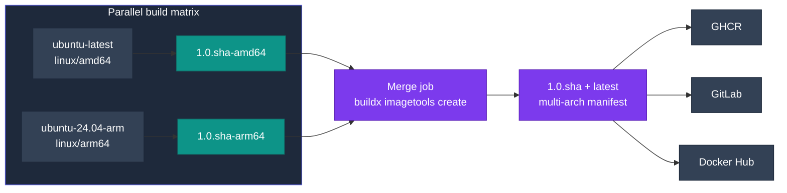

# Multi-platform images

Every published tag covers **linux/amd64** and **linux/arm64**. This page explains how CI produces them and how to do the same yourself.

## How CI builds them

CI doesn't use QEMU. Each architecture is built **natively** on its own runner in a parallel matrix, pushed as an architecture-specific tag, and then merged into one multi-arch manifest that is pushed to all three registries.



`latest` is only pushed from `main`. When you pull, Docker picks the matching entry from the manifest automatically.

## Build for your own machine

The simplest case: a native, single-platform image loaded straight into your local Docker.

```bash
docker build --target all-devops -t all-devops:local .
```

To pick a platform explicitly (it still has to be a single one for `--load`):

```bash
docker buildx build --platform linux/arm64 --target all-devops \
  -t all-devops:arm64-local --load .
```

!!! warning "`--load` and multiple platforms don't mix"
    `--platform linux/amd64,linux/arm64 --load` fails with Docker's classic image store, because it can hold only one platform per tag. Use `--push` to a registry, or build and load one platform at a time. With the containerd image store (the default in Docker Desktop and for new installs of Docker Engine 29 and later), loading multi-platform images does work.

## Build both and push

=== ":lucide-zap: One command (emulated)"

    Easiest, but the non-native architecture runs under QEMU emulation, and compiling Python from source that way is **very** slow.

    ```bash
    # One-off: a builder that can produce multi-platform output
    docker buildx create --name devops-multiarch --driver docker-container --use
    docker buildx inspect --bootstrap

    IMAGE=ghcr.io/<you>/all-devops
    VERSION="1.0.$(git rev-parse --short=7 HEAD)"

    docker buildx build \
      --platform linux/amd64,linux/arm64 \
      --target all-devops \
      -t "$IMAGE:$VERSION" -t "$IMAGE:latest" \
      --push .
    ```

    On Linux you may first need QEMU handlers: `docker run --privileged --rm tonistiigi/binfmt --install arm64,amd64`. Docker Desktop ships them.

=== ":lucide-split: Native per-arch + merge (what CI does)"

    Build each architecture on a machine of that architecture, then stitch the tags together:

    ```bash
    IMAGE=ghcr.io/<you>/all-devops
    VERSION="1.0.$(git rev-parse --short=7 HEAD)"

    # On an amd64 machine
    docker buildx build --platform linux/amd64 --target all-devops \
      -t "$IMAGE:$VERSION-amd64" --push .

    # On an arm64 machine
    docker buildx build --platform linux/arm64 --target all-devops \
      -t "$IMAGE:$VERSION-arm64" --push .

    # Anywhere: create the multi-arch manifest
    docker buildx imagetools create \
      -t "$IMAGE:$VERSION" -t "$IMAGE:latest" \
      "$IMAGE:$VERSION-amd64" "$IMAGE:$VERSION-arm64"
    ```

Repeat with `--target aws-devops` or `--target gcp-devops` for the other images.

## Check the result

```bash
docker buildx imagetools inspect ghcr.io/jinalshah/devops/images/all-devops:latest
```

The output shows the index **digest** and one manifest per platform, each followed by an `unknown/unknown` attestation manifest. Pin that digest (`image@sha256:…`) when you need strict reproducibility, because `1.0.<sha>` tags are refreshed by scheduled rebuilds.

To run a specific architecture, for example to reproduce an arm64-only problem on an amd64 machine (this needs the QEMU handlers described above):

```bash
docker run --rm --platform linux/arm64 \
  ghcr.io/jinalshah/devops/images/all-devops:latest uname -m
```

## Next steps

- [Building images](index.md)
- [Customisation](customization.md)
- [GitHub Actions workflows](../workflows/ci-cd-github.md)
