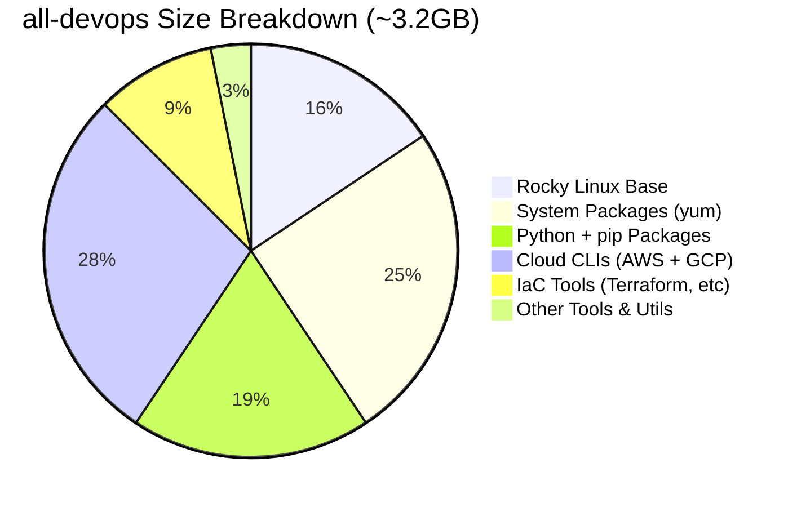

# Image Size Optimization

Learn how to optimize DevOps Image builds for faster pulls, reduced storage, and improved performance.

## Size Breakdown

Understanding where the size comes from helps identify optimization opportunities:



### Component Sizes

| Component | Approximate Size | Optimization Potential |
|-----------|------------------|----------------------|
| **Rocky Linux 9 Base** | ~500 MB | ❌ Minimal (required base) |
| **System Packages** | ~800 MB | ⚠️  Moderate (clean cache) |
| **Python + Packages** | ~600 MB | ✅ High (reduce packages) |
| **AWS CLI + gcloud** | ~900 MB | ✅ High (use single-cloud image) |
| **Terraform & IaC Tools** | ~300 MB | ⚠️  Moderate (pin versions) |
| **Other Tools** | ~100 MB | ⚠️  Low (essential utils) |

---

## Quick Wins: Reduce Image Size

### 1. Use Cloud-Specific Images

**Savings**: ~300-400 MB

Instead of `all-devops`, use `aws-devops` or `gcp-devops` if you only need one cloud provider.

| Image | Size | Cloud Tools | Savings |
|-------|------|-------------|---------|
| **all-devops** | ~3.2 GB | AWS + GCP | Baseline |
| **aws-devops** | ~2.8 GB | AWS only | **-400 MB** |
| **gcp-devops** | ~2.9 GB | GCP only | **-300 MB** |

```bash
# Instead of
docker pull ghcr.io/jinalshah/devops/images/all-devops:latest

# Use
docker pull ghcr.io/jinalshah/devops/images/aws-devops:latest  # If AWS-only
```

### 2. Multi-Stage Builds for Custom Images

**Savings**: Variable, can be 500+ MB

Build a custom image with only the tools you need:

```dockerfile
# Build stage - includes build tools
FROM ghcr.io/jinalshah/devops/images/all-devops:latest AS builder

# Install additional tools or build artifacts
RUN pip3 install --no-cache-dir custom-package

# Final stage - minimal runtime
FROM rockylinux:9-minimal

# Copy only what you need from builder
COPY --from=builder /usr/local/bin/custom-tool /usr/local/bin/
COPY --from=builder /usr/bin/terraform /usr/bin/
COPY --from=builder /usr/bin/kubectl /usr/bin/

# Your application code
WORKDIR /workspace
CMD ["zsh"]
```

### 3. Remove Unused Python Packages

**Savings**: ~100-200 MB

```dockerfile
FROM ghcr.io/jinalshah/devops/images/all-devops:latest

# Remove packages you don't use
RUN pip3 uninstall -y ansible && \
    yum remove -y ansible && \
    yum clean all
```

### 4. Clean Package Manager Caches

**Savings**: ~50-100 MB

Already done in base images, but verify in custom builds:

```dockerfile
RUN yum install -y package-name && \
    yum clean all && \
    rm -rf /var/cache/yum
```

---

## Layer Optimization Strategies

### Order Dockerfile Instructions by Change Frequency

Layers that change less frequently should come first:

**✅ Good**: Maximize cache hits

```dockerfile
# 1. Base OS (changes almost never)
FROM rockylinux:9

# 2. System packages (changes rarely)
RUN yum install -y git curl wget

# 3. Binary downloads (version updates occasionally)
RUN curl -LO https://releases.hashicorp.com/terraform/1.7.0/terraform_1.7.0_linux_amd64.zip

# 4. Python packages (moderate change frequency)
RUN pip3 install ansible

# 5. Application code (changes frequently)
COPY scripts/ /usr/local/bin/
```

**❌ Bad**: Frequent cache invalidation

```dockerfile
FROM rockylinux:9

# Application code changes frequently, invalidates all subsequent layers
COPY scripts/ /usr/local/bin/

# These get rebuilt every time even though they don't change
RUN yum install -y git curl wget
RUN pip3 install ansible
```

### Combine RUN Commands

**✅ Good**: Fewer layers

```dockerfile
RUN yum install -y \
      git \
      curl \
      wget && \
    yum clean all && \
    rm -rf /var/cache/yum
```

**❌ Bad**: More layers

```dockerfile
RUN yum install -y git
RUN yum install -y curl
RUN yum install -y wget
RUN yum clean all
```

### Use .dockerignore

Prevent unnecessary files from being added to the build context:

```gitignore
# .dockerignore
.git
.github
*.md
tests/
.env
.env.*
*.log
.DS_Store
node_modules/
__pycache__/
*.pyc
.terraform/
*.tfstate
*.tfstate.backup
```

**Savings**: Faster builds, no impact on image size but improves build performance

---

## Build Argument Optimization

### Pin Versions for Reproducibility

```bash
# Good - consistent builds
docker build \
  --build-arg TERRAFORM_VERSION=1.7.0 \
  --build-arg PYTHON_VERSION=3.12 \
  -t custom-devops:1.0.0 .

# Avoid - unpredictable builds
docker build -t custom-devops:latest .
```

### Use BuildKit Cache Mounts

**Savings**: Faster rebuilds (not smaller images, but faster iteration)

```dockerfile
# syntax=docker/dockerfile:1

FROM rockylinux:9

# Cache pip downloads across builds
RUN --mount=type=cache,target=/root/.cache/pip \
    pip3 install ansible boto3 requests

# Cache yum packages
RUN --mount=type=cache,target=/var/cache/yum \
    yum install -y git curl wget && \
    yum clean all
```

Build with BuildKit:

```bash
DOCKER_BUILDKIT=1 docker build -t custom-devops:latest .
```

---

## Compression and Export Optimization

### Export and Compress for Distribution

```bash
# Save image to tar
docker save ghcr.io/jinalshah/devops/images/all-devops:latest \
  -o all-devops.tar

# Compress with gzip
gzip all-devops.tar
# Result: all-devops.tar.gz (~1.2 GB compressed from ~3.2 GB)

# Or use better compression with zstd
docker save ghcr.io/jinalshah/devops/images/all-devops:latest | \
  zstd -19 -o all-devops.tar.zst
# Result: ~1.0 GB with better compression
```

### Squash Layers (Use with Caution)

**Savings**: Can reduce size by eliminating intermediate layers

```bash
docker build --squash -t custom-devops:latest .
```

!!! warning "Squash Trade-offs"
    **Pros**:

    - Single layer = smaller total size
    - Simpler layer structure

    **Cons**:

    - Loses layer caching benefits
    - Slower rebuilds
    - Harder to debug

    **Recommendation**: Only squash final production images, not development images

---

## Build Performance Optimization

### Parallel Builds

Build multiple images simultaneously:

```bash
# Build all variants in parallel
docker build --target all-devops -t all-devops:latest . &
docker build --target aws-devops -t aws-devops:latest . &
docker build --target gcp-devops -t gcp-devops:latest . &
wait
```

### Use BuildKit for Better Performance

BuildKit provides:

- ✅ Parallel build stage execution
- ✅ Better caching
- ✅ Faster builds

```bash
# Enable BuildKit globally
export DOCKER_BUILDKIT=1

# Or per-build
DOCKER_BUILDKIT=1 docker build -t custom-devops:latest .
```

---

## Before/After Optimization Examples

### Example 1: AWS-Only Deployment

**Before**: Using `all-devops`

```bash
# Pull time: ~2-3 minutes (3.2 GB)
docker pull ghcr.io/jinalshah/devops/images/all-devops:latest
```

**After**: Using `aws-devops`

```bash
# Pull time: ~1.5-2 minutes (2.8 GB)
docker pull ghcr.io/jinalshah/devops/images/aws-devops:latest
```

**Savings**: ~400 MB, ~30% faster pulls

### Example 2: Custom Build with Minimal Tools

**Before**: Using base image with all tools (~3.2 GB)

**After**: Custom multi-stage build with only Terraform + kubectl

```dockerfile
FROM ghcr.io/jinalshah/devops/images/all-devops:latest AS base

FROM rockylinux:9-minimal
COPY --from=base /usr/bin/terraform /usr/bin/
COPY --from=base /usr/bin/kubectl /usr/bin/
COPY --from=base /usr/bin/zsh /usr/bin/
COPY --from=base /root/.oh-my-zsh /root/.oh-my-zsh
RUN dnf install -y git curl && dnf clean all
WORKDIR /workspace
CMD ["zsh"]
```

**Result**: ~800 MB (75% reduction)

---

## CI/CD Optimization

### 1. Use Image Caching in Pipelines

=== "GitHub Actions"

    ```yaml
    - name: Set up Docker Buildx
      uses: docker/setup-buildx-action@v3

    - name: Build and push
      uses: docker/build-push-action@v5
      with:
        context: .
        push: true
        cache-from: type=gha
        cache-to: type=gha,mode=max
    ```

=== "GitLab CI"

    ```yaml
    build:
      image: docker:latest
      services:
        - docker:dind
      variables:
        DOCKER_DRIVER: overlay2
        DOCKER_BUILDKIT: 1
      script:
        - docker build --cache-from $CI_REGISTRY_IMAGE:latest -t $CI_REGISTRY_IMAGE:latest .
    ```

### 2. Pin Image Versions

```yaml
# Good - immutable, cacheable
container:
  image: ghcr.io/jinalshah/devops/images/all-devops:1.0.abc1234

# Avoid - unpredictable, cache invalidation
container:
  image: ghcr.io/jinalshah/devops/images/all-devops:latest
```

### 3. Pre-pull Images in Setup

```yaml
# GitHub Actions example
- name: Pre-pull image
  run: docker pull ghcr.io/jinalshah/devops/images/all-devops:1.0.abc1234

- name: Run deployment
  run: |
    docker run --rm \
      -v $PWD:/workspace \
      ghcr.io/jinalshah/devops/images/all-devops:1.0.abc1234 \
      terraform apply -auto-approve
```

---

## Monitoring Image Size

### Check Layer Sizes

```bash
# View all layers
docker history ghcr.io/jinalshah/devops/images/all-devops:latest

# View sizes sorted
docker history ghcr.io/jinalshah/devops/images/all-devops:latest \
  --no-trunc \
  --format "table {{.Size}}\t{{.CreatedBy}}" | \
  sort -h -r
```

### Compare Images

```bash
# Get image sizes
docker images --format "table {{.Repository}}:{{.Tag}}\t{{.Size}}" | \
  grep devops

# Expected output:
# ghcr.io/jinalshah/devops/images/all-devops:latest    3.2GB
# ghcr.io/jinalshah/devops/images/aws-devops:latest    2.8GB
# ghcr.io/jinalshah/devops/images/gcp-devops:latest    2.9GB
```

### Dive Tool Analysis

Use [dive](https://github.com/wagoodman/dive) to analyze layers:

```bash
# Install dive
docker pull wagoodman/dive

# Analyze image
docker run --rm -it \
  -v /var/run/docker.sock:/var/run/docker.sock \
  wagoodman/dive:latest \
  ghcr.io/jinalshah/devops/images/all-devops:latest
```

---

## Optimization Checklist

- [ ] ✅ Use cloud-specific image if possible (`aws-devops` or `gcp-devops`)
- [ ] ✅ Remove unused Python packages in custom builds
- [ ] ✅ Combine RUN commands to reduce layers
- [ ] ✅ Order Dockerfile by change frequency (base → app code)
- [ ] ✅ Use `.dockerignore` to exclude unnecessary files
- [ ] ✅ Clean package manager caches (`yum clean all`)
- [ ] ✅ Pin versions for reproducible builds
- [ ] ✅ Use BuildKit cache mounts for faster rebuilds
- [ ] ✅ Enable DOCKER_BUILDKIT=1
- [ ] ✅ Use multi-stage builds for custom images
- [ ] ✅ Pin image versions in CI/CD pipelines
- [ ] ✅ Pre-pull images in CI/CD setup phase
- [ ] ✅ Monitor layer sizes with `docker history`

---

## Next Steps

- [Customization Guide](customization.md) - Build your own custom image
- [Build Images Overview](index.md) - General build instructions
- [Architecture](../architecture/index.md) - Understand image composition
- [Choosing an Image](../choosing-an-image.md) - Select the right base image

---

## Additional Resources

- [Docker Best Practices](https://docs.docker.com/develop/develop-images/dockerfile_best-practices/)
- [BuildKit Documentation](https://docs.docker.com/build/buildkit/)
- [Multi-stage Builds](https://docs.docker.com/build/building/multi-stage/)
- [Dive Tool](https://github.com/wagoodman/dive) - Layer analysis
