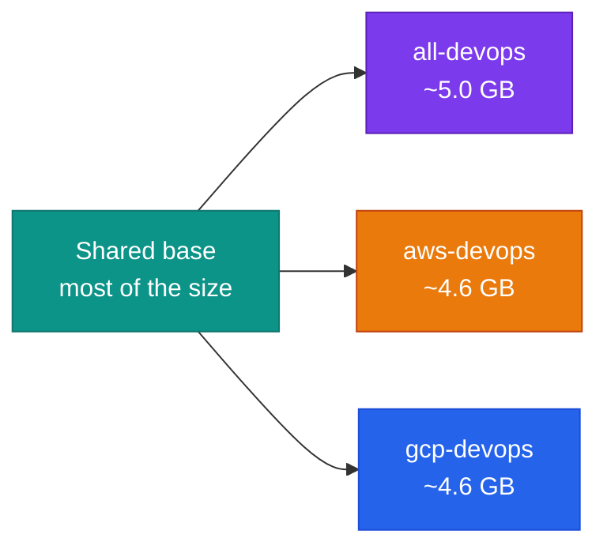

# Size and build optimisation

How big the images really are, where that size comes from, and what actually works if you need something smaller or faster to build.

<div class="di-stats">
  <div class="di-stat"><strong>~1.6 GB</strong><span>all-devops download</span></div>
  <div class="di-stat"><strong>~5.0 GB</strong><span>all-devops unpacked</span></div>
  <div class="di-stat"><strong>&lt; 0.5 GB</strong><span>difference between variants</span></div>
  <div class="di-stat"><strong>2</strong><span>architectures</span></div>
</div>

## Real sizes

Measured from GHCR (`latest`). arm64 downloads are about 0.05 to 0.1 GB smaller.

| Image | Compressed download | Unpacked on disk (amd64) |
|-------|---------------------|--------------------------|
| <span class="di-pill di-pill--all">all-devops</span> | ~1.6 GB | ~5.0 GB |
| <span class="di-pill di-pill--aws">aws-devops</span> | ~1.55 GB | ~4.6 GB |
| <span class="di-pill di-pill--gcp">gcp-devops</span> | ~1.5 GB | ~4.6 GB |

The shared **base** is most of the size: Rocky Linux with the build toolchain (gcc, make, the `-devel` libraries), Python compiled from source with its pip packages, Node.js with four AI CLIs, and a dozen standalone binaries. The cloud layers on top are comparatively small, so switching from `all-devops` to a single-cloud image saves only a few hundred MB.


```mermaid
flowchart LR
  B["Shared base<br/>most of the size"] --> A["all-devops<br/>~5.0 GB"]
  B --> W["aws-devops<br/>~4.6 GB"]
  B --> G["gcp-devops<br/>~4.6 GB"]

  classDef base fill:#0d9488,stroke:#0f766e,color:#fff
  classDef all fill:#7c3aed,stroke:#5b21b6,color:#fff
  classDef aws fill:#ea7a0c,stroke:#c2410c,color:#fff
  classDef gcp fill:#2563eb,stroke:#1d4ed8,color:#fff
  class B base
  class A all
  class W aws
  class G gcp
```

## What works for a smaller image

!!! warning "Deleting in a child image doesn't shrink it"
    `FROM all-devops` followed by `RUN dnf remove …` or `rm -rf …` hides the files but keeps them in the lower layers, so the image is just as big (or bigger). To really shrink, either change the Dockerfile or copy what you need into a fresh base.

=== ":lucide-git-branch: Fork and trim the Dockerfile"

    The most effective option. Delete the install steps you don't need from the `base` stage, then build your target:

    - no AI agents: drop the third `RUN` (Node.js, Claude Code, Codex, Copilot CLI, Antigravity CLI)
    - no databases: drop the MongoDB, PostgreSQL and MySQL client steps
    - a single cloud: build `aws-devops` or `gcp-devops` instead of `all-devops`

    ```bash
    docker build --target aws-devops -t aws-devops:slim .
    ```

=== ":lucide-package: Copy binaries into a fresh base"

    Many of the tools are static binaries in `/usr/local/bin`, so a multi-stage build can copy just those onto a clean Rocky Linux image:

    ```dockerfile
    FROM ghcr.io/jinalshah/devops/images/all-devops:latest AS tools

    FROM rockylinux/rockylinux:10
    COPY --from=tools /usr/local/bin/kubectl   /usr/local/bin/
    COPY --from=tools /usr/local/bin/terraform /usr/local/bin/
    COPY --from=tools /usr/local/bin/helm      /usr/local/bin/
    COPY --from=tools /usr/local/bin/tflint    /usr/local/bin/
    RUN dnf install -y git jq && dnf clean all && rm -rf /var/cache/dnf
    WORKDIR /srv
    CMD ["/bin/bash"]
    ```

    This only works for self-contained binaries. Python tools (Ansible, the AWS CLI's dependencies, gcloud) and Node.js tools need their runtimes too, so install those normally.

=== ":lucide-cloud: Pick a single-cloud image"

    The easiest option, but the smallest saving: `aws-devops` and `gcp-devops` are about 0.4 GB smaller unpacked than `all-devops`.

## Dockerfile habits that keep layers lean

<div class="grid cards" markdown>

-   :lucide-link:{ .lg .middle } __Clean up in the same `RUN`__

    ---

    Files deleted in a later layer still ship. The project Dockerfile removes `/tmp/*`, pip caches and `__pycache__` at the end of each `RUN`.

    ```dockerfile
    RUN dnf install -y httpd-tools && \
        dnf clean all && \
        rm -rf /var/cache/dnf
    ```

-   :lucide-list-checks:{ .lg .middle } __Order by change frequency__

    ---

    Rarely changing steps first and fast-moving ones last, so a version bump only rebuilds the tail. This is why the AI CLIs, which change most often, sit in the last base `RUN`.

-   :lucide-file-x:{ .lg .middle } __Use `.dockerignore`__

    ---

    Keep `.git`, `site/`, `.terraform/` and state files out of the build context. That speeds up builds, though it doesn't change the image size.

-   :lucide-archive:{ .lg .middle } __Cache mounts for faster rebuilds__

    ---

    BuildKit cache mounts keep package downloads between builds without storing them in the image:

    ```dockerfile
    # syntax=docker/dockerfile:1
    RUN --mount=type=cache,target=/var/cache/dnf \
        --mount=type=cache,target=/root/.cache/pip \
        dnf install -y httpd-tools && \
        python3 -m pip install checkov
    ```

</div>

!!! note "`--squash` isn't an option"
    `docker build --squash` is a legacy-builder feature and isn't supported with BuildKit, which is now the default builder. Since the Dockerfile already cleans up inside each `RUN`, flattening the layers would save little anyway.

## Faster pulls in CI

- **Pin one tag per pipeline.** Using the same `1.0.<sha>` (or digest) across jobs lets self-hosted runners reuse layers they've already pulled. `latest` moves with every rebuild.
- **Use GHCR.** Docker Hub rate-limits anonymous pulls.
- **Hosted runners start empty.** GitHub-hosted runners don't keep container layers between jobs, so each job downloads the image again (about 1.5 to 1.6 GB). If that matters, use self-hosted runners or a single job with several steps.

## Measure it yourself

```bash
# Size of local images
docker image ls --format 'table {{.Repository}}:{{.Tag}}\t{{.Size}}' | grep devops

# Layer-by-layer breakdown, biggest first
docker history --no-trunc --format '{{.Size}}\t{{.CreatedBy}}' \
  ghcr.io/jinalshah/devops/images/all-devops:latest | sort -h -r | head

# Compressed size per architecture, straight from the registry
docker buildx imagetools inspect ghcr.io/jinalshah/devops/images/all-devops:latest
```

To analyse the image interactively, use [dive](https://github.com/wagoodman/dive) from your host:

```bash
docker run --rm -it \
  -v /var/run/docker.sock:/var/run/docker.sock \
  wagoodman/dive:latest ghcr.io/jinalshah/devops/images/all-devops:latest
```

## Checklist

- [ ] Use a single-cloud image if you only need one cloud
- [ ] To really shrink, trim the Dockerfile or copy binaries into a fresh base; don't delete in a child image
- [ ] Clean package caches (`dnf clean all`, `rm -rf /var/cache/dnf`, `pip --no-cache-dir`) in the same `RUN`
- [ ] Order steps by how often they change
- [ ] Add a `.dockerignore`
- [ ] Use BuildKit cache mounts for faster rebuilds
- [ ] Pin one tag or digest per pipeline

## Next steps

- [Customisation guide](customization.md)
- [Building images](index.md)
- [Architecture](../architecture/index.md)
- [Docker build best practices](https://docs.docker.com/build/building/best-practices/)
