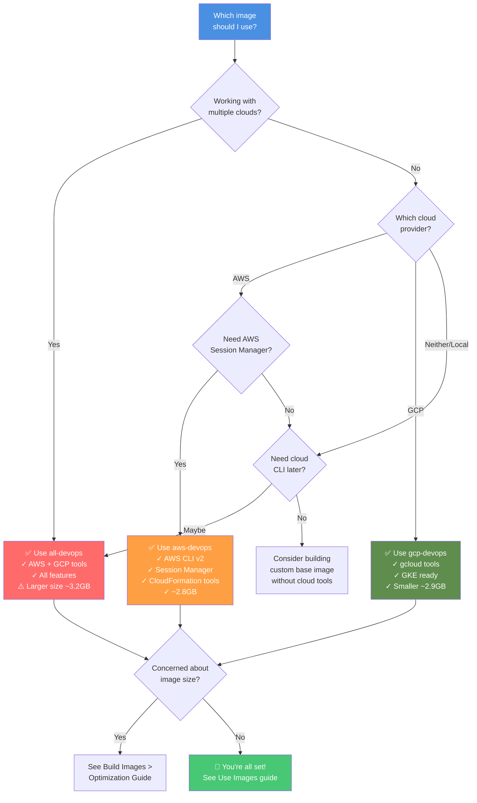
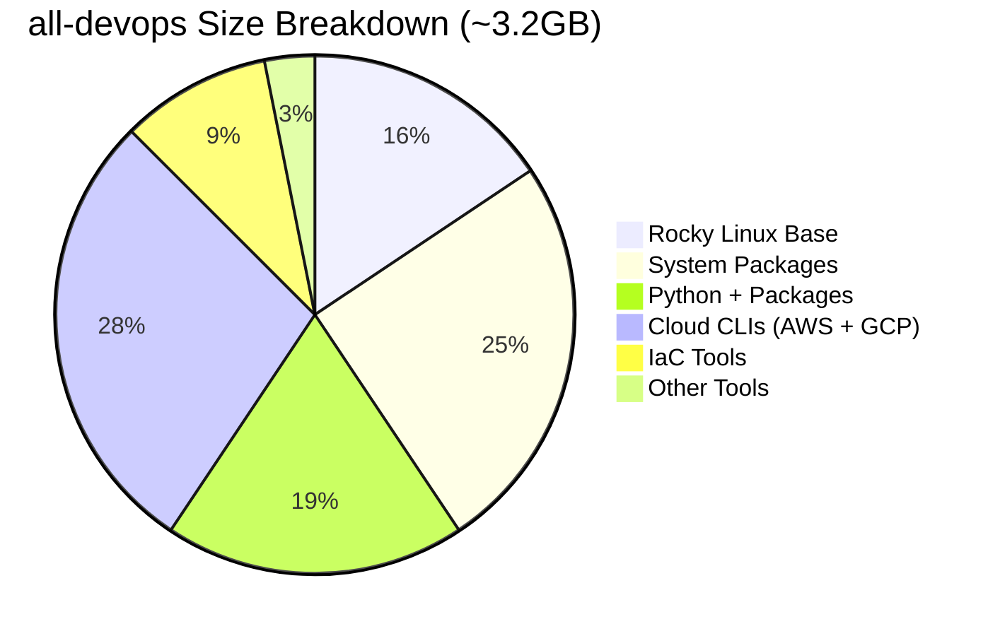

# Choosing the Right Image

Use this guide to select the best DevOps image for your needs.

## Decision Tree



## Quick Comparison

| Feature | all-devops | aws-devops | gcp-devops |
|---------|:----------:|:----------:|:----------:|
| **Base Tools** | ✅ | ✅ | ✅ |
| **Terraform & IaC** | ✅ | ✅ | ✅ |
| **Kubernetes** | ✅ | ✅ | ✅ |
| **AI CLI Tools** | ✅ | ✅ | ✅ |
| **AWS CLI** | ✅ | ✅ | ❌ |
| **gcloud** | ✅ | ❌ | ✅ |
| **Session Manager** | ✅ | ✅ | ❌ |
| **docker-credential-gcr** | ✅ | ❌ | ✅ |
| **Size (approx)** | ~3.2GB | ~2.8GB | ~2.9GB |
| **Best For** | Multi-cloud teams | AWS-first teams | GCP-first teams |

## Use Case Scenarios

### Solo Developer - Local Development

**Recommendation**: Start with **all-devops**

- ✅ Maximum flexibility for experimentation
- ✅ Try both AWS and GCP without switching images
- ✅ All AI CLI tools for productivity
- ⚠️  Slightly larger, but comprehensive

```bash
docker pull ghcr.io/jinalshah/devops/images/all-devops:latest
```

### Team - Standardised AWS Environment

**Recommendation**: **aws-devops**

- ✅ Smaller image for faster CI/CD pulls
- ✅ AWS-specific tools (Session Manager for EC2)
- ✅ No unnecessary GCP tools
- ✅ Team consistency

```bash
docker pull ghcr.io/jinalshah/devops/images/aws-devops:latest
```

### Team - Google Cloud Platform

**Recommendation**: **gcp-devops**

- ✅ GCP-optimised with gcloud
- ✅ GCR authentication built-in
- ✅ Smaller than all-devops
- ✅ GKE-ready

```bash
docker pull ghcr.io/jinalshah/devops/images/gcp-devops:latest
```

### CI/CD Pipeline - Multi-Cloud

**Recommendation**: **all-devops** with version pinning

- ✅ One image for all deployment targets
- ✅ Consistent tooling across pipelines
- ✅ Version pinning for reproducibility
- 🎯 Use immutable tags

```bash
docker pull ghcr.io/jinalshah/devops/images/all-devops:1.0.abc1234
```

### Security-Conscious Team

**Recommendation**: Start with **aws-devops** or **gcp-devops**, scan with Trivy

- ✅ Smaller attack surface (fewer tools)
- ✅ Trivy included for vulnerability scanning
- ✅ Pin specific versions in production
- 🔒 Regular security updates

```bash
# Pull and scan
docker pull ghcr.io/jinalshah/devops/images/aws-devops:latest
docker run --rm \
  -v /var/run/docker.sock:/var/run/docker.sock \
  ghcr.io/jinalshah/devops/images/aws-devops:latest \
  trivy image ghcr.io/jinalshah/devops/images/aws-devops:latest
```

## Size vs Features Trade-off

### What's in Each Image?



### Size Optimisation Strategies

!!! tip "Reduce Image Size"
    If size is a concern:

    1. **Use cloud-specific images** - Save ~300-400MB by using aws-devops or gcp-devops instead of all-devops
    2. **Pin versions** - Use immutable tags for Docker layer caching in CI/CD
    3. **Build custom** - Remove tools you don't need (see [Customisation Guide](build-images/customisation.md))
    4. **Multi-stage builds** - Copy only what you need into final stage

## Feature Comparison Matrix

### Infrastructure as Code Tools

| Tool | all-devops | aws-devops | gcp-devops | Notes |
|------|:----------:|:----------:|:----------:|-------|
| Terraform | ✅ | ✅ | ✅ | Multi-version via tfswitch |
| Terragrunt | ✅ | ✅ | ✅ | Latest stable |
| TFLint | ✅ | ✅ | ✅ | Linting and validation |
| Packer | ✅ | ✅ | ✅ | Image building |

### Kubernetes Tools

| Tool | all-devops | aws-devops | gcp-devops | Notes |
|------|:----------:|:----------:|:----------:|-------|
| kubectl | ✅ | ✅ | ✅ | Latest stable |
| Helm 3 | ✅ | ✅ | ✅ | Package manager |
| k9s | ✅ | ✅ | ✅ | Terminal UI |

### Cloud Provider Tools

| Tool | all-devops | aws-devops | gcp-devops | Notes |
|------|:----------:|:----------:|:----------:|-------|
| AWS CLI v2 | ✅ | ✅ | ❌ | AWS service management |
| Session Manager Plugin | ✅ | ✅ | ❌ | EC2 instance access |
| gcloud | ✅ | ❌ | ✅ | GCP service management |
| docker-credential-gcr | ✅ | ❌ | ✅ | GCR authentication |

### AI CLI Tools

| Tool | all-devops | aws-devops | gcp-devops | Notes |
|------|:----------:|:----------:|:----------:|-------|
| Claude CLI | ✅ | ✅ | ✅ | Code review, architecture |
| Codex CLI | ✅ | ✅ | ✅ | Code generation |
| Copilot CLI | ✅ | ✅ | ✅ | GitHub integration |
| Gemini CLI | ✅ | ✅ | ✅ | Multi-modal, GCP-aware |

### Configuration Management

| Tool | all-devops | aws-devops | gcp-devops | Notes |
|------|:----------:|:----------:|:----------:|-------|
| Ansible | ✅ | ✅ | ✅ | Latest stable |
| ansible-lint | ✅ | ✅ | ✅ | Playbook validation |
| pre-commit | ✅ | ✅ | ✅ | Git hook framework |
| Task | ✅ | ✅ | ✅ | Modern task runner |

## Still Not Sure?

!!! question "Need Help Deciding?"
    - **Starting fresh?** → Use **all-devops** for maximum flexibility
    - **Existing AWS infrastructure?** → Use **aws-devops** for optimal size
    - **Using GKE/Cloud Run?** → Use **gcp-devops** for GCP integration
    - **CI/CD with multi-cloud deployments?** → Use **all-devops** with version pinning
    - **Want to customise?** → Build your own based on any variant ([guide](build-images/customisation.md))

## Registry Choice

All images are available in three registries:

=== "GitHub Container Registry (Recommended)"

    ```bash
    ghcr.io/jinalshah/devops/images/{image-name}:latest
    ```

    **Why GHCR?**

    - ✅ No rate limits for public images
    - ✅ Best availability and uptime
    - ✅ Integrated with GitHub releases
    - ✅ Fast global CDN

=== "GitLab Container Registry"

    ```bash
    registry.gitlab.com/jinal-shah/devops/images/{image-name}:latest
    ```

    **Why GitLab?**

    - ✅ Native GitLab CI integration
    - ✅ Good for GitLab-first organisations
    - ✅ Private runner support

=== "Docker Hub"

    ```bash
    js01/{image-name}:latest
    ```

    **Why Docker Hub?**

    - ✅ Familiar to most developers
    - ⚠️  Rate limits apply (100 pulls/6h for anonymous)
    - 💡 Best for authenticated users with Pro/Team accounts

## Next Steps

Once you've chosen your image:

1. **Get Started**: Follow the [Quick Start Guide](quick-start.md)
2. **Pull the Image**: See [Use Images](use-images/index.md) for pull commands
3. **Set Up Authentication**: Configure [credentials and volume mounts](use-images/authentication.md)
4. **Explore Workflows**: Check out [real-world examples](workflows/index.md)
5. **Customise**: Learn how to [build custom images](build-images/customisation.md)

---

**Quick Links**:

- [Architecture Overview](architecture/index.md)
- [Tool Basics](tool-basics/index.md)
- [Troubleshooting](troubleshooting/index.md)
