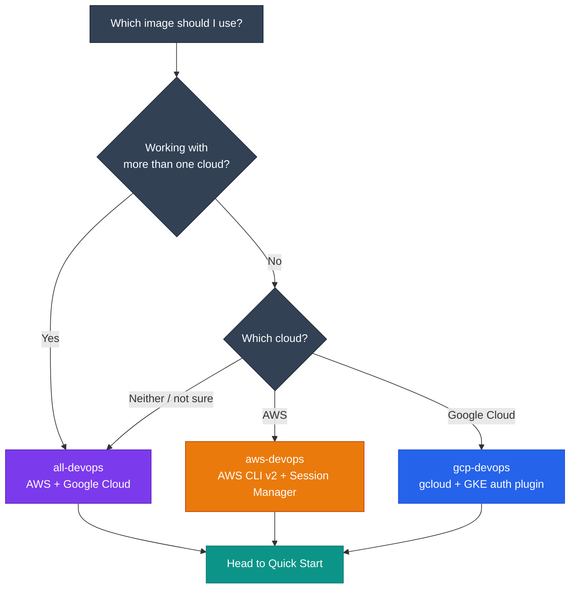

# Choosing the Right Image

Use this guide to pick the best image for you. Answer three quick questions, or read on for the full comparison.

<div class="di-widget" data-di-picker markdown>
!!! note "Interactive picker"
    This picker needs JavaScript. Without it, use the decision tree below.
</div>

## Decision tree


```mermaid
flowchart TD
    START["Which image should I use?"] --> Q1{"Working with<br/>more than one cloud?"}
    Q1 -->|Yes| ALL["all-devops<br/>AWS + Google Cloud"]
    Q1 -->|No| Q2{"Which cloud?"}
    Q2 -->|AWS| AWS["aws-devops<br/>AWS CLI v2 + Session Manager"]
    Q2 -->|Google Cloud| GCP["gcp-devops<br/>gcloud + GKE auth plugin"]
    Q2 -->|"Neither / not sure"| ALL
    ALL --> DONE["Head to Quick Start"]
    AWS --> DONE
    GCP --> DONE

    classDef q fill:#334155,stroke:#1e293b,color:#fff
    classDef all fill:#7c3aed,stroke:#5b21b6,color:#fff
    classDef aws fill:#ea7a0c,stroke:#c2410c,color:#fff
    classDef gcp fill:#2563eb,stroke:#1d4ed8,color:#fff
    classDef done fill:#0d9488,stroke:#0f766e,color:#fff
    class START,Q1,Q2 q
    class ALL all
    class AWS aws
    class GCP gcp
    class DONE done
```

!!! info "Everything else is identical"
    All three images share the same base: Terraform, Terragrunt, TFLint, Packer, kubectl, Helm, k9s, Ansible, Trivy, Python, Node.js, the four AI coding agents, database clients and network tools. You're only choosing which **cloud CLIs** come on top.

## At a glance

| | <span class="di-pill di-pill--all">all-devops</span> | <span class="di-pill di-pill--aws">aws-devops</span> | <span class="di-pill di-pill--gcp">gcp-devops</span> |
|---|:---:|:---:|:---:|
| Shared base toolkit | :material-check: | :material-check: | :material-check: |
| AWS CLI v2 + Session Manager plugin | :material-check: | :material-check: | — |
| boto3, cfn-lint, s3cmd, pytest | :material-check: | :material-check: | — |
| gcloud (+ beta), gsutil, bq | :material-check: | — | :material-check: |
| GKE auth plugin, docker-credential-gcr | :material-check: | — | :material-check: |
| Download (compressed, amd64) | ~1.6 GB | ~1.55 GB | ~1.5 GB |
| On disk (unpacked, amd64) | ~5.0 GB | ~4.6 GB | ~4.6 GB |
| Best for | Multi-cloud and platform teams | AWS-first teams | Google Cloud-first teams |

!!! tip "Size isn't a big differentiator"
    The shared base is most of each image, so the single-cloud images are only about 0.4 GB smaller on disk than `all-devops`. Choose on the tools you need, not on size. If you do need something slimmer, [build a custom image](build-images/customization.md) from the `base` target.

## Scenarios

=== ":lucide-user: Solo developer"

    **Use <span class="di-pill di-pill--all">all-devops</span>**

    - Try AWS and Google Cloud without switching images
    - Every tool is there when you need it

    ```bash
    docker pull ghcr.io/jinalshah/devops/images/all-devops:latest
    ```

=== ":fontawesome-brands-aws: AWS team"

    **Use <span class="di-pill di-pill--aws">aws-devops</span>**

    - AWS CLI v2, SSO profiles and the Session Manager plugin for EC2 access without SSH
    - boto3 and cfn-lint for scripting and CloudFormation
    - No Google Cloud SDK to keep patched

    ```bash
    docker pull ghcr.io/jinalshah/devops/images/aws-devops:latest
    ```

=== ":simple-googlecloud: Google Cloud team"

    **Use <span class="di-pill di-pill--gcp">gcp-devops</span>**

    - gcloud with beta components, gsutil and bq
    - `gke-gcloud-auth-plugin`, so `gcloud container clusters get-credentials` and kubectl work against GKE
    - `docker-credential-gcr` for Artifact Registry authentication

    ```bash
    docker pull ghcr.io/jinalshah/devops/images/gcp-devops:latest
    ```

=== ":lucide-workflow: Multi-cloud CI/CD"

    **Use <span class="di-pill di-pill--all">all-devops</span> with a pinned tag**

    - One image for every deployment target
    - Pin a per-commit `1.0.<short-sha>` tag, or a `@sha256:` digest for exact bits (scheduled rebuilds refresh tags with newer tools)

    ```yaml
    container:
      image: ghcr.io/jinalshah/devops/images/all-devops:1.0.abc1234
    ```

=== ":lucide-shield-check: Security-conscious"

    **Use the single-cloud image you need, and scan it**

    - Fewer tools means a smaller attack surface
    - Trivy is included, and it can scan any registry image directly (no Docker daemon needed):

    ```bash
    docker run --rm ghcr.io/jinalshah/devops/images/aws-devops:latest \
      trivy image --severity HIGH,CRITICAL ghcr.io/jinalshah/devops/images/aws-devops:latest
    ```

## Tool matrix

=== "Infrastructure as code"

    | Tool | all | aws | gcp | Notes |
    |------|:---:|:---:|:---:|-------|
    | Terraform | :material-check: | :material-check: | :material-check: | Latest at build time; switch versions with tfswitch |
    | Terragrunt | :material-check: | :material-check: | :material-check: | Pinned per build, bumped automatically |
    | TFLint | :material-check: | :material-check: | :material-check: | Pinned per build, bumped automatically |
    | Packer | :material-check: | :material-check: | :material-check: | Pinned per build, bumped automatically |

=== "Kubernetes"

    | Tool | all | aws | gcp | Notes |
    |------|:---:|:---:|:---:|-------|
    | kubectl | :material-check: | :material-check: | :material-check: | Client v1.31 (see [Base layer](architecture/base-layer.md#run-2-downloaded-binaries)) |
    | Helm 3 | :material-check: | :material-check: | :material-check: | Package manager |
    | k9s | :material-check: | :material-check: | :material-check: | Terminal UI |
    | gke-gcloud-auth-plugin | :material-check: | — | :material-check: | Needed for GKE clusters |

=== "Cloud"

    | Tool | all | aws | gcp | Notes |
    |------|:---:|:---:|:---:|-------|
    | AWS CLI v2 | :material-check: | :material-check: | — | |
    | Session Manager plugin | :material-check: | :material-check: | — | `aws ssm start-session` |
    | gcloud, gsutil, bq | :material-check: | — | :material-check: | With `beta` components |
    | docker-credential-gcr | :material-check: | — | :material-check: | Registry credential helper |

=== "AI coding agents"

    | Tool | all | aws | gcp | Notes |
    |------|:---:|:---:|:---:|-------|
    | Claude Code (`claude`) | :material-check: | :material-check: | :material-check: | Anthropic |
    | Codex CLI (`codex`) | :material-check: | :material-check: | :material-check: | OpenAI |
    | Copilot CLI (`copilot`) | :material-check: | :material-check: | :material-check: | GitHub |
    | Antigravity CLI (`agy`) | :material-check: | :material-check: | :material-check: | Google (replaces Gemini CLI) |

=== "Automation & quality"

    | Tool | all | aws | gcp | Notes |
    |------|:---:|:---:|:---:|-------|
    | Ansible + ansible-lint | :material-check: | :material-check: | :material-check: | |
    | pre-commit | :material-check: | :material-check: | :material-check: | Git hook framework |
    | Task | :material-check: | :material-check: | :material-check: | Taskfile runner |
    | Trivy | :material-check: | :material-check: | :material-check: | Vulnerability and IaC scanner |

The [tool explorer](use-images/quick-reference.md#tool-explorer) lets you search all of them.

## Registry choice

=== ":simple-github: GHCR (recommended)"

    ```bash
    ghcr.io/jinalshah/devops/images/<image>:latest
    ```

    The recommended registry, and it's where each image's package page lives.

=== ":simple-gitlab: GitLab"

    ```bash
    registry.gitlab.com/jinal-shah/devops/images/<image>:latest
    ```

    Handy if your pipelines already run on GitLab CI.

=== ":simple-docker: Docker Hub"

    ```bash
    js01/<image>:latest
    ```

    Familiar, but anonymous pulls are rate-limited, so log in with `docker login` in CI.

## Next steps

<div class="grid cards" markdown>

-   :lucide-rocket: [__Quick start__](quick-start.md)

    Pull, run and mount your project.

-   :lucide-key-round: [__Authentication__](use-images/authentication.md)

    Credentials and volume mounts.

-   :lucide-workflow: [__Workflows__](workflows/index.md)

    Real-world CI/CD examples.

-   :lucide-hammer: [__Customise__](build-images/customization.md)

    Build your own variant.

</div>
