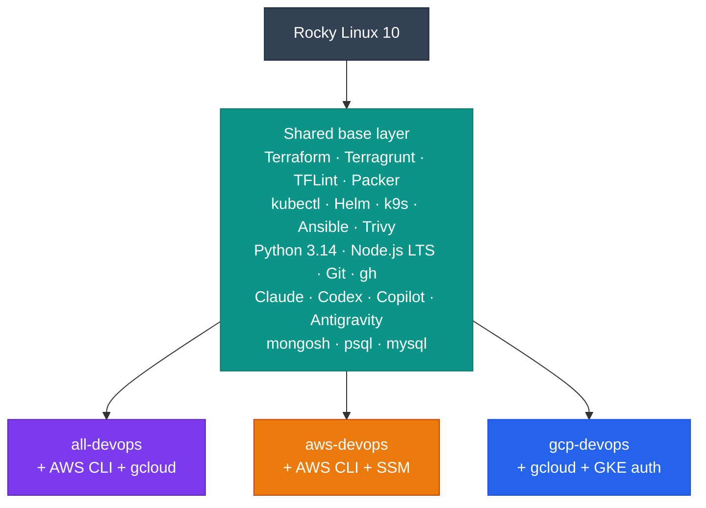

<div class="di-hero" markdown>

<div class="di-hero-badges"><span>Rocky Linux 10</span><span>amd64 + arm64</span><span>Rebuilt weekly</span><span>3 registries</span></div>

# Your whole DevOps toolbox, in one container

Terraform, Kubernetes, AWS, Google Cloud, Ansible, security scanning, database clients and four AI coding agents, pre-installed and ready to go. You don't need to install anything on your machine or your CI runners.

[:lucide-rocket: Quick start](quick-start.md){ .md-button .md-button--primary }
[:lucide-compass: Pick an image](choosing-an-image.md){ .md-button }
[:simple-github: GitHub](https://github.com/jinalshah/devops-images){ .md-button }

</div>

<div class="di-stats">
  <div class="di-stat"><strong>3</strong><span>image variants</span></div>
  <div class="di-stat"><strong>40+</strong><span>tools pre-installed</span></div>
  <div class="di-stat"><strong>4</strong><span>AI coding agents</span></div>
  <div class="di-stat"><strong>2</strong><span>CPU architectures</span></div>
</div>

<div class="di-terminal" data-di-terminal></div>

## Choose your image

All three images share the same base toolkit. They differ only in which cloud CLIs they add on top.

<div class="grid cards di-images" markdown>

-   :lucide-layers:{ .lg .middle } __all-devops__

    ---

    Everything: **AWS CLI v2 + Session Manager** *and* **Google Cloud CLI**. Best for multi-cloud and platform teams.

    `ghcr.io/jinalshah/devops/images/all-devops`

    [:octicons-arrow-right-24: All DevOps guide](use-images/all-devops.md)

-   :fontawesome-brands-aws:{ .lg .middle } __aws-devops__

    ---

    AWS CLI v2, Session Manager plugin, boto3, cfn-lint and s3cmd, with no Google Cloud SDK.

    `ghcr.io/jinalshah/devops/images/aws-devops`

    [:octicons-arrow-right-24: AWS DevOps guide](use-images/aws-devops.md)

-   :simple-googlecloud:{ .lg .middle } __gcp-devops__

    ---

    Google Cloud CLI with beta components, `gsutil`, `bq`, `docker-credential-gcr` and the GKE auth plugin, with no AWS tooling.

    `ghcr.io/jinalshah/devops/images/gcp-devops`

    [:octicons-arrow-right-24: GCP DevOps guide](use-images/gcp-devops.md)

</div>

Not sure? The [interactive image picker](choosing-an-image.md) answers it in three clicks.

## How the images are layered



## What's inside

<div class="grid cards" markdown>

-   :simple-terraform: __Infrastructure as code__

    ---

    Terraform (via tfswitch), Terragrunt, TFLint, Packer

-   :simple-kubernetes: __Kubernetes__

    ---

    kubectl (latest stable), Helm 3, k9s

-   :simple-ansible: __Automation__

    ---

    Ansible, ansible-lint, pre-commit, Task (go-task)

-   :simple-trivy: __Security__

    ---

    Trivy for image, filesystem and IaC scanning

-   :lucide-bot: __AI coding agents__

    ---

    Claude Code, OpenAI Codex CLI, GitHub Copilot CLI, Google Antigravity CLI (`agy`)

-   :lucide-database: __Database clients__

    ---

    MongoDB Shell 8.0, PostgreSQL 17 `psql`, MySQL 8.4 client

-   :simple-python: __Languages & dev tools__

    ---

    Python 3.14, Node.js LTS, Git, GitHub CLI, ghorg, Zensical

-   :lucide-network: __Network & shells__

    ---

    dig, nslookup, nmap, ncat, telnet, curl, wget, lftp, jq · zsh (Oh My Zsh), bash, fish

</div>

:lucide-search: Want to search and filter the whole list? Open the [interactive tool explorer](use-images/quick-reference.md#tool-explorer).

## Quick start

=== ":lucide-play: Try it"

    ```bash
    docker run -it --rm ghcr.io/jinalshah/devops/images/all-devops:latest
    ```

    This drops you into a Zsh shell with every tool available.

=== ":lucide-folder-open: Work on a project"

    ```bash
    docker run -it --rm \
      -v "$PWD":/srv -w /srv \
      -v ~/.ssh:/root/.ssh:ro \
      -v ~/.aws:/root/.aws \
      -v ~/.config/gcloud:/root/.config/gcloud \
      ghcr.io/jinalshah/devops/images/all-devops:latest
    ```

    Your project is mounted at `/srv`, and your SSH keys and cloud credentials come with you.

=== ":lucide-workflow: Use in CI"

    ```yaml
    jobs:
      plan:
        runs-on: ubuntu-latest
        container:
          image: ghcr.io/jinalshah/devops/images/all-devops:1.0.abc1234
        steps:
          - uses: actions/checkout@v4
          - run: terraform init
          - run: terraform plan
    ```

    Pin a `1.0.<short-sha>` tag so pipelines don't change under you, or pin the digest (`@sha256:…`) for byte-for-byte reproducibility.

Want every mount option? Use the [`docker run` builder](quick-start.md#build-your-command).

## Registries and tags

Every image is published to three registries:

| Registry | Image path | Best for |
|----------|------------|----------|
| :simple-github: **GitHub Container Registry** | `ghcr.io/jinalshah/devops/images/<image>:<tag>` | Recommended for most users |
| :simple-gitlab: **GitLab Container Registry** | `registry.gitlab.com/jinal-shah/devops/images/<image>:<tag>` | GitLab CI/CD pipelines |
| :simple-docker: **Docker Hub** | `js01/<image>:<tag>` | Alternative (mind the pull rate limits) |

| Tag | Example | Use for |
|-----|---------|---------|
| **Version** | `1.0.abc1234` | CI/CD: one tag per commit (scheduled rebuilds refresh its tools) |
| **Architecture-specific** | `1.0.abc1234-amd64` | Debugging a single architecture |
| **Latest** | `latest` | Local development: always the newest build from `main` |

Both **linux/amd64** and **linux/arm64** (including Apple Silicon) are published under the same tag, and Docker pulls the right one automatically.

!!! tip "Need byte-for-byte reproducibility?"
    Images are rebuilt weekly (and whenever tool versions are bumped), and a rebuild of the same commit refreshes its `1.0.<sha>` tag with newer tools. To lock a pipeline to exact bits, pin the digest:

    ```bash
    docker buildx imagetools inspect ghcr.io/jinalshah/devops/images/all-devops:latest --format '{{json .Manifest.Digest}}'
    # then use ghcr.io/jinalshah/devops/images/all-devops@sha256:<digest>
    ```

## Why use these images?

<div class="grid cards" markdown>

-   :lucide-user: __For individual developers__

    ---

    - No local tool installation
    - Keep your host clean
    - Same setup on Intel, AMD and Apple Silicon

-   :lucide-users: __For teams__

    ---

    - Everyone runs identical tool versions
    - New starters are productive in minutes
    - Pin a tag or digest for reproducibility

-   :lucide-git-branch: __For CI/CD__

    ---

    - Pre-built, so there's no install step in pipelines
    - Per-commit version tags (or pin a digest)
    - Works on x86 and ARM runners
    - Rebuilt weekly with the latest tools

</div>

## Where next?

<div class="grid cards" markdown>

-   :lucide-rocket: [__Quick start__](quick-start.md)

    Up and running in five minutes.

-   :lucide-container: [__Use the images__](use-images/index.md)

    Mounts, authentication, Compose and everyday patterns.

-   :lucide-workflow: [__Workflows & patterns__](workflows/index.md)

    GitHub Actions, GitLab CI, Jenkins, CircleCI and Terraform.

-   :lucide-hammer: [__Build your own__](build-images/index.md)

    Build locally, customise and go multi-platform.

-   :lucide-book-open: [__Tool basics__](tool-basics/index.md)

    A cheat sheet for every tool in the box.

-   :lucide-life-buoy: [__Troubleshooting__](troubleshooting/index.md)

    Fixes for the most common problems.

</div>
