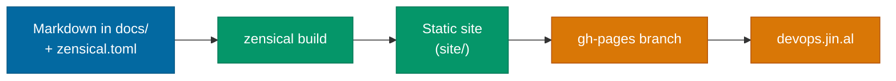

# Reading the Documentation

## Published documentation

The docs site is at **[devops.jin.al](https://devops.jin.al/)** (also reachable from [jinalshah.github.io/devops-images](https://jinalshah.github.io/devops-images/)).

!!! tip "Find things fast"
    Press ++slash++ to search, and use the :lucide-sun: / :lucide-moon: toggle in the header to switch between light and dark mode.

## How the site is built



The docs are built with [Zensical](https://zensical.org/) and configured in `zensical.toml`. The custom colours live in `docs/stylesheets/extra.css`, and the interactive widgets (image picker, `docker run` builder, tool explorer) in `docs/javascripts/extra.js`.

## Preview locally

=== ":simple-python: With Python"

    From the repository root:

    ```bash
    python3 -m pip install --upgrade zensical
    zensical serve
    ```

    Then open [http://localhost:8000](http://localhost:8000). Pages reload as you save.

=== ":simple-docker: With the image itself"

    Every image ships with Zensical, so there's nothing to install:

    ```bash
    docker run --rm -it -p 8000:8000 -v "$PWD":/srv -w /srv \
      ghcr.io/jinalshah/devops/images/all-devops:latest \
      zensical serve -a 0.0.0.0:8000
    ```

## Docs deployment

`.github/workflows/docs.yml` builds and deploys the docs when changes under `docs/**`, to `zensical.toml` or to the workflow itself are pushed to `main` (it can also be run manually). Pull requests that touch the docs run the build without deploying, so build errors show up before merge.

## Common issues

| Problem | Fix |
|---------|-----|
| Port 8000 in use | `zensical serve -a 0.0.0.0:8080` and open port `8080` |
| `zensical: command not found` | `python3 -m pip install --upgrade zensical` |
| Stale pages or assets | Stop and restart `zensical serve`, or run `zensical build --clean` |
