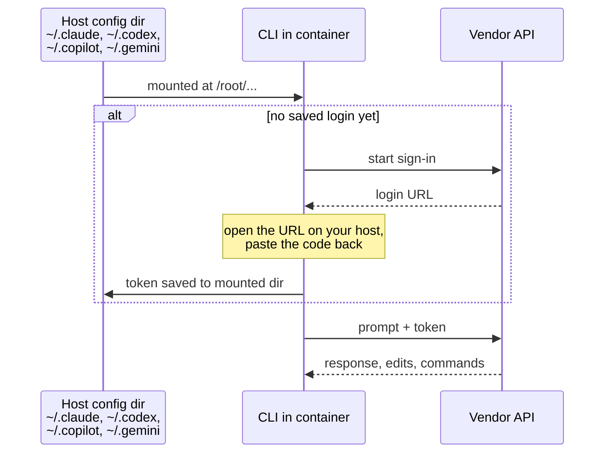

# AI CLI Setup & Usage

Every DevOps image ships four agentic AI coding assistants. Each one can read your project, edit files and run commands, and each has an interactive mode for you and a non-interactive mode for scripts and CI. This page shows how to sign in to each one inside the container and how to call it from a script.

<div class="grid cards" markdown>

-   :simple-claude:{ .lg .middle } __Claude Code__ · `claude`

    ---

    Anthropic's coding agent. Sign in with a Claude subscription or an Anthropic API key.

    [:octicons-arrow-right-24: Set up Claude Code](#claude-code)

-   :lucide-sparkles:{ .lg .middle } __OpenAI Codex CLI__ · `codex`

    ---

    OpenAI's coding agent. Sign in with ChatGPT or an OpenAI API key.

    [:octicons-arrow-right-24: Set up Codex](#openai-codex-cli)

-   :simple-githubcopilot:{ .lg .middle } __GitHub Copilot CLI__ · `copilot`

    ---

    GitHub's standalone agentic terminal assistant (not the old `gh copilot` extension). Needs a Copilot subscription.

    [:octicons-arrow-right-24: Set up Copilot](#github-copilot-cli)

-   :simple-googlegemini:{ .lg .middle } __Google Antigravity CLI__ · `agy`

    ---

    Google's coding agent, and the successor to Gemini CLI. Sign in with a Google account, a Gemini API key or ADC.

    [:octicons-arrow-right-24: Set up Antigravity](#google-antigravity-cli)

</div>

!!! info "Gemini CLI has been replaced by Antigravity CLI"
    On 19 May 2026 Google [announced that Gemini CLI is being replaced by Antigravity CLI](https://developers.googleblog.com/an-important-update-transitioning-gemini-cli-to-antigravity-cli/). From 18 June 2026 Gemini CLI stopped serving free and Google AI Pro/Ultra individual users, so the images now ship `agy` instead of `gemini`.

    Antigravity CLI shares its agent harness with the Antigravity 2.0 desktop app. It still keeps its state under `~/.gemini` and still reads `GEMINI.md` context files, but the commands and the API-key setup are different (see [below](#google-antigravity-cli)). Full docs: [antigravity.google/docs](https://antigravity.google/docs).

## At a glance

| | :simple-claude: Claude Code | :lucide-sparkles: Codex CLI | :simple-githubcopilot: Copilot CLI | :simple-googlegemini: Antigravity CLI |
|---|---|---|---|---|
| **Command** | `claude` | `codex` | `copilot` | `agy` |
| **Installed from** | Native installer | npm `@openai/codex` | npm `@github/copilot` | Google installer (`/usr/local/bin/agy`) |
| **Interactive sign-in** | `claude`, then `/login` | `codex login` (add `--device-auth` when headless) | `copilot`, then `/login` | `agy`, then sign in with Google |
| **CI / headless auth** | `ANTHROPIC_API_KEY` or `CLAUDE_CODE_OAUTH_TOKEN` | `CODEX_API_KEY` | `COPILOT_GITHUB_TOKEN` (fine-grained PAT) | `GEMINI_API_KEY` + `settings.json`, or ADC + `AGY_ADC_AUTH=true` |
| **Non-interactive** | `claude -p "..."` | `codex exec "..."` | `copilot -p "..." --allow-all-tools` | `agy -p "..."` |
| **Config to mount** | `~/.claude` (+ `~/.claude.json`) | `~/.codex` | `~/.copilot` | `~/.gemini` |
| **You need** | Claude plan or Anthropic API key | ChatGPT plan or OpenAI API key | GitHub Copilot subscription | Google account or Gemini API key |

Plans and prices change often, so check each vendor directly: [Claude](https://www.anthropic.com/pricing), [OpenAI API](https://openai.com/api/pricing/), [GitHub Copilot](https://github.com/features/copilot/plans) and [Antigravity](https://antigravity.google/docs).

## How sign-in works in a container

The CLIs keep their login in a config directory under `/root`. Mount that directory from your host and you sign in once, then every new container reuses the login. In CI, where nothing is mounted, you pass a token as an environment variable instead.



Start a container with all four logins mounted (you only need the ones you use):

```bash
touch ~/.claude.json
mkdir -p ~/.claude ~/.codex ~/.copilot ~/.gemini

docker run -it --rm \
  -v "$PWD":/srv -w /srv \
  -v ~/.claude:/root/.claude \
  -v ~/.claude.json:/root/.claude.json \
  -v ~/.codex:/root/.codex \
  -v ~/.copilot:/root/.copilot \
  -v ~/.gemini:/root/.gemini \
  ghcr.io/jinalshah/devops/images/all-devops:latest
```

!!! tip "Create the paths first"
    If a mounted path doesn't exist on the host, Docker creates it as a root-owned **directory**. That breaks `~/.claude.json`, which must be a file, so the `touch` and `mkdir` lines above come first.

!!! note "Host logins don't always carry over"
    Some CLIs keep tokens in the operating system's keychain on macOS and Windows, so mounting the directory doesn't bring the host login with it. Just sign in once inside the container: with the directory mounted, that login is saved and reused. Containers have no browser, so each CLI prints a URL (or a device code) for you to open on your host.

---

## :simple-claude: Claude Code { #claude-code }

=== ":lucide-terminal: Interactive"

    ```bash
    docker run -it --rm \
      -v "$PWD":/srv -w /srv \
      -v ~/.claude:/root/.claude \
      -v ~/.claude.json:/root/.claude.json \
      ghcr.io/jinalshah/devops/images/all-devops:latest \
      claude
    ```

    Type `/login` and pick your Claude subscription or Anthropic Console account. `claude auth status` shows who you're signed in as, and `claude doctor` checks the install.

=== ":lucide-workflow: CI / headless"

    Use an API key from the [Anthropic Console](https://console.anthropic.com/), or create a long-lived subscription token with `claude setup-token` (needs a Claude subscription):

    ```bash
    docker run --rm \
      -v "$PWD":/srv -w /srv \
      -e ANTHROPIC_API_KEY \
      ghcr.io/jinalshah/devops/images/all-devops:latest \
      claude -p "Summarise what this repository deploys"
    ```

    Swap `-e ANTHROPIC_API_KEY` for `-e CLAUDE_CODE_OAUTH_TOKEN` to use the subscription token.

**Non-interactive use:** always pass `-p` (`--print`). Without it, `claude` opens the interactive UI even when you redirect the output. There are no `--file` or `--stdin` flags: pipe content in, or name files in the prompt and Claude reads them from the working directory.

```bash
# Review your uncommitted changes
git diff | claude -p "Review this diff for security issues and risky changes"

# Explain a failure
terraform plan 2>&1 | claude -p "Why did this plan fail, and how do I fix it?"

# Let Claude read files itself
claude -p "Explain what ansible/deploy.yml does, step by step" > deploy-explained.md

# Machine-readable output
claude -p "List the AWS resources in main.tf" --output-format json
```

Other handy flags: `--model`, `-c/--continue` (carry on from the last conversation) and `--permission-mode acceptEdits` (let a `-p` run edit files).

---

## :lucide-sparkles: OpenAI Codex CLI { #openai-codex-cli }

=== ":lucide-terminal: Interactive"

    ```bash
    docker run -it --rm \
      -v "$PWD":/srv -w /srv \
      -v ~/.codex:/root/.codex \
      ghcr.io/jinalshah/devops/images/all-devops:latest \
      codex login --device-auth
    ```

    `--device-auth` gives you a code to enter in your host browser, which suits containers. After that, run `codex` for the interactive agent, or check the login with `codex login status`.

    To use an API key instead of ChatGPT sign-in, store it once:

    ```bash
    printenv OPENAI_API_KEY | codex login --with-api-key
    ```

=== ":lucide-workflow: CI / headless"

    Set `CODEX_API_KEY` for a single `codex exec` run. Nothing is written to disk:

    ```bash
    docker run --rm \
      -v "$PWD":/srv -w /srv \
      -e CODEX_API_KEY \
      ghcr.io/jinalshah/devops/images/all-devops:latest \
      codex exec "Summarise what this repository deploys"
    ```

**Non-interactive use:** use `codex exec` (alias `codex e`). Plain `codex "..."` starts the interactive UI. `codex exec` runs in a read-only sandbox by default. Add `--sandbox workspace-write` when you want it to create or edit files.

```bash
# Review a diff (piped input is added to the prompt)
git diff | codex exec "Review this diff for security issues"

# Let Codex write files in the project
codex exec --sandbox workspace-write \
  "Create scripts/backup-postgres.sh that dumps a PostgreSQL database and uploads it to S3"

# JSONL event stream for tooling
codex exec --json "List the Terraform modules in this repo"
```

Settings live in `~/.codex/config.toml` and credentials in `~/.codex/auth.json`, which you should treat like a password. Set `CODEX_HOME` to move them. `-m/--model` picks a model, and `codex resume` reopens an earlier session.

---

## :simple-githubcopilot: GitHub Copilot CLI { #github-copilot-cli }

`copilot` is GitHub's standalone agentic CLI. It is not IDE inline completion, and the old `gh copilot suggest/explain` extension isn't in the image.

=== ":lucide-terminal: Interactive"

    ```bash
    docker run -it --rm \
      -v "$PWD":/srv -w /srv \
      -v ~/.copilot:/root/.copilot \
      ghcr.io/jinalshah/devops/images/all-devops:latest \
      copilot
    ```

    Type `/login`. In a container it uses the GitHub device flow: open the URL on your host and enter the code.

=== ":lucide-workflow: CI / headless"

    Create a **fine-grained** personal access token with the **Copilot Requests** permission (classic `ghp_` tokens are not supported), and pass it as `COPILOT_GITHUB_TOKEN`:

    ```bash
    docker run --rm \
      -v "$PWD":/srv -w /srv \
      -e COPILOT_GITHUB_TOKEN \
      ghcr.io/jinalshah/devops/images/all-devops:latest \
      copilot -p "Summarise what this repository deploys" --allow-all-tools
    ```

    Copilot checks `COPILOT_GITHUB_TOKEN`, then `GH_TOKEN`, then `GITHUB_TOKEN`.

**Non-interactive use:** `copilot -p "..."` needs `--allow-all-tools` (or `COPILOT_ALLOW_ALL=true`), because it can't stop to ask for permission. Add `-s/--silent` to print only the answer. There's no `--file` flag: name files in the prompt.

```bash
copilot -s --allow-all-tools \
  -p "Review .github/workflows/deploy.yml for security issues and missing caching"
```

Other flags: `--model` and `--output-format text|json`. State lives in `~/.copilot` (set `COPILOT_HOME` to move it).

---

## :simple-googlegemini: Google Antigravity CLI { #google-antigravity-cli }

=== ":lucide-terminal: Interactive"

    ```bash
    docker run -it --rm \
      -v "$PWD":/srv -w /srv \
      -v ~/.gemini:/root/.gemini \
      ghcr.io/jinalshah/devops/images/all-devops:latest \
      agy
    ```

    Sign in with Google when prompted. With no browser available, `agy` prints a URL: open it on your host, then paste the code it shows you back into the terminal. This works in containers and over SSH. Use `/login` and `/logout` inside `agy` to switch accounts.

=== ":lucide-key-round: Gemini API key"

    Setting `GEMINI_API_KEY` on its own is **not** enough, which is different from Gemini CLI. You also have to switch the model provider in `~/.gemini/antigravity-cli/settings.json`:

    ```bash
    mkdir -p ~/.gemini/antigravity-cli
    echo '{"modelProvider": "gemini"}' > ~/.gemini/antigravity-cli/settings.json

    docker run --rm \
      -v "$PWD":/srv -w /srv \
      -v ~/.gemini:/root/.gemini \
      -e GEMINI_API_KEY \
      ghcr.io/jinalshah/devops/images/all-devops:latest \
      agy -p "Summarise what this repository deploys"
    ```

    If you already have a `settings.json`, add the `modelProvider` key to it rather than overwriting the file.

=== ":simple-googlecloud: ADC (Vertex / enterprise)"

    Use Application Default Credentials from your host, or a service account key, and set `AGY_ADC_AUTH=true`. This needs Gemini 3 Flash or newer models.

    ```bash
    gcloud auth application-default login   # on the host

    docker run --rm \
      -v "$PWD":/srv -w /srv \
      -v ~/.config/gcloud:/root/.config/gcloud \
      -e AGY_ADC_AUTH=true \
      ghcr.io/jinalshah/devops/images/gcp-devops:latest \
      agy -p "Summarise what this repository deploys"
    ```

    For a service account, mount the key and set `GOOGLE_APPLICATION_CREDENTIALS` to its path inside the container.

**Non-interactive use:** `agy -p "..."` (`--print`), with `--output-format text|json|stream-json` and `--print-timeout 5m`. When a headless run fails, `agy` exits with code `3` and prints `AGY_ERROR: {json}` on stderr, which is easy to catch in CI. There are no `--file`, `--stdin` or `--image` flags: pipe content in, or name files in the prompt.

```bash
git diff | agy -p "Review this diff for security issues"

trivy config --format json . | agy -p "Prioritise these findings and suggest fixes" > trivy-triage.md

# Let it edit files without asking
agy -p "Add descriptions to every variable in modules/vpc/variables.tf" --mode accept-edits
```

Other flags: `--model`, `--effort low|medium|high`, `--mode plan`, `-c/--continue` and `--sandbox`. Subcommands include `agy models`, `agy mcp` and `agy update`, and `agy --version` prints the version. The binary also updates itself in the background.

??? note "Where Antigravity keeps things"
    - `~/.gemini/antigravity-cli/`: `settings.json`, conversations and logs
    - `~/.gemini/config/`: `mcp_config.json`, `hooks.json`, skills and plugins
    - Tokens go in the OS keyring. Containers have no D-Bus, so there they fall back to files under `~/.gemini`, which is why mounting `~/.gemini` keeps you signed in. `~/.antigravity` is not used.
    - Project context comes from `GEMINI.md` and `AGENTS.md`, and workspace customisations go in `<repo>/.agents/` (`skills/`, `rules/`, `hooks.json`).

---

## Choosing an assistant

All four are capable agentic assistants: each reads and edits files and runs commands, and several accept images too. Pick based on what your team already pays for and signs in with:

- :material-check: **Already on a Claude plan or the Anthropic API?** Use `claude`.
- :material-check: **Already on ChatGPT or the OpenAI API?** Use `codex`.
- :material-check: **Already licensed for GitHub Copilot?** Use `copilot`, with no extra vendor account.
- :material-check: **Google Workspace, a Gemini API key or Vertex AI?** Use `agy`.

A second assistant is also a cheap second opinion: generate with one, then review with another.

## Good habits

!!! tip "Getting good results"
    - **Pipe in the evidence.** `git diff`, `terraform plan` output and `trivy` JSON give the model the facts it needs.
    - **Be specific.** "Check IAM for `*` actions and security groups for `0.0.0.0/0`" beats "review this".
    - **Keep the checks.** Run `terraform validate`, `tflint`, `ansible-lint` and `trivy` on anything an AI writes, then review it yourself.

!!! warning "Permissions and secrets"
    - Flags such as `--allow-all-tools`, `--dangerously-skip-permissions` and `--sandbox danger-full-access` let an agent run any command. Use them only in throwaway containers without production credentials mounted.
    - Pass API keys with `-e VAR` (the value comes from your shell) rather than typing them on the command line, and keep them in your CI's secret store.
    - `~/.codex/auth.json`, `~/.claude` and `~/.gemini` hold live tokens. Never commit them or bake them into an image.

## Troubleshooting

??? question "My script hangs or opens a full-screen UI"
    You started the interactive mode. Use `claude -p`, `codex exec`, `copilot -p ... --allow-all-tools` or `agy -p`.

??? question "I have to sign in every time I start a container"
    The config directory isn't mounted, or it's mounted at the wrong path. Check the table above; for Claude Code, also mount `~/.claude.json`. Then check it's visible inside the container:

    ```bash
    docker run --rm -v ~/.gemini:/root/.gemini \
      ghcr.io/jinalshah/devops/images/all-devops:latest ls -la /root/.gemini
    ```

??? question "`agy` ignores my `GEMINI_API_KEY`"
    Add `{"modelProvider": "gemini"}` to `~/.gemini/antigravity-cli/settings.json`. The environment variable alone doesn't switch `agy` away from Google sign-in.

??? question "Copilot rejects my token"
    Classic `ghp_` tokens aren't supported. Create a fine-grained PAT with the **Copilot Requests** permission on an account that has a Copilot subscription.

??? question "Codex didn't write the file I asked for"
    `codex exec` is read-only by default. Add `--sandbox workspace-write`.

## Next steps

- [AI-assisted DevOps workflows](../workflows/ai-assisted-devops.md): review, generate and troubleshoot, with CI examples
- [Authentication guide](../use-images/authentication.md): cloud, SSH and AI credentials in one place
- [Multi-tool patterns](../workflows/multi-tool-patterns.md): combine AI with Terraform, Trivy and friends
