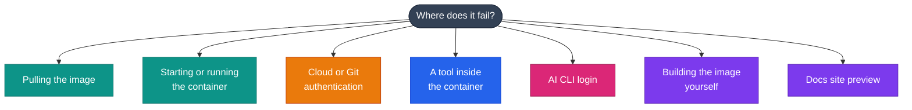

# Troubleshooting

Fixes for the problems people hit most often with DevOps Images. Find your symptom below, then open the matching question.



<div class="grid cards" markdown>

-   :simple-docker:{ .lg .middle } __[Pulling images](#pull)__

    ---

    Access denied, unknown tags, rate limits, wrong architecture

-   :lucide-square-terminal:{ .lg .middle } __[Running containers](#runtime)__

    ---

    Root-owned files, permissions, exits, disk space

-   :lucide-key-round:{ .lg .middle } __[Authentication](#auth)__

    ---

    AWS, Google Cloud and SSH credentials

-   :lucide-wrench:{ .lg .middle } __[Tools](#tools)__

    ---

    Command not found, kubectl, GKE, Terraform locks, Trivy, pip

-   :lucide-bot:{ .lg .middle } __[AI CLIs](#ai-clis)__

    ---

    Claude Code, Codex, Copilot and Antigravity logins

-   :lucide-hammer:{ .lg .middle } __[Building images](#build)__

    ---

    Download failures, build args, memory, cross-architecture

</div>

---

## Pulling images { #pull }

??? question "`pull access denied`, `manifest unknown` or `not found`"

    ```text
    Error response from daemon: manifest for ghcr.io/jinalshah/devops/images/all-devops:1.0 not found
    ```

    1. **Check the path.** The three registries use different paths:

        ```text
        ghcr.io/jinalshah/devops/images/all-devops:latest
        registry.gitlab.com/jinal-shah/devops/images/all-devops:latest
        js01/all-devops:latest
        ```

    2. **Check the tag.** Only `latest`, `1.0.<7-char sha>` and `1.0.<sha>-amd64` / `-arm64` exist. There is no `1.0` tag and no semver tags. To list published tags on GHCR (the packages API needs authentication even for public images, and your `gh` token needs the `read:packages` scope: `gh auth refresh -s read:packages`):

        ```bash
        gh api /users/jinalshah/packages/container/devops%2Fimages%2Fall-devops/versions \
          --jq '.[].metadata.container.tags[]' | head -20
        ```

    3. **Try another registry** if one is having an outage:

        ```bash
        docker pull registry.gitlab.com/jinal-shah/devops/images/all-devops:latest
        ```

    The images are public, so you shouldn't need `docker login` to pull. If you are logged in with an expired token, `docker logout ghcr.io` and try again.

??? question "`toomanyrequests: You have reached your pull rate limit` (Docker Hub)"

    Docker Hub throttles anonymous pulls. Either:

    - pull from GHCR instead: `docker pull ghcr.io/jinalshah/devops/images/all-devops:latest`, or
    - log in to Docker Hub (`docker login`) so the higher authenticated limit applies. In GitHub Actions:

        ```yaml
        - uses: docker/login-action@v4
          with:
            username: ${{ secrets.DOCKERHUB_USERNAME }}
            password: ${{ secrets.DOCKERHUB_TOKEN }}
        ```

??? question "Pulls are slow or time out"

    The images are about 1.5 to 1.6 GB compressed, so a first pull takes a while. In CI, retry transient failures:

    ```bash
    for i in 1 2 3; do
      docker pull ghcr.io/jinalshah/devops/images/all-devops:latest && break
      echo "Attempt $i failed, retrying..."
      sleep $((i * 10))
    done
    ```

    Pick the smallest image that has what you need (`aws-devops` or `gcp-devops`), and on self-hosted runners keep the image cached between jobs.

??? question "`exec format error` or a platform mismatch warning"

    The images are published for `linux/amd64` and `linux/arm64`, and Docker normally picks the right one. If you get the wrong one (for example after pulling a `-amd64` tag on Apple Silicon):

    ```bash
    # What did you get?
    docker run --rm ghcr.io/jinalshah/devops/images/all-devops:latest uname -m
    # x86_64 = amd64, aarch64 = arm64

    # Force the native platform
    docker pull --platform linux/arm64 ghcr.io/jinalshah/devops/images/all-devops:latest
    ```

    Use the plain `1.0.<sha>` tag (the multi-arch manifest) rather than an arch-suffixed one unless you really need a specific architecture.

---

## Running containers { #runtime }

??? question "Files created in the container are owned by root on the host"

    The container runs as root, so files it writes to a bind mount belong to root on Linux hosts. Options:

    === "Fix ownership afterwards"

        ```bash
        docker run --rm -v "$PWD":/srv -w /srv \
          ghcr.io/jinalshah/devops/images/all-devops:latest \
          sh -c 'terraform fmt -recursive && chown -R '"$(id -u):$(id -g)"' /srv'
        ```

    === "Run as your user"

        ```bash
        docker run --rm --user "$(id -u):$(id -g)" -e HOME=/tmp \
          -v "$PWD":/srv -w /srv \
          ghcr.io/jinalshah/devops/images/all-devops:latest \
          terraform fmt -recursive
        ```

    !!! warning
        With `--user`, `HOME` doesn't point at a directory that user can write to (the image has no account for your UID), hence `-e HOME=/tmp`. The shell configuration and aliases in `/root` won't load either. Binaries in `/usr/local/bin` and `/usr/bin` work normally.

    Docker Desktop on macOS and Windows maps ownership for you, so this mostly affects Linux hosts.

??? question "`Permission denied` on a mounted file or directory"

    ```text
    zsh: permission denied: ./script.sh
    ```

    - Make the script executable on the host (`chmod +x script.sh`), or run it with `bash script.sh`.
    - On SELinux hosts (Fedora, RHEL, Rocky), relabel the mount with `:z` (shared) or `:Z` (private):

        ```bash
        docker run --rm -v "$PWD":/srv:z -w /srv \
          ghcr.io/jinalshah/devops/images/all-devops:latest ls
        ```

??? question "The container exits immediately"

    The default command is `/bin/zsh`, which exits straight away without a terminal. Use `-it` for an interactive shell, or give it a command:

    ```bash
    docker run -it --rm ghcr.io/jinalshah/devops/images/all-devops:latest

    # Keep a container running in the background, then exec into it
    docker run -d --name devops ghcr.io/jinalshah/devops/images/all-devops:latest sleep infinity
    docker exec -it devops zsh
    ```

??? question "`no space left on device`"

    Each image is about 4.6 to 5 GB unpacked, and old tags add up quickly.

    ```bash
    docker system df            # what is using space
    docker image prune -a       # remove unused images
    docker system prune         # remove stopped containers, networks and dangling images
    ```

    On Docker Desktop, you can also raise the disk limit in **Settings → Resources**.

??? question "Aliases like `tf` or `k` don't work"

    Aliases are defined in `~/.zshrc` and `~/.bashrc`, so they only exist in interactive Zsh and Bash shells. They aren't available in `docker run <image> <command>`, CI steps, Fish, or when you override `HOME`. Use the full command there. See the [alias list](../tool-basics/index.md#aliases).

---

## Authentication { #auth }

??? question "AWS: `Unable to locate credentials`"

    Only `aws-devops` and `all-devops` include the AWS CLI. Give the container credentials in one of these ways:

    === "Mount ~/.aws"

        ```bash
        docker run --rm -v ~/.aws:/root/.aws \
          -e AWS_PROFILE=my-profile \
          ghcr.io/jinalshah/devops/images/aws-devops:latest \
          aws sts get-caller-identity
        ```

        For IAM Identity Center profiles, the mount needs to be writable so `aws sso login` can refresh the token cache.

    === "Environment variables"

        ```bash
        docker run --rm \
          -e AWS_ACCESS_KEY_ID -e AWS_SECRET_ACCESS_KEY -e AWS_SESSION_TOKEN \
          -e AWS_REGION=eu-west-2 \
          ghcr.io/jinalshah/devops/images/aws-devops:latest \
          aws sts get-caller-identity
        ```

    === "On AWS compute"

        On EC2, ECS or EKS the SDK picks up the instance, task or pod role automatically. On EC2 with IMDSv2, a container on a bridge network may need the instance's metadata hop limit raised to 2.

??? question "Google Cloud: `You do not currently have an active account selected`"

    Only `gcp-devops` and `all-devops` include `gcloud`.

    === "Mount your gcloud config"

        ```bash
        docker run --rm -v ~/.config/gcloud:/root/.config/gcloud \
          ghcr.io/jinalshah/devops/images/gcp-devops:latest \
          gcloud auth list
        ```

    === "Service account key"

        `gcloud` ignores `GOOGLE_APPLICATION_CREDENTIALS` for its own commands, so activate the key explicitly:

        ```bash
        docker run --rm -v /path/to/sa.json:/secrets/sa.json:ro \
          ghcr.io/jinalshah/devops/images/gcp-devops:latest \
          sh -c 'gcloud auth activate-service-account --key-file=/secrets/sa.json && gcloud projects list'
        ```

        Keep `GOOGLE_APPLICATION_CREDENTIALS` for Terraform and the client libraries, which do read it.

    === "Log in inside the container"

        ```bash
        gcloud auth login                         # for gcloud commands
        gcloud auth application-default login     # for Terraform and client libraries
        ```

        Both print a URL; open it on your machine and paste the code back.

??? question "Git: `Permission denied (publickey)`"

    Mount your SSH directory read-only:

    ```bash
    docker run -it --rm -v ~/.ssh:/root/.ssh:ro -v "$PWD":/srv -w /srv \
      ghcr.io/jinalshah/devops/images/all-devops:latest
    ```

    If SSH complains about key permissions, fix them on the host (`chmod 600 ~/.ssh/id_ed25519`). If your key lives in an agent (for example 1Password or macOS Keychain) rather than a file, use HTTPS with `gh auth login` instead.

---

## Tools inside the container { #tools }

??? question "`command not found: aws` or `command not found: gcloud`"

    You're probably in the wrong image. `aws` and `session-manager-plugin` are only in <span class="di-pill di-pill--all">all-devops</span> <span class="di-pill di-pill--aws">aws-devops</span>, and `gcloud`, `gsutil` and `bq` are only in <span class="di-pill di-pill--all">all-devops</span> <span class="di-pill di-pill--gcp">gcp-devops</span>.

    Some tools aren't in any image: the Docker CLI, standalone `kustomize` (use `kubectl apply -k`), `yq`, `terraform-docs` and `gcloud alpha`. The [tool reference](../tool-basics/index.md) lists what's included.

??? question "kubectl: `The connection to the server localhost:8080 was refused`"

    kubectl has no kubeconfig. Mount yours, or generate one inside the container:

    ```bash
    # Mount your host kubeconfig
    docker run -it --rm -v ~/.kube:/root/.kube \
      ghcr.io/jinalshah/devops/images/all-devops:latest

    # Or point at a specific file
    docker run -it --rm -v ~/.kube/prod.yaml:/kubeconfig:ro -e KUBECONFIG=/kubeconfig \
      ghcr.io/jinalshah/devops/images/all-devops:latest

    # EKS
    aws eks update-kubeconfig --name my-cluster --region eu-west-2
    ```

    If your kubeconfig points at `127.0.0.1` (kind, minikube, Docker Desktop), that address means the container itself. Use `--network host` on Linux, or `host.docker.internal` on Docker Desktop.

??? question "GKE: `gcloud container clusters get-credentials` or kubectl fails"

    `gke-gcloud-auth-plugin` is installed in <span class="di-pill di-pill--all">all-devops</span> and <span class="di-pill di-pill--gcp">gcp-devops</span>, so GKE works without extra setup. If it still fails:

    ```bash
    # 1. Is gcloud authenticated, and on the right project?
    gcloud auth list
    gcloud config get-value project

    # 2. Use the cluster's real location: --region for regional clusters, --zone for zonal ones
    gcloud container clusters list
    gcloud container clusters get-credentials my-cluster --region europe-west2 --project my-project

    # 3. Is the plugin there?
    gke-gcloud-auth-plugin --version
    ```

    - `Permission denied` or `403`: your account needs at least `roles/container.clusterViewer` to fetch credentials, plus Kubernetes RBAC rights for what you then run.
    - `executable gke-gcloud-auth-plugin not found`: you're using a kubeconfig written on another machine or in an older image. Run `get-credentials` again inside this container.
    - Private clusters: the container needs network access to the control-plane endpoint (VPN, authorised networks or DNS-based endpoint).

??? question "Terraform: `Error acquiring the state lock`"

    Another run holds the lock, or a crashed run left it behind. Make sure nothing else is running, then:

    ```bash
    terraform force-unlock <LOCK_ID>
    ```

    For S3 backends, `use_lockfile = true` is the current locking option; `dynamodb_table` is deprecated. Check that the container has credentials for the backend (see [Authentication](#auth)).

??? question "Trivy: the first scan is slow or can't download its database"

    No vulnerability database is baked into the image, so each fresh container downloads it. Cache it between runs:

    ```bash
    docker run --rm -v ~/.cache/trivy:/root/.cache/trivy -v "$PWD":/srv -w /srv \
      ghcr.io/jinalshah/devops/images/all-devops:latest trivy fs .
    ```

    If the cache is corrupt, reset it with `trivy clean --all`. Behind a proxy, pass `HTTPS_PROXY` into the container.

??? question "pip installs a package but Python can't import it"

    A bare `pip` may belong to the distribution's Python rather than the default Python 3.14. Always use:

    ```bash
    python3 -m pip install <package>
    ```

??? question "Ansible: `the playbook: playbook.yml could not be found`"

    Your project isn't mounted, or the working directory isn't set. Use the standard mount:

    ```bash
    docker run --rm -v "$PWD":/srv -w /srv -v ~/.ssh:/root/.ssh:ro \
      ghcr.io/jinalshah/devops/images/all-devops:latest \
      ansible-playbook -i inventory.ini playbook.yml
    ```

---

## AI CLI logins { #ai-clis }

Each CLI keeps its login in a directory under `/root`, so mount it to keep the login between containers:

```bash
docker run -it --rm \
  -v "$PWD":/srv -w /srv \
  -v ~/.claude:/root/.claude \
  -v ~/.codex:/root/.codex \
  -v ~/.copilot:/root/.copilot \
  -v ~/.gemini:/root/.gemini \
  ghcr.io/jinalshah/devops/images/all-devops:latest
```

??? question ":simple-claude: Claude Code asks you to log in every time"

    - **Interactive:** run `claude`, then `/login`. `claude auth status` shows the current state.
    - **CI or scripts:** set `ANTHROPIC_API_KEY`, or `CLAUDE_CODE_OAUTH_TOKEN` (created with `claude setup-token`, which needs a Claude subscription). There is no `CLAUDE_API_KEY`.
    - **Persist it:** mount `~/.claude`, and also `~/.claude.json` if you want the global state.
    - **Script hangs or prints a UI:** add `-p`. Without it, `claude` starts the interactive interface even when output is redirected.

??? question ":lucide-bot: Codex: not signed in"

    ```bash
    codex login                  # ChatGPT sign-in
    codex login --device-auth    # no browser in the container
    printenv OPENAI_API_KEY | codex login --with-api-key
    codex login status
    ```

    In CI, set `CODEX_API_KEY` and run `codex exec "..."`. Credentials live in `~/.codex/auth.json`, so mount `~/.codex` and treat it like a password.

??? question ":simple-githubcopilot: Copilot CLI: authentication fails"

    - **Interactive:** run `copilot`, then `/login` (a device-code flow that works without a browser).
    - **Token:** set `COPILOT_GITHUB_TOKEN` (or `GH_TOKEN` / `GITHUB_TOKEN`) to a **fine-grained** personal access token with the "Copilot Requests" permission. Classic `ghp_` tokens are rejected.
    - You need an active Copilot subscription.
    - Non-interactive runs need `--allow-all-tools`: `copilot -p "..." --allow-all-tools`.
    - The image has the standalone `copilot` CLI, not the old `gh copilot` extension.

??? question ":simple-googlegemini: Antigravity CLI (`agy`): can't sign in"

    Antigravity CLI replaced Google's Gemini CLI, and the `gemini` command isn't in the image.

    - **Interactive:** run `agy`. With no browser it prints a URL; open it on your machine, sign in with Google, and paste the code back. Use `/login` and `/logout` inside `agy`. There's no `agy login` subcommand.
    - **Persist it:** mount `~/.gemini`. In containers there's no keyring, so tokens are stored in files there.
    - **Gemini API key (headless):** exporting `GEMINI_API_KEY` alone isn't enough. Also create `~/.gemini/antigravity-cli/settings.json` containing:

        ```json
        {"modelProvider": "gemini"}
        ```

    - **Application Default Credentials:** run `gcloud auth application-default login` (or set `GOOGLE_APPLICATION_CREDENTIALS`), then `export AGY_ADC_AUTH=true`.
    - Headless failures exit with code 3 and print `AGY_ERROR: {...}` on stderr, which usually names the problem.

See [AI CLI setup](../tool-basics/ai-cli-setup.md) for full configuration.

---

## Building images yourself { #build }

??? question "A download step fails during the build"

    ```text
    ERROR: failed to solve: process "/bin/sh -c ..." did not complete successfully
    ```

    Most failures are transient upstream downloads, so retry first. Then:

    ```bash
    # Force fresh downloads
    docker build --no-cache --target all-devops -t all-devops:local .

    # Behind a corporate proxy
    docker build \
      --build-arg HTTP_PROXY=http://proxy:8080 \
      --build-arg HTTPS_PROXY=http://proxy:8080 \
      --target all-devops -t all-devops:local .
    ```

??? question "The build fails after overriding a version with `--build-arg`"

    - Make sure the version exists on the tool's release page, and pass it without a leading `v` (for example `0.68.14`, not `v0.68.14`).
    - Change one argument at a time:

        ```bash
        docker build --build-arg TERRAGRUNT_VERSION=0.68.14 \
          --target all-devops -t all-devops:test .
        ```

    - Python needs **both** arguments, a full version and the matching binary name:

        ```bash
        docker build \
          --build-arg PYTHON_VERSION=3.13.7 \
          --build-arg PYTHON_VERSION_TO_USE=python3.13 \
          --target all-devops -t all-devops:py313 .
        ```

??? question "The build is `Killed` or runs out of memory"

    Compiling Python with optimisations is the heaviest step. Give Docker more memory (Docker Desktop: **Settings → Resources**, 8 GB or more is comfortable), and build the shared base once so later targets reuse its cache:

    ```bash
    docker build --target base -t devops-base:local .
    docker build --target aws-devops -t aws-devops:local .
    ```

??? question "Building for another architecture"

    CI builds each architecture natively. Locally, cross-building works through emulation but is slow:

    ```bash
    docker buildx create --name multiarch --use

    # Load a single platform into your local image store
    docker buildx build --platform linux/arm64 --target all-devops -t all-devops:arm64 --load .
    ```

    Multi-platform builds (`--platform linux/amd64,linux/arm64`) can't be loaded into the classic image store, so push them to a registry with `--push` instead. The containerd image store (the default in Docker Desktop and for new installs of Docker Engine 29 and later) can load them.

---

## Docs site preview { #docs }

??? question "`zensical: command not found`"

    ```bash
    python3 -m pip install --upgrade zensical
    zensical serve
    ```

    Zensical is also pre-installed in every image, so you can preview the docs from a container:

    ```bash
    docker run --rm -it -p 8000:8000 -v "$PWD":/srv -w /srv \
      ghcr.io/jinalshah/devops/images/all-devops:latest \
      zensical serve -a 0.0.0.0:8000
    ```

??? question "Port 8000 is already in use"

    ```bash
    zensical serve -a localhost:8080
    ```

??? question "Changes don't show up"

    Stop the server with ++ctrl+c++, then rebuild from scratch and serve again:

    ```bash
    zensical build --clean
    zensical serve
    ```

    If the page still looks stale, hard-refresh the browser.

---

## Still stuck?

Collect these details and [open an issue](https://github.com/jinalshah/devops-images/issues/new):

```bash
docker version
uname -m
docker image inspect --format '{{index .RepoDigests 0}}' ghcr.io/jinalshah/devops/images/all-devops:latest
```

- [x] The image and tag (or digest) you used
- [x] Your host OS and architecture
- [x] The exact command you ran
- [x] The full error output
- [x] What you expected to happen
