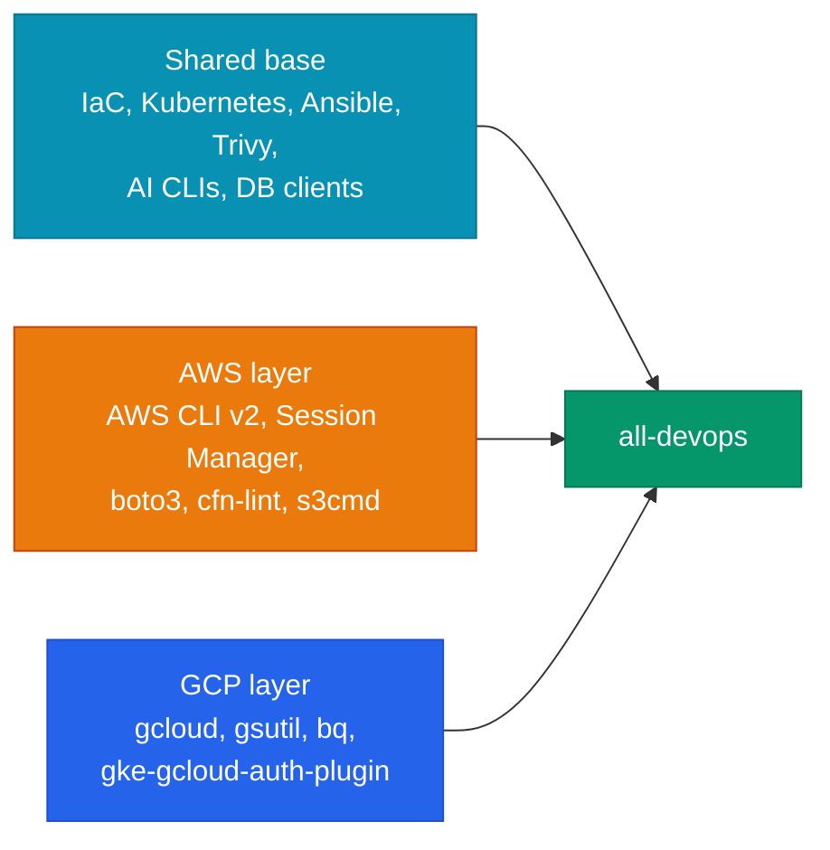

<div class="di-hero" markdown style="background: linear-gradient(120deg, #064e3b 0%, #047857 45%, #0d9488 100%)">

<div class="di-hero-badges"><span>AWS + Google Cloud</span><span>amd64 + arm64</span><span>~1.6 GB download</span></div>

# all-devops

The complete multi-cloud toolkit: the shared base **plus** AWS CLI v2 with Session Manager **and** the Google Cloud CLI with the GKE auth plugin.

`ghcr.io/jinalshah/devops/images/all-devops`

[:lucide-play: Quick start](#quick-start){ .md-button .md-button--primary }
[:lucide-hammer: Build it yourself](../build-images/all-devops.md){ .md-button }

</div>

## When to use it

<div class="grid cards" markdown>

-   :material-check:{ .lg .middle } __Great for__

    ---

    - Platform teams running AWS **and** Google Cloud
    - CI pipelines that deploy to more than one cloud
    - A single "does everything" workstation image

-   :lucide-scale:{ .lg .middle } __Consider instead__

    ---

    - AWS only: <span class="di-pill di-pill--aws">aws-devops</span>
    - Google Cloud only: <span class="di-pill di-pill--gcp">gcp-devops</span>

    The shared base is most of the size, so the single-cloud images are only a few hundred MB smaller.

</div>

| Image | Compressed download | Unpacked (amd64) |
|-------|---------------------|------------------|
| <span class="di-pill di-pill--all">all-devops</span> | ~1.6 GB | ~5.0 GB |
| <span class="di-pill di-pill--aws">aws-devops</span> | ~1.55 GB | ~4.6 GB |
| <span class="di-pill di-pill--gcp">gcp-devops</span> | ~1.5 GB | ~4.6 GB |

## What's inside



<div class="grid cards" markdown>

-   :fontawesome-brands-aws:{ .lg .middle } __AWS__

    ---

    AWS CLI v2, Session Manager plugin, and the Python packages boto3, cfn-lint, s3cmd, requests, pytest, bs4 and lxml

-   :simple-googlecloud:{ .lg .middle } __Google Cloud__

    ---

    `gcloud` (with `beta`), `gsutil`, `bq`, `docker-credential-gcr`, `gke-gcloud-auth-plugin`

-   :simple-terraform:{ .lg .middle } __Infrastructure as code__

    ---

    Terraform (via tfswitch), Terragrunt, TFLint, Packer

-   :simple-kubernetes:{ .lg .middle } __Kubernetes__

    ---

    kubectl, Helm 3, k9s (`kubectl kustomize` is built in)

-   :simple-ansible:{ .lg .middle } __Automation & security__

    ---

    Ansible, ansible-lint, pre-commit, Task, Trivy

-   :lucide-bot:{ .lg .middle } __AI coding agents__

    ---

    Claude Code (`claude`), OpenAI Codex CLI (`codex`), GitHub Copilot CLI (`copilot`), Google Antigravity CLI (`agy`)

-   :lucide-database:{ .lg .middle } __Database clients__

    ---

    `mongosh` (MongoDB 8.0), `psql` 17, `mysql` 8.4

-   :simple-python:{ .lg .middle } __Languages & utilities__

    ---

    Python 3.14, Node.js LTS, Git, `gh`, jq, ghorg, Zensical, dig, nmap, ncat, curl, zsh, bash, fish

</div>

The four AI CLIs are all agentic terminal assistants: they read and edit files and run commands, interactively or non-interactively. See the [AI CLI setup guide](../tool-basics/ai-cli-setup.md) for sign-in.

Search the full list in the [tool explorer](quick-reference.md#tool-explorer).

## Quick start

```bash
docker run -it --rm \
  -v "$PWD":/srv -w /srv \
  -v ~/.ssh:/root/.ssh:ro \
  -v ~/.aws:/root/.aws \
  -v ~/.config/gcloud:/root/.config/gcloud \
  -v ~/.kube:/root/.kube \
  ghcr.io/jinalshah/devops/images/all-devops:latest
```

Then check both clouds from inside the container:

```bash
aws sts get-caller-identity
gcloud auth list
```

## Common tasks

=== ":simple-terraform: Multi-cloud Terraform"

    ```bash
    docker run --rm \
      -v "$PWD":/srv -w /srv \
      -v ~/.aws:/root/.aws \
      -v ~/.config/gcloud:/root/.config/gcloud \
      ghcr.io/jinalshah/devops/images/all-devops:latest \
      bash -c 'terraform -chdir=aws init && terraform -chdir=aws plan &&
               terraform -chdir=gcp init && terraform -chdir=gcp plan'
    ```

    The Google provider uses Application Default Credentials, so run `gcloud auth application-default login` on the host first.

=== ":simple-kubernetes: EKS and GKE"

    ```bash
    docker run --rm \
      -v "$PWD":/srv -w /srv \
      -v ~/.aws:/root/.aws \
      -v ~/.config/gcloud:/root/.config/gcloud \
      -v ~/.kube:/root/.kube \
      ghcr.io/jinalshah/devops/images/all-devops:latest \
      bash -c '
        aws eks update-kubeconfig --region eu-west-2 --name my-eks
        helm upgrade --install myapp ./charts/myapp -n production
        gcloud container clusters get-credentials my-gke --region europe-west2
        helm upgrade --install myapp ./charts/myapp -n production
      '
    ```

    Each `update-kubeconfig` / `get-credentials` switches the current context, so each `helm` call targets the cluster just added. The GKE context uses `gke-gcloud-auth-plugin`, which is why `~/.config/gcloud` must be mounted whenever you use it.

=== ":simple-trivy: Scan and lint"

    ```bash
    docker run --rm -v "$PWD":/srv -w /srv \
      ghcr.io/jinalshah/devops/images/all-devops:latest \
      bash -c 'trivy config terraform/ && cfn-lint "cloudformation/**/*.yaml" && tflint --recursive'
    ```

## In CI

=== ":simple-githubactions: GitHub Actions"

    ```yaml
    jobs:
      deploy:
        runs-on: ubuntu-latest
        permissions:
          contents: read
          id-token: write
        container:
          image: ghcr.io/jinalshah/devops/images/all-devops:1.0.abc1234
        steps:
          - uses: actions/checkout@v7
          - uses: aws-actions/configure-aws-credentials@v6
            with:
              role-to-assume: ${{ secrets.AWS_ROLE_ARN }}
              aws-region: eu-west-2
          - uses: google-github-actions/auth@v3
            with:
              workload_identity_provider: ${{ secrets.GCP_WIF_PROVIDER }}
              service_account: ${{ secrets.GCP_SERVICE_ACCOUNT }}
          - run: terraform -chdir=terraform/aws init && terraform -chdir=terraform/aws apply -auto-approve
          - run: terraform -chdir=terraform/gcp init && terraform -chdir=terraform/gcp apply -auto-approve
    ```

=== ":simple-gitlab: GitLab CI"

    ```yaml
    deploy:
      image: registry.gitlab.com/jinal-shah/devops/images/all-devops:1.0.abc1234
      variables:
        GOOGLE_APPLICATION_CREDENTIALS: /tmp/gcp-key.json
      before_script:
        - echo "$GCP_SA_KEY" | base64 -d > /tmp/gcp-key.json
        - gcloud auth activate-service-account --key-file=/tmp/gcp-key.json
      script:
        - terraform -chdir=terraform/aws init && terraform -chdir=terraform/aws apply -auto-approve
        - terraform -chdir=terraform/gcp init && terraform -chdir=terraform/gcp apply -auto-approve
    ```

    `GOOGLE_APPLICATION_CREDENTIALS` is read by Terraform and client libraries; `gcloud` itself needs the explicit `activate-service-account`. AWS keys come from masked CI/CD variables.

!!! info "Pinning"
    `1.0.<sha>` tags are per-commit and refreshed by scheduled rebuilds. Pin by digest when you need byte-for-byte reproducibility; see [Tags and version pinning](index.md#tags-and-version-pinning).

## Troubleshooting

??? question "`Unable to locate credentials` from the AWS CLI"
    Check the mount and the identity:

    ```bash
    docker run --rm -v ~/.aws:/root/.aws \
      ghcr.io/jinalshah/devops/images/all-devops:latest \
      bash -c 'ls -la /root/.aws && aws sts get-caller-identity'
    ```

    With IAM Identity Center (SSO) profiles, run `aws sso login --profile <name>` first (on the host, or in the container with `--use-device-code`); the token cache lives in `~/.aws/sso/cache`, so it is shared through the mount.

??? question "gcloud or GKE authentication errors"
    Sign in on the host (or inside the container with the mount in place), then verify:

    ```bash
    gcloud auth login
    gcloud auth application-default login   # for Terraform and client libraries

    docker run --rm -v ~/.config/gcloud:/root/.config/gcloud \
      ghcr.io/jinalshah/devops/images/all-devops:latest \
      gcloud auth list
    ```

??? question "Pull is slow"
    The image is about 1.6 GB compressed. Use GHCR, keep one pinned tag across pipeline jobs so persistent (self-hosted) runners can reuse cached layers, and remove old images with `docker image prune`. GitHub-hosted runners start clean, so they pull the image on every job.

## Next steps

- [Authentication guide](authentication.md): AWS, Google Cloud and AI CLI credentials
- [Workflows & patterns](../workflows/index.md): multi-cloud pipelines
- [Architecture](../architecture/index.md): how the layers fit together
