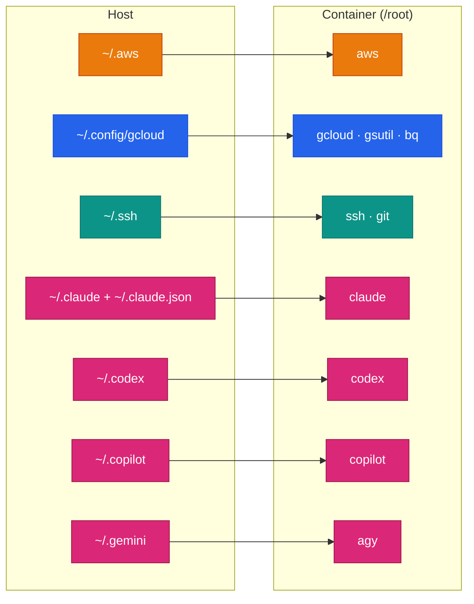

# Authentication & Credentials

The images never contain secrets. Your credentials stay on your host (or in your CI secret store), and you hand them to the container at run time, either by **mounting a config directory** or by **passing an environment variable**.

<div class="grid cards" markdown>

-   :fontawesome-brands-aws:{ .lg .middle } __AWS__

    ---

    Profiles, IAM Identity Center (SSO), instance roles and CI OIDC.

    [:octicons-arrow-right-24: AWS](#aws)

-   :simple-googlecloud:{ .lg .middle } __Google Cloud__

    ---

    `gcloud` user logins, service accounts, ADC and Workload Identity.

    [:octicons-arrow-right-24: Google Cloud](#google-cloud)

-   :lucide-key-round:{ .lg .middle } __SSH & Git__

    ---

    Keys, agent forwarding and HTTPS tokens for `git` and `gh`.

    [:octicons-arrow-right-24: SSH & Git](#ssh-and-git)

-   :lucide-bot:{ .lg .middle } __AI assistants__

    ---

    Claude Code, Codex CLI, Copilot CLI and Antigravity CLI.

    [:octicons-arrow-right-24: AI assistants](#ai-assistants)

</div>

## What to mount



| Host path | Container path | Used by | Available in |
|-----------|----------------|---------|--------------|
| `~/.aws` | `/root/.aws` | `aws`, Terraform, boto3 | <span class="di-pill di-pill--all">all-devops</span> <span class="di-pill di-pill--aws">aws-devops</span> |
| `~/.config/gcloud` | `/root/.config/gcloud` | `gcloud`, `gsutil`, `bq`, ADC | <span class="di-pill di-pill--all">all-devops</span> <span class="di-pill di-pill--gcp">gcp-devops</span> |
| `~/.ssh` | `/root/.ssh` | `ssh`, `git`, Ansible | <span class="di-pill di-pill--base">every image</span> |
| `~/.gitconfig` | `/root/.gitconfig` | `git` name and email | <span class="di-pill di-pill--base">every image</span> |
| `~/.claude`, `~/.claude.json` | `/root/.claude`, `/root/.claude.json` | `claude` | <span class="di-pill di-pill--base">every image</span> |
| `~/.codex` | `/root/.codex` | `codex` | <span class="di-pill di-pill--base">every image</span> |
| `~/.copilot` | `/root/.copilot` | `copilot` | <span class="di-pill di-pill--base">every image</span> |
| `~/.gemini` | `/root/.gemini` | `agy` | <span class="di-pill di-pill--base">every image</span> |

Everything at once:

```bash
docker run -it --rm \
  -v "$PWD":/srv -w /srv \
  -v ~/.aws:/root/.aws \
  -v ~/.config/gcloud:/root/.config/gcloud \
  -v ~/.ssh:/root/.ssh:ro \
  -v ~/.gitconfig:/root/.gitconfig:ro \
  -v ~/.claude:/root/.claude \
  -v ~/.claude.json:/root/.claude.json \
  -v ~/.codex:/root/.codex \
  -v ~/.copilot:/root/.copilot \
  -v ~/.gemini:/root/.gemini \
  ghcr.io/jinalshah/devops/images/all-devops:latest
```

!!! tip "Mount only what the task needs"
    A Terraform plan against AWS needs `~/.aws` and nothing else. Keeping mounts small limits what a mistake, or an over-eager AI agent, can reach. Mount SSH keys and `.gitconfig` read-only (`:ro`).

!!! warning "Missing host paths become directories"
    If a mounted path doesn't exist on the host, Docker creates it as an empty root-owned directory. Create files such as `~/.claude.json` and `~/.gitconfig` first (for example with `touch`), or leave those mounts out.

---

## AWS { #aws }

=== ":lucide-user: Profiles (access keys)"

    ```bash
    aws configure --profile staging   # on the host

    docker run --rm \
      -v ~/.aws:/root/.aws \
      -e AWS_PROFILE=staging \
      ghcr.io/jinalshah/devops/images/aws-devops:latest \
      aws sts get-caller-identity
    ```

    `aws configure` writes `~/.aws/credentials` and `~/.aws/config`. Select a profile with `-e AWS_PROFILE=...` or `aws --profile ...`.

=== ":lucide-log-in: IAM Identity Center (SSO)"

    ```bash
    aws configure sso                              # once, on the host
    aws sso login --profile my-sso-profile         # when the session expires

    docker run --rm \
      -v ~/.aws:/root/.aws \
      -e AWS_PROFILE=my-sso-profile \
      ghcr.io/jinalshah/devops/images/aws-devops:latest \
      aws sts get-caller-identity
    ```

    The SSO token cache lives in `~/.aws/sso/cache`, so the mounted directory carries your login into the container. IAM Identity Center is the recommended way for people to sign in to AWS.

=== ":lucide-server: Instance or task role"

    On EC2, ECS or EKS the SDKs find the role automatically, so you don't need to mount anything:

    ```bash
    docker run --rm \
      ghcr.io/jinalshah/devops/images/aws-devops:latest \
      aws sts get-caller-identity
    ```

    If this hangs on EC2, the container probably can't reach the instance metadata service: IMDSv2's default hop limit of 1 blocks bridged containers. Raise the hop limit to 2 or run with `--network host`.

=== ":lucide-key: Environment variables"

    Pass variables through from your shell, without typing values on the command line:

    ```bash
    docker run --rm \
      -e AWS_ACCESS_KEY_ID -e AWS_SECRET_ACCESS_KEY -e AWS_SESSION_TOKEN \
      -e AWS_REGION=eu-west-2 \
      ghcr.io/jinalshah/devops/images/aws-devops:latest \
      aws sts get-caller-identity
    ```

    !!! warning
        Prefer short-lived credentials (SSO, roles, OIDC) over long-lived access keys.

### Session Manager

`session-manager-plugin` is in <span class="di-pill di-pill--aws">aws-devops</span> and <span class="di-pill di-pill--all">all-devops</span>, so you can reach instances without SSH or open ports:

```bash
docker run -it --rm \
  -v ~/.aws:/root/.aws \
  ghcr.io/jinalshah/devops/images/aws-devops:latest \
  aws ssm start-session --target i-1234567890abcdef0
```

Port forwarding (publish the local port with `-p`):

```bash
docker run -it --rm \
  -v ~/.aws:/root/.aws \
  -p 8080:8080 \
  ghcr.io/jinalshah/devops/images/aws-devops:latest \
  aws ssm start-session --target i-1234567890abcdef0 \
    --document-name AWS-StartPortForwardingSession \
    --parameters '{"portNumber":["80"],"localPortNumber":["8080"]}'
```

---

## Google Cloud { #google-cloud }

!!! info "gcloud and ADC are two different logins"
    - **gcloud's own login** (`gcloud auth login` or `gcloud auth activate-service-account`) is what `gcloud`, `gsutil` and `bq` use.
    - **Application Default Credentials** (ADC) are what client libraries and Terraform use: `gcloud auth application-default login`, or `GOOGLE_APPLICATION_CREDENTIALS` pointing at a key file.

    gcloud **ignores** `GOOGLE_APPLICATION_CREDENTIALS` for its own commands, so setting it doesn't log `gcloud` in. Both logins are stored in `~/.config/gcloud`.

=== ":lucide-user: User login"

    ```bash
    gcloud auth login                       # on the host (for gcloud)
    gcloud auth application-default login   # on the host (for Terraform and SDKs)
    gcloud config set project my-project-id

    docker run --rm \
      -v ~/.config/gcloud:/root/.config/gcloud \
      ghcr.io/jinalshah/devops/images/gcp-devops:latest \
      gcloud auth list
    ```

=== ":lucide-file-key: Service account key"

    Mount the key, activate it for gcloud, and point ADC at it for Terraform and SDKs:

    ```bash
    docker run -it --rm \
      -v "$PWD":/srv -w /srv \
      -v ~/keys/deployer.json:/root/gcp-key.json:ro \
      -e GOOGLE_APPLICATION_CREDENTIALS=/root/gcp-key.json \
      ghcr.io/jinalshah/devops/images/gcp-devops:latest \
      bash -c 'gcloud auth activate-service-account --key-file=/root/gcp-key.json && gcloud auth list && terraform plan'
    ```

    `gcloud auth login --cred-file=/root/gcp-key.json` also works. Where your organisation allows it, prefer impersonation or Workload Identity Federation over downloaded keys.

=== ":simple-kubernetes: Workload Identity (GKE)"

    On GKE with Workload Identity, the pod's Kubernetes service account maps to a Google service account, so there's nothing to mount:

    ```yaml
    apiVersion: v1
    kind: Pod
    metadata:
      name: devops
    spec:
      serviceAccountName: my-ksa
      containers:
        - name: devops
          image: ghcr.io/jinalshah/devops/images/gcp-devops:latest
          command: ["gcloud", "auth", "list"]
    ```

### GKE clusters

`gke-gcloud-auth-plugin` is installed, so `kubectl` works against GKE once gcloud is logged in:

```bash
gcloud container clusters get-credentials my-cluster --region europe-west2 --project my-project-id
kubectl get nodes
```

Use `--project` on any command, or `gcloud config set project ...`, to switch projects.

---

## SSH & Git { #ssh-and-git }

=== ":lucide-key-round: Mount your keys"

    ```bash
    docker run -it --rm \
      -v "$PWD":/srv -w /srv \
      -v ~/.ssh:/root/.ssh:ro \
      -v ~/.gitconfig:/root/.gitconfig:ro \
      ghcr.io/jinalshah/devops/images/all-devops:latest \
      ssh -T git@github.com
    ```

    After that, `git clone git@github.com:org/repo.git`, `ssh user@host` and Ansible all use your keys.

=== ":simple-linux: Agent forwarding (Linux)"

    Forward your running `ssh-agent` so private keys never enter the container:

    ```bash
    docker run -it --rm \
      -v "$SSH_AUTH_SOCK":/ssh-agent \
      -e SSH_AUTH_SOCK=/ssh-agent \
      ghcr.io/jinalshah/devops/images/all-devops:latest \
      ssh-add -l
    ```

=== ":simple-apple: Agent forwarding (Docker Desktop)"

    Docker Desktop on macOS provides a fixed socket for the host agent:

    ```bash
    docker run -it --rm \
      -v /run/host-services/ssh-auth.sock:/run/host-services/ssh-auth.sock \
      -e SSH_AUTH_SOCK=/run/host-services/ssh-auth.sock \
      ghcr.io/jinalshah/devops/images/all-devops:latest \
      ssh-add -l
    ```

!!! note "`ssh-add -l` needs an agent"
    `ssh-add -l` only works when `SSH_AUTH_SOCK` points at a forwarded agent. With keys mounted and no agent, use `ssh -T git@github.com` to test instead.

### Git over HTTPS with `gh`

The GitHub CLI is in every image. Give it a token and let it act as git's credential helper:

```bash
docker run -it --rm \
  -v "$PWD":/srv -w /srv \
  -e GH_TOKEN \
  ghcr.io/jinalshah/devops/images/all-devops:latest \
  bash -c 'gh auth setup-git && git clone https://github.com/org/private-repo.git'
```

---

## AI assistants { #ai-assistants }

Each assistant has its own login. Sign in interactively once with the config directory mounted, or pass a token in CI. The [AI CLI setup guide](../tool-basics/ai-cli-setup.md) covers each one in detail.

!!! info "Gemini CLI → Antigravity CLI"
    Google [replaced Gemini CLI with Antigravity CLI](https://developers.googleblog.com/an-important-update-transitioning-gemini-cli-to-antigravity-cli/) (`agy`), and the images ship `agy`. It still stores its state in `~/.gemini`, so keep mounting that directory.

| Assistant | Interactive sign-in | CI / headless | Mount |
|-----------|---------------------|---------------|-------|
| :simple-claude: `claude` | `claude`, then `/login` | `ANTHROPIC_API_KEY`, or `CLAUDE_CODE_OAUTH_TOKEN` from `claude setup-token` | `~/.claude` + `~/.claude.json` |
| :lucide-sparkles: `codex` | `codex login --device-auth` | `CODEX_API_KEY` with `codex exec` | `~/.codex` |
| :simple-githubcopilot: `copilot` | `copilot`, then `/login` | `COPILOT_GITHUB_TOKEN` (fine-grained PAT with Copilot Requests) | `~/.copilot` |
| :simple-googlegemini: `agy` | `agy`, sign in with Google, paste the code | `GEMINI_API_KEY` + `{"modelProvider": "gemini"}` in `~/.gemini/antigravity-cli/settings.json`, or ADC + `AGY_ADC_AUTH=true` | `~/.gemini` |

=== ":lucide-terminal: Interactive"

    ```bash
    docker run -it --rm \
      -v "$PWD":/srv -w /srv \
      -v ~/.claude:/root/.claude \
      -v ~/.claude.json:/root/.claude.json \
      ghcr.io/jinalshah/devops/images/all-devops:latest \
      claude
    ```

    Type `/login`, open the URL it prints on your host, and paste the code back. The login is saved to the mounted `~/.claude`. Copilot (`copilot` then `/login`) and Antigravity (`agy`) work the same way. For Codex, run `codex login --device-auth`.

=== ":lucide-workflow: CI / scripts"

    ```bash
    # Claude Code
    git diff | claude -p "Review this diff"

    # Codex CLI (API key read from CODEX_API_KEY)
    codex exec "Review the Terraform in ./terraform for security issues"

    # Copilot CLI (token read from COPILOT_GITHUB_TOKEN)
    copilot -p "Review the Terraform in ./terraform for security issues" --allow-all-tools

    # Antigravity CLI (API key read from GEMINI_API_KEY)
    mkdir -p ~/.gemini/antigravity-cli
    echo '{"modelProvider": "gemini"}' > ~/.gemini/antigravity-cli/settings.json
    git diff | agy -p "Review this diff"
    ```

    To store an OpenAI API key for later (rather than per run), use `printenv OPENAI_API_KEY | codex login --with-api-key`.

---

## CI/CD

=== ":simple-githubactions: GitHub Actions (OIDC)"

    ```yaml
    permissions:
      id-token: write
      contents: read

    jobs:
      deploy:
        runs-on: ubuntu-latest
        container:
          image: ghcr.io/jinalshah/devops/images/aws-devops:latest
        steps:
          - uses: actions/checkout@v4

          - uses: aws-actions/configure-aws-credentials@v4
            with:
              role-to-assume: arn:aws:iam::123456789012:role/github-deploy
              aws-region: eu-west-2

          - run: terraform init && terraform apply -auto-approve
    ```

    OIDC swaps a short-lived GitHub token for temporary AWS credentials, so no access keys are stored. Google Cloud has the same pattern with `google-github-actions/auth` and Workload Identity Federation.

=== ":simple-gitlab: GitLab CI"

    ```yaml
    deploy:
      image: registry.gitlab.com/jinal-shah/devops/images/all-devops:latest
      script:
        - aws sts get-caller-identity
        - gcloud auth activate-service-account --key-file="$GCP_SA_KEY"
        - terraform init && terraform apply -auto-approve
    ```

    Define `AWS_ACCESS_KEY_ID`, `AWS_SECRET_ACCESS_KEY` and `AWS_REGION` as masked CI/CD variables, and `GCP_SA_KEY` as a **File** variable. GitLab puts a File variable's contents in a temporary file and sets the variable to that file's path. Set `GOOGLE_APPLICATION_CREDENTIALS: $GCP_SA_KEY` too if Terraform needs ADC.

### Environment variable cheat sheet

| Variable | Used by | Purpose |
|----------|---------|---------|
| `AWS_PROFILE` | AWS CLI / SDKs | Pick a profile from `~/.aws/config` |
| `AWS_ACCESS_KEY_ID`, `AWS_SECRET_ACCESS_KEY`, `AWS_SESSION_TOKEN` | AWS CLI / SDKs | Static or temporary credentials |
| `AWS_REGION` | AWS CLI / SDKs | Default region |
| `GOOGLE_APPLICATION_CREDENTIALS` | Terraform, Google client libraries, `agy` with ADC | Path to a service account key (**not** used by `gcloud` itself) |
| `SSH_AUTH_SOCK` | `ssh`, `git` | Forwarded agent socket |
| `GH_TOKEN` | `gh`, `copilot` | GitHub token |
| `ANTHROPIC_API_KEY` / `CLAUDE_CODE_OAUTH_TOKEN` | `claude` | Anthropic API key or subscription token |
| `CODEX_API_KEY` | `codex exec` | OpenAI API key for one run |
| `COPILOT_GITHUB_TOKEN` | `copilot` | Fine-grained PAT with Copilot Requests |
| `GEMINI_API_KEY` | `agy` | Gemini API key (also needs `modelProvider` in `settings.json`) |
| `AGY_ADC_AUTH=true` | `agy` | Use Application Default Credentials |

---

## Troubleshooting

??? question "AWS: `Unable to locate credentials`"
    Check that the mount landed and that the profile exists:

    ```bash
    docker run --rm -v ~/.aws:/root/.aws \
      ghcr.io/jinalshah/devops/images/aws-devops:latest \
      aws configure list
    ```

    For SSO profiles, run `aws sso login --profile ...` on the host again when the session expires.

??? question "gcloud works but Terraform says `could not find default credentials`"
    Terraform uses ADC, not gcloud's login. Run `gcloud auth application-default login` on the host, or set `GOOGLE_APPLICATION_CREDENTIALS` to a mounted key file.

??? question "Terraform works but gcloud says `You do not currently have an active account`"
    It's the reverse problem: `GOOGLE_APPLICATION_CREDENTIALS` doesn't log `gcloud` in. Run `gcloud auth activate-service-account --key-file=...` (or `gcloud auth login`).

??? question "SSH: `Bad owner or permissions on /root/.ssh/config` or `UNPROTECTED PRIVATE KEY FILE`"
    Inside the container you are `root`, but on a Linux host the mounted files belong to your own user. SSH refuses config files owned by another user, and private keys that other users can read. Fix the modes on the host (`chmod 700 ~/.ssh && chmod 600 ~/.ssh/id_* ~/.ssh/config`). If the owner check still fails, use [agent forwarding](#ssh-and-git) instead of mounting `~/.ssh`.

??? question "AI assistant asks me to sign in every time"
    Its config directory isn't mounted. See the [table above](#ai-assistants).

---

## Security checklist

- [x] Mount credentials at run time; never `COPY` them into an image or commit them to Git
- [x] Prefer short-lived credentials: IAM Identity Center, instance roles, OIDC and Workload Identity
- [x] Use CI secret stores (masked variables) for tokens and API keys
- [x] Grant least privilege, and keep development and production credentials separate
- [x] Mount keys read-only, and only the ones the task needs
- [x] Treat `~/.codex/auth.json`, `~/.claude`, `~/.copilot` and `~/.gemini` like passwords

## Next steps

- [AI CLI setup guide](../tool-basics/ai-cli-setup.md): sign in to and use each AI assistant
- [Quick reference](quick-reference.md): common mount patterns
- [Troubleshooting](../troubleshooting/index.md): more error fixes
- [Workflows](../workflows/index.md): real-world CI/CD examples
