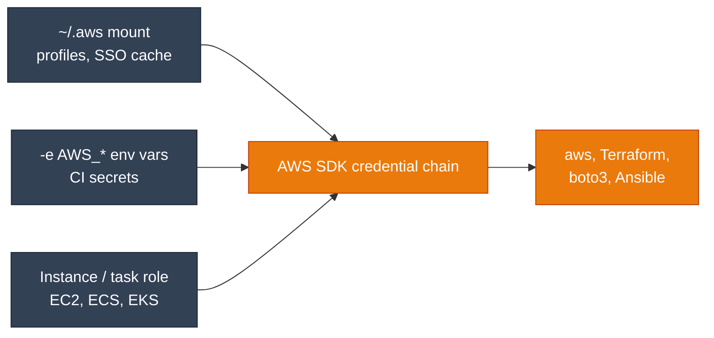

<div class="di-hero" markdown style="background: linear-gradient(120deg, #9a3412 0%, #ea7a0c 55%, #f59e0b 100%)">

<div class="di-hero-badges"><span>AWS</span><span>amd64 + arm64</span><span>~1.55 GB download</span></div>

# aws-devops

The shared DevOps base plus **AWS CLI v2**, the **Session Manager plugin** and AWS-focused Python packages. No Google Cloud SDK.

`ghcr.io/jinalshah/devops/images/aws-devops`

[:lucide-play: Quick start](#quick-start){ .md-button .md-button--primary }
[:lucide-hammer: Build it yourself](../build-images/aws-devops.md){ .md-button }

</div>

## What's inside

<div class="grid cards" markdown>

-   :fontawesome-brands-aws:{ .lg .middle } __AWS layer__

    ---

    - **AWS CLI v2** (official installer for the host architecture)
    - **Session Manager plugin** for `aws ssm start-session`
    - Python: **boto3**, **cfn-lint**, **s3cmd**, requests, pytest, bs4, lxml
    - **crcmod**: a CRC32C checksum library with a C extension (mostly used by `gsutil`; harmless here)

-   :lucide-layers:{ .lg .middle } __Shared base__

    ---

    - Terraform (tfswitch), Terragrunt, TFLint, Packer
    - kubectl, Helm 3, k9s
    - Ansible, ansible-lint, pre-commit, Task, Trivy
    - Python 3.14, Node.js LTS, Git, `gh`, jq
    - `claude`, `codex`, `copilot`, `agy`
    - `mongosh`, `psql` 17, `mysql` 8.4

</div>

Not included: kustomize as a separate binary (use `kubectl kustomize` or `kubectl apply -k`), yq, the Docker CLI. The full list is in the [tool explorer](quick-reference.md#tool-explorer).

!!! info "Size"
    About 1.55 GB compressed and 4.6 GB unpacked, only slightly smaller than <span class="di-pill di-pill--all">all-devops</span>, because the shared base is most of the size. Pick it for a focused toolset rather than for a big size saving.

## Quick start

```bash
docker run -it --rm \
  -v "$PWD":/srv -w /srv \
  -v ~/.aws:/root/.aws \
  ghcr.io/jinalshah/devops/images/aws-devops:latest
```

Mount `~/.aws` to reuse your credentials, profiles and IAM Identity Center (SSO) token cache.

## Authentication



=== ":lucide-folder-key: Mount ~/.aws (recommended)"

    ```bash
    docker run --rm \
      -v ~/.aws:/root/.aws \
      -e AWS_PROFILE=dev \
      ghcr.io/jinalshah/devops/images/aws-devops:latest \
      aws sts get-caller-identity
    ```

    For IAM Identity Center profiles, run `aws sso login --profile dev` first. On the host that works as normal; inside the container add `--use-device-code`, because the default browser flow (AWS CLI 2.22 and later) has to finish on the same machine as the CLI.

=== ":lucide-key-round: Environment variables"

    ```bash
    # Values come from your shell, so they never appear in the command itself
    docker run --rm \
      -e AWS_ACCESS_KEY_ID \
      -e AWS_SECRET_ACCESS_KEY \
      -e AWS_SESSION_TOKEN \
      -e AWS_DEFAULT_REGION=eu-west-2 \
      ghcr.io/jinalshah/devops/images/aws-devops:latest \
      aws s3 ls
    ```

    Values passed with `-e` are visible in `docker inspect`. Prefer short-lived credentials.

=== ":lucide-server: Instance or task role"

    On EC2, ECS or EKS (IRSA or Pod Identity), the AWS CLI and SDKs pick up the role automatically, with no mounts or variables:

    ```bash
    docker run --rm ghcr.io/jinalshah/devops/images/aws-devops:latest \
      aws sts get-caller-identity
    ```

    On EC2 with IMDSv2 and a hop limit of 1, IMDSv2 responses may not reach containers on a bridge network, because the container counts as an extra network hop. AWS recommends raising the hop limit to 2; `--network host` also avoids the extra hop.

More options, including SSO and assuming roles, are in the [Authentication guide](authentication.md).

## Common tasks

=== ":simple-terraform: Terraform"

    ```bash
    docker run --rm \
      -v "$PWD":/srv -w /srv \
      -v ~/.aws:/root/.aws \
      ghcr.io/jinalshah/devops/images/aws-devops:latest \
      bash -c 'terraform init && terraform plan -out=tfplan'
    ```

=== ":lucide-file-code: CloudFormation"

    ```bash
    # Lint, then deploy
    docker run --rm \
      -v "$PWD":/srv -w /srv \
      -v ~/.aws:/root/.aws \
      ghcr.io/jinalshah/devops/images/aws-devops:latest \
      bash -c 'cfn-lint template.yaml &&
               aws cloudformation deploy --template-file template.yaml --stack-name my-stack'
    ```

=== ":simple-kubernetes: EKS"

    ```bash
    docker run --rm \
      -v "$PWD":/srv -w /srv \
      -v ~/.aws:/root/.aws \
      -v ~/.kube:/root/.kube \
      ghcr.io/jinalshah/devops/images/aws-devops:latest \
      bash -c 'aws eks update-kubeconfig --region eu-west-2 --name my-cluster &&
               kubectl get nodes'
    ```

    The kubeconfig calls `aws eks get-token`, so keep `~/.aws` mounted whenever you use it.

=== ":lucide-terminal: Session Manager"

    ```bash
    docker run -it --rm \
      -v ~/.aws:/root/.aws \
      ghcr.io/jinalshah/devops/images/aws-devops:latest \
      aws ssm start-session --target i-0123456789abcdef0
    ```

    Inside the container the `aws-ssm <instance-id>` alias does the same.

=== ":simple-ansible: Ansible on EC2"

    ```bash
    docker run --rm \
      -v "$PWD":/srv -w /srv \
      -v ~/.aws:/root/.aws \
      -v ~/.ssh:/root/.ssh:ro \
      ghcr.io/jinalshah/devops/images/aws-devops:latest \
      ansible-playbook -i aws_ec2.yml deploy.yml
    ```

    `aws_ec2.yml` is an inventory for the `amazon.aws.aws_ec2` plugin, which uses the boto3 already in the image.

=== ":simple-python: boto3 scripts"

    ```bash
    docker run --rm \
      -v "$PWD":/srv -w /srv \
      -v ~/.aws:/root/.aws \
      ghcr.io/jinalshah/devops/images/aws-devops:latest \
      python3 scripts/cleanup-unused-ebs.py
    ```

## Tips

??? tip "Cache Terraform providers between runs"
    Terraform only uses a shared plugin cache when you tell it to:

    ```bash
    mkdir -p ~/.terraform.d/plugin-cache
    docker run --rm \
      -v "$PWD":/srv -w /srv \
      -v ~/.aws:/root/.aws \
      -v ~/.terraform.d:/root/.terraform.d \
      -e TF_PLUGIN_CACHE_DIR=/root/.terraform.d/plugin-cache \
      ghcr.io/jinalshah/devops/images/aws-devops:latest \
      terraform init
    ```

??? tip "A host alias"
    Add this to your `~/.bashrc` or `~/.zshrc`:

    ```bash
    alias aws-devops='docker run -it --rm -v "$PWD":/srv -w /srv -v ~/.aws:/root/.aws -v ~/.ssh:/root/.ssh:ro ghcr.io/jinalshah/devops/images/aws-devops:latest'
    ```

    Then run `aws-devops terraform plan` or `aws-devops aws s3 ls`.

## Troubleshooting

??? question "`Unable to locate credentials`"
    1. Check that the files are mounted: `docker run --rm -v ~/.aws:/root/.aws ghcr.io/jinalshah/devops/images/aws-devops:latest ls -la /root/.aws`
    2. If you use named profiles, pass `-e AWS_PROFILE=<name>`.
    3. For SSO profiles, refresh the session with `aws sso login --profile <name>`.

??? question "`You must specify a region`"
    The image doesn't set a default region. Add `region = eu-west-2` to the profile in `~/.aws/config`, or pass `-e AWS_DEFAULT_REGION=eu-west-2`.

??? question "Files created in my project are owned by root"
    Run `sudo chown -R "$(id -u):$(id -g)" .` afterwards, or chown inside the container as the last step. `--user` isn't a good fix because Terraform, `claude` and `HOME` live under `/root`, which only root can read. See [Root-owned files](index.md#recommended-workstation-setup).

## Next steps

- [Authentication guide](authentication.md)
- [Quick reference](quick-reference.md)
- [Terraform workflows](../workflows/terraform-workflows.md)
- [GitHub Actions](../workflows/ci-cd-github.md)
