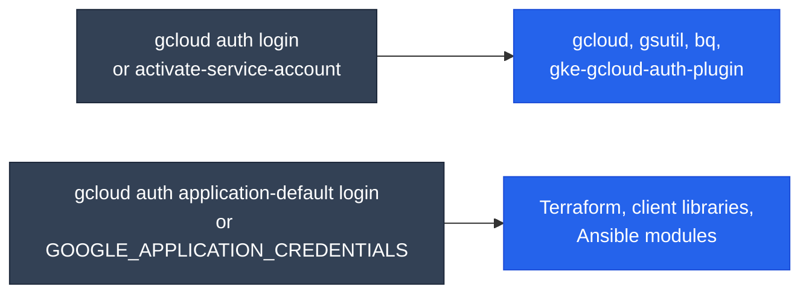
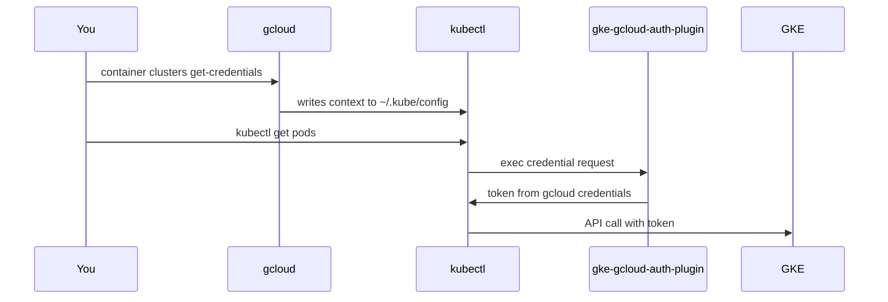

<div class="di-hero" markdown style="background: linear-gradient(120deg, #1e3a8a 0%, #2563eb 55%, #0891b2 100%)">

<div class="di-hero-badges"><span>Google Cloud</span><span>GKE ready</span><span>amd64 + arm64</span><span>~1.5 GB download</span></div>

# gcp-devops

The shared DevOps base plus the **Google Cloud CLI**, with `gsutil`, `bq`, beta commands and the **GKE auth plugin**. No AWS tooling.

`ghcr.io/jinalshah/devops/images/gcp-devops`

[:lucide-play: Quick start](#quick-start){ .md-button .md-button--primary }
[:lucide-hammer: Build it yourself](../build-images/gcp-devops.md){ .md-button }

</div>

## What's inside

<div class="grid cards" markdown>

-   :simple-googlecloud:{ .lg .middle } __Google Cloud layer__

    ---

    - **Google Cloud SDK**, pinned per build, in `/usr/lib/google-cloud-sdk`
    - `gcloud`, `gsutil` (Cloud Storage) and `bq` (BigQuery)
    - Components: `beta`, `docker-credential-gcr`, `gke-gcloud-auth-plugin`
    - Usage reporting turned off

-   :lucide-layers:{ .lg .middle } __Shared base__

    ---

    - Terraform (tfswitch), Terragrunt, TFLint, Packer
    - kubectl, Helm 3, k9s
    - Ansible, ansible-lint, pre-commit, Task, Trivy
    - Python 3.14, Node.js LTS, Git, `gh`, jq
    - `claude`, `codex`, `copilot`, `agy`
    - `mongosh`, `psql` 17, `mysql` 8.4

</div>

Not included: `gcloud alpha` (install it in a [custom image](../build-images/customization.md) with `gcloud components install alpha`), kustomize as a separate binary (use `kubectl kustomize`), yq and the Docker CLI. The full list is in the [tool explorer](quick-reference.md#tool-explorer).

!!! info "Size"
    About 1.5 GB compressed and 4.6 GB unpacked. That's only slightly smaller than <span class="di-pill di-pill--all">all-devops</span>, because the shared base is most of the size.

## Quick start

```bash
docker run -it --rm \
  -v "$PWD":/srv -w /srv \
  -v ~/.config/gcloud:/root/.config/gcloud \
  ghcr.io/jinalshah/devops/images/gcp-devops:latest
```

`~/.config/gcloud` holds your gcloud accounts, active configuration and project, and Application Default Credentials (ADC).

## Authentication

gcloud and everything else authenticate separately, which is the most common source of confusion:



=== ":lucide-user: Your user account (recommended)"

    Sign in once. You can do this on the host, or inside the container with the mount in place:

    ```bash
    gcloud auth login
    gcloud auth application-default login
    gcloud config set project my-project
    ```

    Then reuse it:

    ```bash
    docker run --rm \
      -v ~/.config/gcloud:/root/.config/gcloud \
      ghcr.io/jinalshah/devops/images/gcp-devops:latest \
      gcloud auth list
    ```

=== ":lucide-key-round: Service account key"

    `gcloud` ignores `GOOGLE_APPLICATION_CREDENTIALS` for its own commands, so activate the key explicitly. The variable is still useful for Terraform and client libraries.

    ```bash
    docker run --rm \
      -v "$PWD":/srv -w /srv \
      -v /path/to/key.json:/secrets/key.json:ro \
      -e GOOGLE_APPLICATION_CREDENTIALS=/secrets/key.json \
      ghcr.io/jinalshah/devops/images/gcp-devops:latest \
      bash -c 'gcloud auth activate-service-account --key-file=/secrets/key.json &&
               gcloud auth list && terraform plan'
    ```

    Keys are long-lived secrets. Never commit them; prefer Workload Identity Federation in CI.

=== ":lucide-server: Workload Identity / metadata server"

    On GKE with Workload Identity, Cloud Run, Cloud Build or Compute Engine, gcloud and the client libraries use the attached service account from the metadata server, with no mounts needed:

    ```bash
    gcloud auth list
    gcloud config list
    ```

More detail, including Workload Identity Federation for GitHub Actions, is in the [Authentication guide](authentication.md).

## Working with GKE

The image includes `gke-gcloud-auth-plugin`, which kubectl uses to fetch tokens for GKE clusters. Keep **both** `~/.config/gcloud` and `~/.kube` mounted, because kubectl runs the plugin whenever it needs a token, and the plugin uses your gcloud credentials to get one (caching it under `~/.kube`).



```bash
docker run -it --rm \
  -v "$PWD":/srv -w /srv \
  -v ~/.config/gcloud:/root/.config/gcloud \
  -v ~/.kube:/root/.kube \
  ghcr.io/jinalshah/devops/images/gcp-devops:latest \
  bash -c 'gcloud container clusters get-credentials my-cluster --region europe-west2 &&
           kubectl get pods -A'
```

A kubeconfig written on your host with `get-credentials` usually works too, as long as `~/.config/gcloud` is also mounted. The exception is when gcloud wrote a full host path to the plugin (it does so when the plugin isn't on the host's `PATH`) or `gke-gcloud-auth-plugin.exe` on Windows; in that case re-run `get-credentials` inside the container.

## Common tasks

=== ":simple-terraform: Terraform"

    ```bash
    docker run --rm \
      -v "$PWD":/srv -w /srv \
      -v ~/.config/gcloud:/root/.config/gcloud \
      ghcr.io/jinalshah/devops/images/gcp-devops:latest \
      bash -c 'terraform init && terraform plan -out=tfplan'
    ```

    The Google provider uses ADC (`gcloud auth application-default login`).

=== ":simple-helm: Deploy to GKE with Helm"

    ```bash
    docker run --rm \
      -v "$PWD":/srv -w /srv \
      -v ~/.config/gcloud:/root/.config/gcloud \
      -v ~/.kube:/root/.kube \
      ghcr.io/jinalshah/devops/images/gcp-devops:latest \
      bash -c 'gcloud container clusters get-credentials prod --region europe-west2 &&
               helm upgrade --install myapp ./charts/myapp'
    ```

=== ":simple-googlecloudstorage: Cloud Storage & BigQuery"

    ```bash
    docker run --rm \
      -v "$PWD":/srv -w /srv \
      -v ~/.config/gcloud:/root/.config/gcloud \
      ghcr.io/jinalshah/devops/images/gcp-devops:latest \
      bash -c 'gsutil -m rsync -r ./build gs://my-bucket/releases/ &&
               bq ls'
    ```

    `gcloud storage cp` / `gcloud storage rsync` are the newer equivalents of the `gsutil` commands.

=== ":simple-docker: Artifact Registry login"

    Configure your **host's** Docker to push to Artifact Registry (the image has no Docker CLI of its own):

    ```bash
    docker run --rm \
      -v ~/.config/gcloud:/root/.config/gcloud \
      ghcr.io/jinalshah/devops/images/gcp-devops:latest \
      gcloud auth print-access-token \
      | docker login -u oauth2accesstoken --password-stdin https://europe-west2-docker.pkg.dev
    ```

=== ":simple-ansible: Ansible on Compute Engine"

    The `google.cloud.gcp_compute` inventory plugin needs `requests` and `google-auth`. `requests` is already in the image, but `google-auth` isn't, so install it first:

    ```bash
    docker run --rm \
      -v "$PWD":/srv -w /srv \
      -v ~/.config/gcloud:/root/.config/gcloud \
      -v ~/.ssh:/root/.ssh:ro \
      ghcr.io/jinalshah/devops/images/gcp-devops:latest \
      bash -c 'python3 -m pip install --quiet google-auth &&
               ansible-playbook -i gcp_compute.yml deploy.yml'
    ```

    To avoid installing it on every run, bake them into a [custom image](../build-images/customization.md).

## Tips

??? tip "Cache Terraform providers between runs"
    ```bash
    mkdir -p ~/.terraform.d/plugin-cache
    docker run --rm \
      -v "$PWD":/srv -w /srv \
      -v ~/.config/gcloud:/root/.config/gcloud \
      -v ~/.terraform.d:/root/.terraform.d \
      -e TF_PLUGIN_CACHE_DIR=/root/.terraform.d/plugin-cache \
      ghcr.io/jinalshah/devops/images/gcp-devops:latest \
      terraform init
    ```

??? tip "A host alias"
    ```bash
    alias gcp-devops='docker run -it --rm -v "$PWD":/srv -w /srv -v ~/.config/gcloud:/root/.config/gcloud -v ~/.kube:/root/.kube -v ~/.ssh:/root/.ssh:ro ghcr.io/jinalshah/devops/images/gcp-devops:latest'
    ```

    Then run `gcp-devops gcloud projects list` or `gcp-devops kubectl get pods`.

## Troubleshooting

??? question "gcloud says there are no credentialed accounts"
    1. Make sure you signed in with `gcloud auth login` (or activated a service account) and that `~/.config/gcloud` is mounted.
    2. Check the mount: `docker run --rm -v ~/.config/gcloud:/root/.config/gcloud ghcr.io/jinalshah/devops/images/gcp-devops:latest ls -la /root/.config/gcloud`
    3. With a key file, run `gcloud auth activate-service-account --key-file=...`. Setting `GOOGLE_APPLICATION_CREDENTIALS` alone doesn't sign gcloud in.

??? question "`You do not currently have an active project`"
    Set it in your configuration, pass it per command, or use an environment variable. Use single quotes so that the variable expands **inside** the container, not on your host:

    ```bash
    gcloud config set project my-project

    docker run --rm \
      -v ~/.config/gcloud:/root/.config/gcloud \
      -e CLOUDSDK_CORE_PROJECT=my-project \
      ghcr.io/jinalshah/devops/images/gcp-devops:latest \
      bash -c 'gcloud projects describe "$CLOUDSDK_CORE_PROJECT"'
    ```

??? question "kubectl can't reach or authenticate to GKE"
    - `executable gke-gcloud-auth-plugin not found`: you're using an old image or a different container. The plugin is in current gcp-devops and all-devops images.
    - Authentication errors: mount `~/.config/gcloud` alongside `~/.kube`, then re-run `gcloud container clusters get-credentials`.
    - Check the context: `kubectl config current-context`.

??? question "Files created in my project are owned by root"
    Run `sudo chown -R "$(id -u):$(id -g)" .` afterwards, or chown inside the container as the last step. `--user` isn't a good fix because Terraform, `claude` and `HOME` live under `/root`, which only root can read. See [Root-owned files](index.md#recommended-workstation-setup).

## Next steps

- [Authentication guide](authentication.md)
- [Quick reference](quick-reference.md)
- [Terraform workflows](../workflows/terraform-workflows.md)
- [GitHub Actions](../workflows/ci-cd-github.md)
