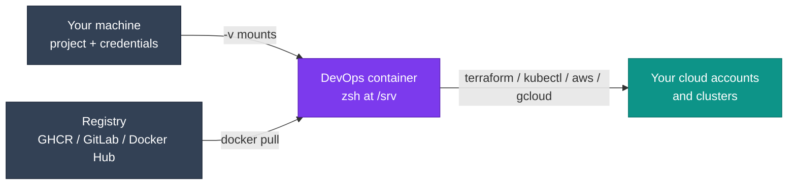

# Using the Images

Everything you need for day-to-day use: pulling, running, mounting your project and credentials, and pinning versions in CI.

!!! tip "New here?"
    The [Quick start](../quick-start.md) gets you running in five minutes, and the [image picker](../choosing-an-image.md) tells you which variant to use.

<div class="grid cards di-images" markdown>

-   :lucide-layers:{ .lg .middle } __all-devops__

    ---

    AWS **and** Google Cloud tooling on top of the shared base. Best for multi-cloud and platform teams.

    [:octicons-arrow-right-24: all-devops guide](all-devops.md)

-   :fontawesome-brands-aws:{ .lg .middle } __aws-devops__

    ---

    AWS CLI v2, Session Manager plugin, boto3, cfn-lint and s3cmd. No Google Cloud SDK.

    [:octicons-arrow-right-24: aws-devops guide](aws-devops.md)

-   :simple-googlecloud:{ .lg .middle } __gcp-devops__

    ---

    Google Cloud CLI with `gsutil`, `bq`, beta components and the GKE auth plugin. No AWS tooling.

    [:octicons-arrow-right-24: gcp-devops guide](gcp-devops.md)

</div>

## How a typical session fits together



## Pull an image

Every image is published to three registries under the same tags.

=== ":simple-github: GHCR (recommended)"

    ```bash
    docker pull ghcr.io/jinalshah/devops/images/all-devops:latest
    docker pull ghcr.io/jinalshah/devops/images/aws-devops:latest
    docker pull ghcr.io/jinalshah/devops/images/gcp-devops:latest
    ```

=== ":simple-gitlab: GitLab"

    ```bash
    docker pull registry.gitlab.com/jinal-shah/devops/images/all-devops:latest
    docker pull registry.gitlab.com/jinal-shah/devops/images/aws-devops:latest
    docker pull registry.gitlab.com/jinal-shah/devops/images/gcp-devops:latest
    ```

=== ":simple-docker: Docker Hub"

    ```bash
    docker pull js01/all-devops:latest
    docker pull js01/aws-devops:latest
    docker pull js01/gcp-devops:latest
    ```

    Docker Hub applies pull rate limits, especially to anonymous users. Prefer GHCR in CI.

The download is about 1.5 to 1.6 GB compressed (about 4.6 to 5.0 GB once unpacked). Both `linux/amd64` and `linux/arm64` are published under the same tag, so Apple Silicon and ARM runners get a native image automatically.

## Run it

=== ":lucide-terminal: Interactive shell"

    ```bash
    docker run -it --rm ghcr.io/jinalshah/devops/images/all-devops:latest
    ```

    You land in **zsh** (Oh My Zsh, `candy` theme) as `root`. `bash` and `fish` are installed too.

=== ":lucide-folder-open: With your project"

    ```bash
    docker run -it --rm \
      -v "$PWD":/srv -w /srv \
      ghcr.io/jinalshah/devops/images/all-devops:latest
    ```

=== ":lucide-play: One command"

    ```bash
    docker run --rm -v "$PWD":/srv -w /srv \
      ghcr.io/jinalshah/devops/images/all-devops:latest \
      terraform fmt -check -recursive
    ```

    Anything after the image name replaces the default `zsh` command.

## Recommended workstation setup

Mount your project plus whichever credentials you use. Drop the lines you don't need.

```bash
# Project, SSH keys, cloud credentials and kubeconfig
# AI agent state: Claude Code, Codex, Copilot and Antigravity (agy)
docker run -it --name devops-work \
  -v "$PWD":/srv -w /srv \
  -v ~/.ssh:/root/.ssh:ro \
  -v ~/.aws:/root/.aws \
  -v ~/.config/gcloud:/root/.config/gcloud \
  -v ~/.kube:/root/.kube \
  -v ~/.claude:/root/.claude \
  -v ~/.codex:/root/.codex \
  -v ~/.copilot:/root/.copilot \
  -v ~/.gemini:/root/.gemini \
  ghcr.io/jinalshah/devops/images/all-devops:latest
```

| Mount | What it gives you |
|-------|-------------------|
| `-v "$PWD":/srv -w /srv` | Your project, as the working directory |
| `~/.ssh` (read-only) | Git over SSH and remote hosts |
| `~/.aws` | `aws`, Terraform AWS provider, boto3 |
| `~/.config/gcloud` | `gcloud`, `gsutil`, `bq`, GKE credentials, ADC for Terraform |
| `~/.kube` | `kubectl`, `helm`, `k9s` |
| `~/.claude`, `~/.codex`, `~/.copilot`, `~/.gemini` | Logins and settings for `claude`, `codex`, `copilot` and `agy` |

Because the container is named (no `--rm`), you can come back to it with `docker start -i devops-work`.

The [`docker run` builder](../quick-start.md#build-your-command) generates this command for you, and the [Authentication guide](authentication.md) covers every credential option in depth.

!!! tip "Root-owned files on Linux"
    The container runs as `root`, so files it creates in your project are owned by root on a Linux host. For simple commands you can run as yourself:

    ```bash
    docker run --rm --user "$(id -u):$(id -g)" \
      -v "$PWD":/srv -w /srv \
      ghcr.io/jinalshah/devops/images/all-devops:latest \
      terraform fmt -recursive
    ```

    `HOME` is still `/root`, which your user can't write to, so tools that store state in `HOME` may fail. In that case run as root and fix ownership afterwards with `sudo chown -R "$(id -u):$(id -g)" .`

## Tags and version pinning

| Tag | Example | What it is |
|-----|---------|------------|
| `latest` | `all-devops:latest` | Newest build from `main`. Good for local work |
| `1.0.<sha>` | `all-devops:1.0.abc1234` | Per-commit multi-arch tag, stable for a given commit but refreshed by scheduled rebuilds |
| `1.0.<sha>-amd64` / `-arm64` | `all-devops:1.0.abc1234-arm64` | A single architecture, useful for debugging |

There is no `1.0` or semver tag.

!!! warning "Per-commit tags get refreshed"
    The weekly schedule and the daily tool-version update rebuild the same commit and push fresh tool versions under the same `1.0.<sha>` tag. For strictly reproducible pipelines, pin by digest:

    ```bash
    # Look up the digest of a tag (the "Digest:" line)
    docker buildx imagetools inspect ghcr.io/jinalshah/devops/images/all-devops:1.0.abc1234
    ```

    Then reference `ghcr.io/jinalshah/devops/images/all-devops@sha256:<digest>`.

Browse the available tags on [GHCR](https://github.com/jinalshah/devops-images/pkgs/container/devops%2Fimages%2Fall-devops), [GitLab](https://gitlab.com/jinal-shah/devops/container_registry) or [Docker Hub](https://hub.docker.com/r/js01/all-devops/tags).

## Use it in CI

=== ":simple-githubactions: GitHub Actions"

    ```yaml
    jobs:
      deploy:
        runs-on: ubuntu-latest
        container:
          image: ghcr.io/jinalshah/devops/images/all-devops:1.0.abc1234
        steps:
          - uses: actions/checkout@v4
          - uses: aws-actions/configure-aws-credentials@v4
            with:
              role-to-assume: arn:aws:iam::123456789012:role/ci-deploy
              aws-region: eu-west-2
          - run: terraform init
          - run: terraform apply -auto-approve
    ```

    OIDC role assumption also needs `permissions: id-token: write` on the job.

=== ":simple-gitlab: GitLab CI"

    ```yaml
    deploy:
      image: registry.gitlab.com/jinal-shah/devops/images/all-devops:1.0.abc1234
      script:
        - terraform init
        - terraform apply -auto-approve
      rules:
        - if: $CI_COMMIT_BRANCH == "main"
    ```

    Set `AWS_ACCESS_KEY_ID`, `AWS_SECRET_ACCESS_KEY` and `AWS_DEFAULT_REGION` as masked CI/CD variables; GitLab exposes them to the job automatically.

More complete pipelines: [GitHub Actions](../workflows/ci-cd-github.md), [GitLab CI](../workflows/ci-cd-gitlab.md), [Jenkins](../workflows/ci-cd-jenkins.md) and [CircleCI](../workflows/ci-cd-circleci.md).

## Where next?

<div class="grid cards" markdown>

-   :lucide-zap: [__Quick reference__](quick-reference.md)

    Tool explorer, mounts cheat sheet and copy-paste commands.

-   :lucide-key-round: [__Authentication__](authentication.md)

    AWS, Google Cloud, Git and AI CLI credentials.

-   :simple-docker: [__Docker Compose__](docker-compose.md)

    Local stacks with databases and S3-compatible storage.

-   :lucide-life-buoy: [__Troubleshooting__](../troubleshooting/index.md)

    Fixes for the most common problems.

</div>
