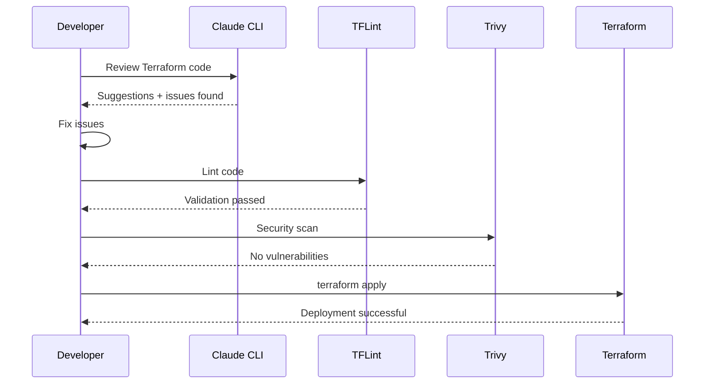

# AI-Assisted DevOps Workflows

Leverage AI CLI tools (Claude, Codex, Copilot, Gemini) for code generation, review, and troubleshooting in your DevOps workflows.

!!! info "AI CLI Tools Included"
    All DevOps Images include four AI CLI assistants. See the [AI CLI Setup Guide](../tool-basics/ai-cli-setup.md) for authentication details.

## Overview

The DevOps Images include four powerful AI CLI tools that can accelerate your infrastructure and automation workflows:

| AI Tool | Provider | Strengths | Best For |
|---------|----------|-----------|----------|
| **Claude CLI** | Anthropic | Long context (200K tokens), reasoning, analysis | Code review, architecture decisions, documentation |
| **Codex CLI** | OpenAI | Fast code generation | Quick scripts, Terraform modules, one-off tasks |
| **Copilot CLI** | GitHub | GitHub integration | PR reviews, GitHub Actions, repository operations |
| **Gemini CLI** | Google | Multi-modal, GCP knowledge | GCP-specific tasks, image analysis, diverse inputs |

## Common AI-Assisted Workflows

### Workflow 1: AI Code Review Before Deployment

Use AI to review infrastructure code before applying changes:



**Implementation**:

```bash
#!/bin/bash
# AI-powered review pipeline

echo "🤖 Running AI code review..."

# Step 1: AI review with Claude
docker run --rm \
  -v $PWD:/workspace \
  -v ~/.claude:/root/.claude \
  -w /workspace \
  ghcr.io/jinalshah/devops/images/all-devops:latest \
  claude "Review this Terraform code for security issues, best practices, and potential bugs. Focus on: 1) Security groups and IAM policies, 2) Resource naming and tagging, 3) State management, 4) Cost optimization" \
  --file terraform/main.tf \
  > ai-review.md

# Step 2: Validate with TFLint
docker run --rm \
  -v $PWD:/workspace \
  -w /workspace \
  ghcr.io/jinalshah/devops/images/all-devops:latest \
  sh -c "cd terraform && tflint"

# Step 3: Security scan with Trivy
docker run --rm \
  -v $PWD:/workspace \
  ghcr.io/jinalshah/devops/images/all-devops:latest \
  trivy config workspace/terraform

# Step 4: Review AI suggestions
cat ai-review.md

echo "✅ Review complete! Check ai-review.md for AI suggestions."
```

### Workflow 2: Generate Infrastructure Code with AI

Generate Terraform modules or Ansible playbooks from natural language:

```bash
# Generate a Terraform module for AWS VPC
docker run --rm \
  -v $PWD:/workspace \
  -v ~/.codex:/root/.codex \
  -e OPENAI_API_KEY=$OPENAI_API_KEY \
  -w /workspace \
  ghcr.io/jinalshah/devops/images/all-devops:latest \
  codex "Create a Terraform module for an AWS VPC with:
  - 3 public subnets across 3 AZs
  - 3 private subnets across 3 AZs
  - NAT gateways in each public subnet
  - Internet gateway
  - Proper route tables
  - VPC Flow Logs to CloudWatch
  - Tags for environment and project
  Output as main.tf, variables.tf, and outputs.tf" \
  > modules/vpc/main.tf

# Validate generated code
docker run --rm \
  -v $PWD:/workspace \
  -w /workspace/modules/vpc \
  ghcr.io/jinalshah/devops/images/all-devops:latest \
  terraform validate
```

### Workflow 3: AI-Powered Troubleshooting

Use AI to diagnose and fix errors:

```bash
# Capture error
docker run --rm \
  -v $PWD:/workspace \
  -v ~/.aws:/root/.aws \
  -w /workspace \
  ghcr.io/jinalshah/devops/images/aws-devops:latest \
  terraform apply 2>&1 | tee error.log

# AI diagnosis
docker run --rm \
  -v $PWD:/workspace \
  -v ~/.claude:/root/.claude \
  -w /workspace \
  ghcr.io/jinalshah/devops/images/all-devops:latest \
  claude "Analyze this Terraform error and provide:
  1. Root cause explanation
  2. Step-by-step fix
  3. Prevention tips for the future" \
  --stdin < error.log
```

### Workflow 4: Documentation Generation

Auto-generate documentation from code:

```bash
# Generate README for Terraform module
docker run --rm \
  -v $PWD:/workspace \
  -v ~/.claude:/root/.claude \
  -w /workspace \
  ghcr.io/jinalshah/devops/images/all-devops:latest \
  claude "Generate comprehensive documentation for this Terraform module including:
  - Purpose and use cases
  - Input variables with descriptions and defaults
  - Outputs with descriptions
  - Usage examples
  - Prerequisites
  - Architecture diagram in Mermaid format
  Output in README.md format" \
  --file modules/eks/main.tf \
  > modules/eks/README.md
```

## Real-World Examples

### Example 1: AI-Reviewed Terraform Module

**Scenario**: Create and review an AWS EKS cluster module

```bash
# Step 1: Generate module with Codex
docker run --rm \
  -v $PWD:/workspace \
  -e OPENAI_API_KEY=$OPENAI_API_KEY \
  -w /workspace \
  ghcr.io/jinalshah/devops/images/all-devops:latest \
  codex "Create a production-ready Terraform module for AWS EKS cluster with:
  - EKS cluster version 1.28
  - Node groups with auto-scaling
  - IRSA (IAM Roles for Service Accounts)
  - CloudWatch logging
  - Encryption at rest
  - Private endpoint access
  Include variables.tf and outputs.tf" \
  > modules/eks/main.tf

# Step 2: Review with Claude
docker run --rm \
  -v $PWD:/workspace \
  -v ~/.claude:/root/.claude \
  -w /workspace \
  ghcr.io/jinalshah/devops/images/all-devops:latest \
  claude "Review this EKS module for:
  1. Security best practices (encryption, IAM, network policies)
  2. High availability configuration
  3. Cost optimization opportunities
  4. Missing critical configurations
  Provide specific recommendations" \
  --file modules/eks/main.tf \
  > modules/eks/review.md

# Step 3: Validate
docker run --rm \
  -v $PWD:/workspace \
  -w /workspace/modules/eks \
  ghcr.io/jinalshah/devops/images/all-devops:latest \
  sh -c "terraform init && terraform validate && tflint"

# Step 4: Security scan
docker run --rm \
  -v $PWD:/workspace \
  ghcr.io/jinalshah/devops/images/all-devops:latest \
  trivy config workspace/modules/eks

echo "✅ Module generated, reviewed, and validated!"
echo "📄 See modules/eks/review.md for AI recommendations"
```

### Example 2: Ansible Playbook Generation and Optimisation

```bash
# Generate playbook
docker run --rm \
  -v $PWD:/workspace \
  -e OPENAI_API_KEY=$OPENAI_API_KEY \
  -w /workspace \
  ghcr.io/jinalshah/devops/images/all-devops:latest \
  codex "Create an Ansible playbook to:
  - Install Docker on Ubuntu 22.04
  - Configure Docker daemon with custom settings
  - Set up Docker log rotation
  - Add user to docker group
  - Enable and start Docker service
  Use best practices and idempotent tasks" \
  > playbooks/docker-setup.yml

# Review and optimize with Claude
docker run --rm \
  -v $PWD:/workspace \
  -v ~/.claude:/root/.claude \
  -w /workspace \
  ghcr.io/jinalshah/devops/images/all-devops:latest \
  claude "Review this Ansible playbook for:
  - Idempotency
  - Error handling
  - Security considerations
  - Performance optimization
  - Best practices
  Suggest improvements" \
  --file playbooks/docker-setup.yml

# Lint
docker run --rm \
  -v $PWD:/workspace \
  -w /workspace \
  ghcr.io/jinalshah/devops/images/all-devops:latest \
  ansible-lint playbooks/docker-setup.yml
```

### Example 3: Multi-Cloud Migration Planning

Use AI to plan and execute cloud migrations:

```bash
# Analyze existing AWS infrastructure
docker run --rm \
  -v $PWD:/workspace \
  -v ~/.claude:/root/.claude \
  -w /workspace \
  ghcr.io/jinalshah/devops/images/all-devops:latest \
  claude "Analyze this AWS infrastructure and create a migration plan to GCP. Include:
  1. Service mapping (AWS → GCP equivalents)
  2. Migration strategy (lift-and-shift vs re-architect)
  3. Estimated effort and timeline
  4. Risks and mitigation strategies
  5. Cost comparison
  Output as a detailed migration plan" \
  --file terraform/aws/main.tf \
  > migration-plan.md

# Generate GCP equivalent
docker run --rm \
  -v $PWD:/workspace \
  -v ~/.gemini:/root/.gemini \
  -w /workspace \
  ghcr.io/jinalshah/devops/images/gcp-devops:latest \
  gemini "Convert this AWS Terraform configuration to GCP equivalent using Google Cloud Platform best practices" \
  --file terraform/aws/main.tf \
  > terraform/gcp/main.tf
```

### Example 4: CI/CD Pipeline Enhancement

Get AI suggestions for improving your pipelines:

```bash
# Review GitHub Actions workflow
docker run --rm \
  -v $PWD:/workspace \
  -v ~/.copilot:/root/.copilot \
  -w /workspace \
  ghcr.io/jinalshah/devops/images/all-devops:latest \
  copilot "Review this GitHub Actions workflow and suggest:
  - Performance optimizations (caching, parallelization)
  - Security improvements
  - Better error handling
  - Cost reduction strategies
  - Additional quality gates" \
  --file .github/workflows/deploy.yml

# Generate GitLab CI equivalent
docker run --rm \
  -v $PWD:/workspace \
  -e OPENAI_API_KEY=$OPENAI_API_KEY \
  -w /workspace \
  ghcr.io/jinalshah/devops/images/all-devops:latest \
  codex "Convert this GitHub Actions workflow to GitLab CI format with equivalent functionality" \
  --file .github/workflows/deploy.yml \
  > .gitlab-ci.yml
```

## Advanced AI Workflows

### Workflow: AI-Powered Security Audit

Comprehensive security review using multiple AI tools:

```bash
#!/bin/bash
# ai-security-audit.sh

WORKSPACE=$PWD

echo "🔒 Starting AI-powered security audit..."

# Audit 1: Terraform security with Claude
echo "1️⃣ Terraform security review..."
docker run --rm \
  -v $WORKSPACE:/workspace \
  -v ~/.claude:/root/.claude \
  -w /workspace \
  ghcr.io/jinalshah/devops/images/all-devops:latest \
  claude "Perform a comprehensive security audit of this Terraform code. Check for:
  - Overly permissive IAM policies
  - Public-facing resources
  - Unencrypted data stores
  - Missing security groups
  - Hardcoded secrets
  - Compliance issues (CIS benchmarks)
  Rate each finding by severity" \
  --file terraform/ \
  > reports/terraform-security.md

# Audit 2: Ansible security with Claude
echo "2️⃣ Ansible security review..."
docker run --rm \
  -v $WORKSPACE:/workspace \
  -v ~/.claude:/root/.claude \
  -w /workspace \
  ghcr.io/jinalshah/devops/images/all-devops:latest \
  claude "Audit these Ansible playbooks for security issues:
  - Privilege escalation risks
  - Insecure file permissions
  - Hardcoded credentials
  - Unsafe module usage
  - Missing input validation" \
  --file ansible/ \
  > reports/ansible-security.md

# Audit 3: Container security with Trivy + Claude interpretation
echo "3️⃣ Container security scan..."
docker run --rm \
  -v $WORKSPACE:/workspace \
  ghcr.io/jinalshah/devops/images/all-devops:latest \
  trivy config workspace/ --format json \
  > reports/trivy-results.json

docker run --rm \
  -v $WORKSPACE:/workspace \
  -v ~/.claude:/root/.claude \
  -w /workspace \
  ghcr.io/jinalshah/devops/images/all-devops:latest \
  claude "Analyze this Trivy scan result and provide:
  - Executive summary
  - Critical findings prioritized
  - Remediation steps
  - Long-term recommendations" \
  --file reports/trivy-results.json \
  > reports/trivy-analysis.md

# Audit 4: CI/CD pipeline security
echo "4️⃣ CI/CD security review..."
docker run --rm \
  -v $WORKSPACE:/workspace \
  -v ~/.copilot:/root/.copilot \
  -w /workspace \
  ghcr.io/jinalshah/devops/images/all-devops:latest \
  copilot "Audit CI/CD workflows for security issues:
  - Secrets management
  - Permission scopes
  - Third-party actions security
  - Code injection risks
  - Artifact security" \
  --file .github/workflows/ \
  > reports/cicd-security.md

echo "✅ Security audit complete!"
echo "📊 Reports generated in reports/"
ls -lh reports/
```

### Workflow: Automated Infrastructure Documentation

Keep documentation in sync with code:

```bash
#!/bin/bash
# auto-document.sh

# Generate module documentation
for module in modules/*; do
  echo "📝 Documenting $module..."

  docker run --rm \
    -v $PWD:/workspace \
    -v ~/.claude:/root/.claude \
    -w /workspace \
    ghcr.io/jinalshah/devops/images/all-devops:latest \
    claude "Generate complete documentation for this Terraform module:
    - Overview and purpose
    - Architecture diagram (Mermaid)
    - Variables table with descriptions, types, defaults
    - Outputs table
    - Usage examples
    - Dependencies
    - Version requirements
    Format as professional README.md" \
    --file $module/main.tf \
    > $module/README.md

  echo "✅ Generated $module/README.md"
done

# Generate architecture diagrams
docker run --rm \
  -v $PWD:/workspace \
  -v ~/.claude:/root/.claude \
  -w /workspace \
  ghcr.io/jinalshah/devops/images/all-devops:latest \
  claude "Analyze all Terraform modules and create a high-level architecture diagram in Mermaid format showing:
  - Resource relationships
  - Data flow
  - Network topology
  - External dependencies" \
  --file terraform/ \
  > docs/architecture.md

echo "📚 Documentation generation complete!"
```

## CI/CD Integration with AI Review

### GitHub Actions: AI Code Review Bot

```yaml
name: AI Code Review

on:
  pull_request:
    paths:
      - 'terraform/**'
      - 'ansible/**'

jobs:
  ai-review:
    runs-on: ubuntu-latest
    container:
      image: ghcr.io/jinalshah/devops/images/all-devops:latest

    steps:
      - uses: actions/checkout@v4
        with:
          fetch-depth: 0

      - name: Get changed files
        id: changed-files
        run: |
          git diff --name-only origin/${{ github.base_ref }}...HEAD > changed_files.txt

      - name: AI Review with Claude
        env:
          CLAUDE_API_KEY: ${{ secrets.CLAUDE_API_KEY }}
        run: |
          mkdir -p reviews

          # Review each changed file
          while IFS= read -r file; do
            if [[ $file == *.tf ]] || [[ $file == *.yml ]]; then
              echo "Reviewing $file..."
              claude "Review this file for:
              - Security issues
              - Best practices
              - Potential bugs
              - Performance concerns
              Provide specific, actionable feedback" \
              --file "$file" \
              > "reviews/$(basename $file).review.md"
            fi
          done < changed_files.txt

      - name: Post Review Comment
        uses: actions/github-script@v7
        with:
          script: |
            const fs = require('fs');
            const reviews = fs.readdirSync('reviews')
              .map(file => fs.readFileSync(`reviews/${file}`, 'utf8'))
              .join('\n\n---\n\n');

            github.rest.issues.createComment({
              issue_number: context.issue.number,
              owner: context.repo.owner,
              repo: context.repo.repo,
              body: `## 🤖 AI Code Review\n\n${reviews}`
            });
```

### GitLab CI: AI-Enhanced Pipeline

```yaml
stages:
  - ai-review
  - validate
  - deploy

ai:review:
  stage: ai-review
  image: registry.gitlab.com/jinal-shah/devops/images/all-devops:latest
  script:
    - |
      claude "Review this merge request's infrastructure changes for:
      - Security vulnerabilities
      - Cost implications
      - Architectural concerns
      - Breaking changes
      Provide a summary and recommendations" \
      --file terraform/ \
      > ai-review.md

      # Post to MR discussion
      curl --request POST \
        --header "PRIVATE-TOKEN: $GITLAB_TOKEN" \
        --data "body=$(cat ai-review.md)" \
        "$CI_API_V4_URL/projects/$CI_PROJECT_ID/merge_requests/$CI_MERGE_REQUEST_IID/notes"
  only:
    - merge_requests
```

## Best Practices

!!! tip "AI CLI Best Practices"

    1. **Be Specific**: Provide detailed context and requirements
    2. **Iterate**: Use AI suggestions as starting point, refine as needed
    3. **Validate**: Always validate AI-generated code with linters and tests
    4. **Review**: Manually review AI suggestions, don't blindly accept
    5. **Combine Tools**: Use multiple AI tools for different perspectives
    6. **Version Control**: Track AI prompts and responses for reproducibility

!!! warning "AI Limitations"

    - **Not Infallible**: AI can make mistakes or hallucinate
    - **Context Limits**: Large codebases may exceed context windows
    - **Outdated Knowledge**: May not know latest tool versions
    - **Security Sensitive**: Never share production secrets with AI
    - **Compliance**: Review AI-generated code for compliance requirements

## Cost Optimisation

AI API calls have costs. Optimise usage:

1. **Batch operations**: Review multiple files in one prompt
2. **Cache responses**: Save reviews for similar code patterns
3. **Use appropriate models**: Smaller models for simple tasks
4. **Set budgets**: Use API rate limits and spending caps
5. **Local alternatives**: Consider local LLMs for sensitive work

## Troubleshooting

??? question "AI CLI authentication failing"

    See [AI CLI Setup Guide](../tool-basics/ai-cli-setup.md) for detailed authentication steps for each tool.

??? question "Context window exceeded"

    **Problem**: File too large for AI context

    **Solution**: Split into smaller chunks or use summary approach
    ```bash
    # Summarize large file first
    head -n 100 large-file.tf > summary.tf
    claude "Review this excerpt" --file summary.tf
    ```

??? question "AI responses are generic or unhelpful"

    **Problem**: Prompt lacks specificity

    **Solution**: Provide more context and specific requirements
    ```bash
    # ❌ Bad: Generic
    claude "Review this code" --file main.tf

    # ✅ Good: Specific
    claude "Review this Terraform code for:
    1. IAM permission security (check for * wildcards)
    2. S3 bucket encryption at rest
    3. VPC security group rules (no 0.0.0.0/0)
    4. Missing tags (environment, project, owner)
    5. Cost optimization opportunities" \
    --file main.tf
    ```

## Next Steps

- [AI CLI Setup Guide](../tool-basics/ai-cli-setup.md) - Authentication and configuration
- [Multi-Tool Patterns](multi-tool-patterns.md) - Combining AI with other DevOps tools
- [GitHub Actions Examples](ci-cd-github.md) - Complete CI/CD configurations
- [Authentication Guide](../use-images/authentication.md) - Credential management
