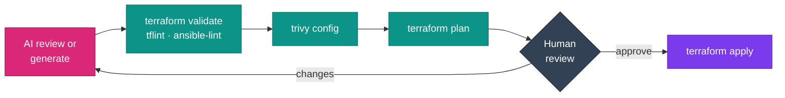

# AI-Assisted DevOps Workflows

Put the four AI assistants in the images (Claude Code, Codex CLI, Copilot CLI and Antigravity CLI) to work on real infrastructure tasks: reviewing changes, writing modules, explaining failures and reviewing pull requests in CI.

!!! info "Sign in first"
    Every example assumes you've signed in, or are passing a CI token. See the [AI CLI setup guide](../tool-basics/ai-cli-setup.md) for each assistant's login, environment variables and config directory. Google's Gemini CLI has been [replaced by Antigravity CLI](https://developers.googleblog.com/an-important-update-transitioning-gemini-cli-to-antigravity-cli/) (`agy`), and the examples use `agy`.

## The golden rule: AI suggests, tools verify

AI output is a first draft. Every workflow here runs the image's deterministic tools on it before anything reaches a cloud account.


```mermaid
flowchart LR
  A["AI review or<br/>generate"] --> V["terraform validate<br/>tflint · ansible-lint"]
  V --> S["trivy config"]
  S --> P["terraform plan"]
  P --> H{"Human<br/>review"}
  H -->|approve| D["terraform apply"]
  H -->|changes| A

  classDef ai fill:#db2777,stroke:#9d174d,color:#fff
  classDef base fill:#0d9488,stroke:#0f766e,color:#fff
  classDef neutral fill:#334155,stroke:#1e293b,color:#fff
  classDef all fill:#7c3aed,stroke:#5b21b6,color:#fff
  class A ai
  class V,S,P base
  class H neutral
  class D all
```

All the snippets below run **inside** the container, from a shell started like this (mount only the logins you use):

```bash
docker run -it --rm \
  -v "$PWD":/srv -w /srv \
  -v ~/.claude:/root/.claude \
  -v ~/.claude.json:/root/.claude.json \
  -v ~/.codex:/root/.codex \
  -v ~/.copilot:/root/.copilot \
  -v ~/.gemini:/root/.gemini \
  -v ~/.aws:/root/.aws \
  ghcr.io/jinalshah/devops/images/all-devops:latest
```

!!! tip "Feeding files to an assistant"
    None of the CLIs has a `--file` flag. Either **pipe** content in (`git diff | claude -p "..."`), or **name the files in the prompt**, since each agent can read the working directory itself.

## Workflow 1: Review changes before you apply

The same review, done with whichever assistant you have. Piping `git diff` keeps the model focused on what changed.

=== ":simple-claude: Claude"

    ```bash
    git diff main -- terraform/ | claude -p "Review this Terraform diff. Check for:
    1. IAM policies with * actions or resources
    2. Security groups open to 0.0.0.0/0
    3. Unencrypted storage
    4. Missing environment/project/owner tags
    Rate each finding high, medium or low." > ai-review.md
    ```

=== ":lucide-sparkles: Codex"

    ```bash
    git diff main -- terraform/ | codex exec "Review this Terraform diff for
    over-permissive IAM, open security groups, unencrypted storage and missing tags.
    Rate each finding high, medium or low." > ai-review.md
    ```

=== ":simple-githubcopilot: Copilot"

    ```bash
    git diff main -- terraform/ > /tmp/tf.diff
    copilot -s --allow-all-tools -p "Review the Terraform diff in /tmp/tf.diff for
    over-permissive IAM, open security groups, unencrypted storage and missing tags.
    Rate each finding high, medium or low." > ai-review.md
    ```

=== ":simple-googlegemini: Antigravity"

    ```bash
    git diff main -- terraform/ | agy -p "Review this Terraform diff for
    over-permissive IAM, open security groups, unencrypted storage and missing tags.
    Rate each finding high, medium or low." > ai-review.md
    ```

Then let the deterministic tools have their say:

```bash
cd terraform
terraform init -backend=false && terraform validate
tflint
trivy config .
```

## Workflow 2: Generate a module, then prove it

Let an agent write files directly rather than redirecting its chat output into a `.tf` file. You get clean HCL across several files.

=== ":lucide-sparkles: Codex"

    ```bash
    codex exec --sandbox workspace-write "Create a Terraform module in modules/vpc with
    main.tf, variables.tf and outputs.tf: a VPC with 3 public and 3 private subnets
    across 3 AZs, one NAT gateway per AZ, VPC Flow Logs to CloudWatch, and
    environment/project tags on everything."
    ```

=== ":simple-claude: Claude"

    ```bash
    claude --permission-mode acceptEdits -p "Create a Terraform module in modules/vpc with
    main.tf, variables.tf and outputs.tf: a VPC with 3 public and 3 private subnets
    across 3 AZs, one NAT gateway per AZ, VPC Flow Logs to CloudWatch, and
    environment/project tags on everything."
    ```

=== ":simple-googlegemini: Antigravity"

    ```bash
    agy --mode accept-edits -p "Create a Terraform module in modules/vpc with
    main.tf, variables.tf and outputs.tf: a VPC with 3 public and 3 private subnets
    across 3 AZs, one NAT gateway per AZ, VPC Flow Logs to CloudWatch, and
    environment/project tags on everything."
    ```

Prove it before trusting it:

```bash
cd modules/vpc
terraform init -backend=false
terraform fmt -check && terraform validate && tflint
trivy config .
```

!!! example "Second opinion"
    Generate with one assistant and review with another, for example `codex exec` to write and `git diff | claude -p "review"` to check. Different models tend to catch different mistakes.

## Workflow 3: Explain a failure

Pipe the error straight in. `2>&1` makes sure stderr, where most tools write their errors, comes along too.

```bash
terraform apply 2>&1 | tee apply.log
claude -p "This terraform apply failed. Explain the root cause, give a step-by-step fix,
and say how to prevent it. The config is in the current directory." < apply.log
```

It works the same for Kubernetes and Ansible:

```bash
kubectl describe pod my-app-7d9c -n prod | agy -p "Why is this pod not starting?"

ansible-playbook site.yml 2>&1 | tail -50 | codex exec "Explain this Ansible failure and suggest a fix"
```

## Workflow 4: Triage security scan results

Scanners are thorough but noisy. Let an assistant sort the findings and draft the fixes:

```bash
trivy config --format json . > trivy.json
agy -p "Summarise trivy.json for an engineer: group findings by severity,
list the top five to fix first, and show the Terraform change for each." > trivy-triage.md
```

## Workflow 5: Keep module docs up to date

```bash
for module in modules/*/; do
  echo "Documenting $module"
  claude --permission-mode acceptEdits -p "Write ${module}README.md for the Terraform module in ${module}:
  purpose, a table of inputs (type, default, description), a table of outputs,
  and a usage example. Base it only on the .tf files in that directory."
done
```

## CI: AI review on every pull request

The images already contain `git`, `gh` and all four assistants, so a review job just needs a token.

=== ":simple-githubactions: GitHub Actions + Claude"

    ```yaml
    name: AI review

    on:
      pull_request:
        paths: ['terraform/**', 'ansible/**']

    permissions:
      contents: read
      pull-requests: write

    jobs:
      ai-review:
        runs-on: ubuntu-latest
        container:
          image: ghcr.io/jinalshah/devops/images/all-devops:latest
        steps:
          - uses: actions/checkout@v4
            with:
              fetch-depth: 0

          - name: Review the diff
            env:
              ANTHROPIC_API_KEY: ${{ secrets.ANTHROPIC_API_KEY }}
            run: |
              git diff "origin/${{ github.base_ref }}...HEAD" -- terraform ansible \
                | claude -p "Review this pull request diff for security issues, bugs and
                  risky infrastructure changes. Be specific and concise; use Markdown." \
                > review.md

          - name: Comment on the PR
            env:
              GH_TOKEN: ${{ github.token }}
            run: gh pr comment ${{ github.event.pull_request.number }} --body-file review.md
    ```

=== ":simple-githubactions: GitHub Actions + Copilot"

    ```yaml
          - name: Review the diff
            env:
              COPILOT_GITHUB_TOKEN: ${{ secrets.COPILOT_PAT }}
            run: |
              git diff "origin/${{ github.base_ref }}...HEAD" -- terraform > /tmp/pr.diff
              copilot -s --allow-all-tools \
                -p "Review the diff in /tmp/pr.diff for security issues and risky changes. Use Markdown." \
                > review.md
    ```

    `COPILOT_PAT` is a fine-grained PAT with the **Copilot Requests** permission. The built-in `github.token` can't call Copilot.

=== ":simple-gitlab: GitLab CI + Codex"

    ```yaml
    ai:review:
      stage: test
      image: registry.gitlab.com/jinal-shah/devops/images/all-devops:latest
      variables:
        GIT_DEPTH: "0"
      rules:
        - if: $CI_PIPELINE_SOURCE == "merge_request_event"
      script:
        - >
          git diff "$CI_MERGE_REQUEST_DIFF_BASE_SHA...HEAD" -- terraform
          | codex exec "Review this merge request diff for security issues and risky changes. Use Markdown."
          > ai-review.md
        - >
          curl --fail --request POST
          --header "PRIVATE-TOKEN: $GITLAB_TOKEN"
          --data-urlencode "body@ai-review.md"
          "$CI_API_V4_URL/projects/$CI_PROJECT_ID/merge_requests/$CI_MERGE_REQUEST_IID/notes"
      artifacts:
        paths: [ai-review.md]
    ```

    Set `CODEX_API_KEY` and `GITLAB_TOKEN` (a token with `api` scope) as masked CI/CD variables.

=== ":simple-googlegemini: Any CI + Antigravity"

    ```bash
    mkdir -p ~/.gemini/antigravity-cli
    echo '{"modelProvider": "gemini"}' > ~/.gemini/antigravity-cli/settings.json
    # GEMINI_API_KEY comes from your CI secret store
    git diff origin/main...HEAD | agy -p "Review this diff for risky changes" --print-timeout 5m > review.md
    ```

    If `agy` fails headless, it exits with code `3` and writes `AGY_ERROR: {json}` to stderr, so the job fails loudly.

!!! warning "Keep AI review advisory"
    Post the review as a comment and let humans decide. Don't let an AI job approve or merge, and don't give it cloud credentials it doesn't need.

## Best practices

<div class="grid cards" markdown>

-   :lucide-scan-search:{ .lg .middle } __Give it evidence__

    ---

    Pipe in diffs, plan output, logs and scan JSON. Specific context gets specific answers.

-   :lucide-shield-check:{ .lg .middle } __Verify everything__

    ---

    `validate`, `tflint`, `ansible-lint`, `trivy` and a human review, every time.

-   :lucide-lock:{ .lg .middle } __Guard secrets__

    ---

    Never paste credentials or `.tfstate` into a prompt. Mount only the credentials the task needs.

-   :lucide-wand-sparkles:{ .lg .middle } __Save good prompts__

    ---

    Keep prompts that work in scripts or `AGENTS.md` / `GEMINI.md` context files so the team reuses them.

</div>

!!! tip "Keeping costs down"
    Review the diff, not the whole repository. Pick a smaller or faster model with `--model` for routine checks. Set spending limits in your vendor console. Current pricing: [Claude](https://www.anthropic.com/pricing), [OpenAI API](https://openai.com/api/pricing/), [GitHub Copilot](https://github.com/features/copilot/plans), [Antigravity](https://antigravity.google/docs).

## Troubleshooting

??? question "The command opens an interactive UI or hangs in CI"
    Use the non-interactive form: `claude -p`, `codex exec`, `copilot -p ... --allow-all-tools` or `agy -p`.

??? question "The input is too large"
    Narrow it down: `git diff -- path/`, `tail -200 build.log`, or `trivy ... --severity HIGH,CRITICAL`. Or skip piping, name the files in the prompt and let the agent read only what it needs.

??? question "The answers are generic"
    Name what to check for (IAM wildcards, `0.0.0.0/0`, encryption, tags) and what shape you want back (a table, a severity ranking, a patch).

## Next steps

- [AI CLI setup guide](../tool-basics/ai-cli-setup.md): sign-in and flags for each assistant
- [Multi-tool patterns](multi-tool-patterns.md): chain AI with Terraform, Helm and Ansible
- [GitHub Actions examples](ci-cd-github.md): complete pipeline configurations
- [Authentication guide](../use-images/authentication.md): credential management
