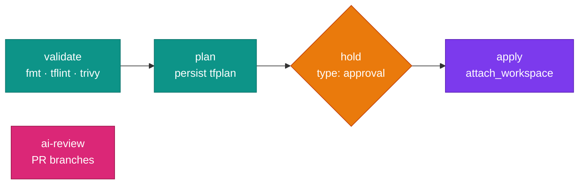

# :simple-circleci: CircleCI

Use a DevOps image as the primary container of a Docker executor. Every `run` step then has Terraform, kubectl, Helm, Trivy, the cloud CLIs and the AI CLIs on `PATH`. The image includes `bash`, so CircleCI's default `/bin/bash -eo pipefail` shell works as usual.

## The pipeline at a glance



## A reusable executor

Executors that use `<< parameters.* >>` must declare those parameters:

```yaml
executors:
  devops:
    parameters:
      variant:
        type: enum
        enum: [all-devops, aws-devops, gcp-devops]
        default: aws-devops
      tag:
        type: string
        default: "1.0.abc1234"
      size:
        type: string
        default: medium   # use arm.medium to run on arm64
    docker:
      - image: ghcr.io/jinalshah/devops/images/<< parameters.variant >>:<< parameters.tag >>
    resource_class: << parameters.size >>
```

Then use `executor: devops`, or `executor: { name: devops, variant: all-devops }`. The images are multi-arch, so `arm.*` resource classes pull the arm64 build automatically.

!!! tip "Pinning"
    `1.0.abc1234` is a per-commit tag: stable for that commit, but refreshed by the scheduled rebuilds with newer tool versions. For strict reproducibility, pin `ghcr.io/jinalshah/devops/images/aws-devops@sha256:<digest>`.

## Validate → plan → approve → apply

```yaml title=".circleci/config.yml"
version: 2.1

executors:
  devops:
    parameters:
      variant: { type: string, default: aws-devops }
    docker:
      - image: ghcr.io/jinalshah/devops/images/<< parameters.variant >>:1.0.abc1234

commands:
  aws-oidc:
    steps:
      - run:
          name: Assume AWS role with CircleCI OIDC
          command: |
            echo "$CIRCLE_OIDC_TOKEN_V2" > /tmp/web-identity-token
            echo 'export AWS_WEB_IDENTITY_TOKEN_FILE=/tmp/web-identity-token' >> "$BASH_ENV"
            echo "export AWS_ROLE_ARN=${AWS_ROLE_ARN}" >> "$BASH_ENV"
            echo 'export AWS_REGION=eu-west-2' >> "$BASH_ENV"

  tf-init:
    steps:
      - restore_cache:
          keys:
            - tf-providers-{{ arch }}-{{ checksum "terraform/.terraform.lock.hcl" }}
      - run:
          name: terraform init
          command: |
            echo "export TF_PLUGIN_CACHE_DIR=$HOME/.terraform-plugin-cache" >> "$BASH_ENV"
            source "$BASH_ENV"
            mkdir -p "$TF_PLUGIN_CACHE_DIR"
            terraform -chdir=terraform init -input=false
      - save_cache:
          key: tf-providers-{{ arch }}-{{ checksum "terraform/.terraform.lock.hcl" }}
          paths: [~/.terraform-plugin-cache]

jobs:
  validate:
    executor: devops
    steps:
      - checkout
      - run: terraform fmt -check -recursive terraform/
      - run: cd terraform && tflint --init && tflint --recursive
      - run: trivy config --severity HIGH,CRITICAL --exit-code 1 terraform/

  plan:
    executor: devops
    steps:
      - checkout
      - aws-oidc
      - tf-init
      - run: terraform -chdir=terraform plan -input=false -out=tfplan
      - persist_to_workspace:
          root: .
          paths: [terraform/tfplan]

  apply:
    executor: devops
    steps:
      - checkout
      - attach_workspace: { at: . }
      - aws-oidc
      - tf-init
      - run: terraform -chdir=terraform apply -input=false tfplan

workflows:
  terraform:
    jobs:
      - validate
      - plan:
          requires: [validate]
          context: [aws-terraform]
      - hold:
          type: approval
          requires: [plan]
          filters: { branches: { only: main } }
      - apply:
          requires: [hold]
          context: [aws-terraform]
          filters: { branches: { only: main } }
```

!!! warning "Each `run` step is a new shell"
    `export FOO=bar` in one `run` step is gone in the next. Append exports to `$BASH_ENV` instead, as the `aws-oidc` command does. CircleCI sources that file at the start of every later step.

!!! info "OIDC needs a context"
    `$CIRCLE_OIDC_TOKEN_V2` is only issued to jobs that use at least one context. Set `AWS_ROLE_ARN` in that context, and give the IAM role a trust policy for your CircleCI organisation's OIDC provider.

## Cloud credentials

=== ":fontawesome-brands-aws: AWS (OIDC)"

    Use the `aws-oidc` command from the config above. No long-lived keys are stored.

=== ":simple-googlecloud: Google Cloud"

    Store the base64-encoded service-account key as `GCP_SA_KEY_B64` in a context.

    ```yaml
    - run:
        name: Authenticate to Google Cloud
        command: |
          echo "$GCP_SA_KEY_B64" | base64 -d > /tmp/gcp-key.json
          gcloud auth activate-service-account --key-file=/tmp/gcp-key.json
          gcloud config set project my-project
          echo 'export GOOGLE_APPLICATION_CREDENTIALS=/tmp/gcp-key.json' >> "$BASH_ENV"
    ```

    `gcloud` needs `activate-service-account`, and Terraform reads `GOOGLE_APPLICATION_CREDENTIALS`. Use <span class="di-pill di-pill--gcp">gcp-devops</span> or <span class="di-pill di-pill--all">all-devops</span>.

=== ":lucide-key-round: Static keys"

    Put `AWS_ACCESS_KEY_ID` and `AWS_SECRET_ACCESS_KEY` in a context. They are exported into every step automatically.

## Many environments with a matrix

```yaml
jobs:
  plan-env:
    parameters:
      env: { type: string }
    executor: { name: devops, variant: all-devops }
    steps:
      - checkout
      - run: |
          cd terraform/<< parameters.env >>
          terraform init -input=false
          terraform plan -input=false -out=tfplan

workflows:
  plan-all:
    jobs:
      - plan-env:
          context: [aws-terraform]
          matrix:
            parameters:
              env: [dev, staging, production]
```

## Security scanning

```yaml
jobs:
  security:
    executor: devops
    steps:
      - checkout
      - run: trivy fs --scanners vuln,secret,misconfig --format json --output trivy.json .
      - run: trivy fs --scanners vuln,secret,misconfig --severity HIGH,CRITICAL --exit-code 1 .
      - run: if [ -d ansible ]; then ansible-lint ansible/; fi
      - store_artifacts:
          path: trivy.json
```

!!! warning "No Docker in the image, so `setup_remote_docker` won't help"
    `setup_remote_docker` gives a job a remote Docker engine, but the job still needs a `docker` CLI, and these images don't include one. Build your application image in a separate job that uses a `cimg/base` image or the `machine` executor. Then scan the pushed image from the DevOps image; Trivy pulls it from the registry itself:

    ```yaml
    - run: |
        TRIVY_USERNAME="$REGISTRY_USER" TRIVY_PASSWORD="$REGISTRY_TOKEN" \
          trivy image --severity HIGH,CRITICAL --exit-code 1 ghcr.io/my-org/app:${CIRCLE_SHA1:0:7}
    ```

## Deploy to Kubernetes

=== "EKS"

    ```yaml
    - aws-oidc
    - run: |
        aws eks update-kubeconfig --region "$AWS_REGION" --name my-cluster
        helm upgrade --install myapp ./charts/myapp -n production --create-namespace --wait
        kubectl rollout status deployment/myapp -n production
    ```

=== "GKE"

    ```yaml
    - run: |
        gcloud container clusters get-credentials my-cluster --region europe-west2 --project my-project
        helm upgrade --install myapp ./charts/myapp -n production --create-namespace --wait
        kubectl rollout status deployment/myapp -n production
    ```

    Run the Google Cloud auth step first. `gke-gcloud-auth-plugin` is included in the image.

## AI review

Put `ANTHROPIC_API_KEY` and a GitHub token (`GH_TOKEN`) in a context, then review the branch against `main` and comment on the PR:

```yaml
jobs:
  ai-review:
    executor: { name: devops, variant: all-devops }
    steps:
      - checkout
      - run:
          name: Review diff with Claude Code
          command: |
            git fetch origin main
            git diff origin/main...HEAD -- terraform/ ansible/ \
              | claude -p "Review this infrastructure diff for security issues and risky changes. Reply in Markdown." \
              > review.md
      - run:
          name: Comment on the PR
          command: |
            if [ -n "$CIRCLE_PULL_REQUEST" ]; then
              gh pr comment "$CIRCLE_PULL_REQUEST" --body-file review.md
            fi
      - store_artifacts:
          path: review.md
```

`gh pr comment` accepts the full PR URL that CircleCI puts in `$CIRCLE_PULL_REQUEST`. To use a different agent, swap in `codex exec "..."` (with `CODEX_API_KEY`) or `agy -p "..."`; see [AI-assisted DevOps](ai-assisted-devops.md).

## Troubleshooting

??? question "A variable set in one step is empty in the next"
    Write it to `$BASH_ENV` (`echo 'export FOO=bar' >> "$BASH_ENV"`) instead of using a bare `export`.

??? question "`Unknown variable(s): parameters.xyz` in an executor"
    The executor uses `<< parameters.xyz >>` without declaring it. Add it under the executor's `parameters:` key, as in [A reusable executor](#a-reusable-executor).

??? question "Slow job start"
    The images are about 1.5 to 1.6 GB compressed, so the first pull on a fresh machine takes a while. CircleCI doesn't guarantee the image is already cached on the machine that runs your job, so use fewer, longer jobs where you can.

## Next steps

- [GitHub Actions](ci-cd-github.md) · [GitLab CI](ci-cd-gitlab.md) · [Jenkins](ci-cd-jenkins.md)
- [Terraform workflows](terraform-workflows.md)
- [AI-assisted DevOps](ai-assisted-devops.md)
