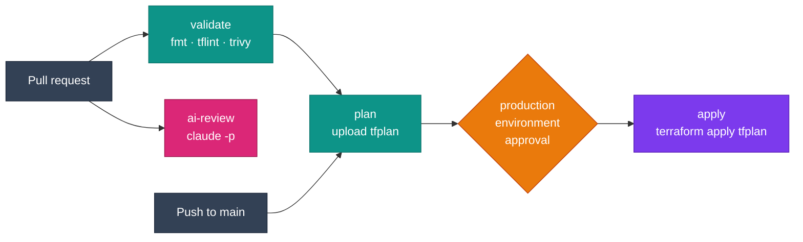

# GitHub Actions

Run any job inside a DevOps image with the `container:` key. Every `run:` step then executes in the image, with Terraform, kubectl, Helm, Trivy, the cloud CLIs and the AI CLIs already on `PATH`.

## The pipeline at a glance



## Minimal job

```yaml title=".github/workflows/terraform.yml"
name: Terraform

on:
  push:
    branches: [main]

permissions:
  contents: read
  id-token: write   # needed for OIDC

jobs:
  apply:
    runs-on: ubuntu-latest
    container:
      image: ghcr.io/jinalshah/devops/images/aws-devops:1.0.abc1234
    steps:
      - uses: actions/checkout@v4

      - uses: aws-actions/configure-aws-credentials@v4
        with:
          role-to-assume: arn:aws:iam::123456789012:role/github-terraform
          aws-region: eu-west-2

      - run: |
          terraform init -input=false
          terraform apply -input=false -auto-approve
```

!!! tip "Pinning"
    `1.0.abc1234` is a per-commit tag. It stays tied to one commit of this repo, but scheduled rebuilds refresh it with newer tool versions. For strict reproducibility, use `image: ghcr.io/jinalshah/devops/images/aws-devops@sha256:<digest>`.

??? info "What changes inside a `container:` job"
    - GitHub mounts the workspace and sets `HOME=/github/home`, so `~` in a step is not `/root`. The tools are still found because the image's `PATH` is kept.
    - Container jobs need a Linux runner. `ubuntu-latest` and `ubuntu-24.04-arm` both work, because the images are multi-arch.
    - Hosted runners start clean, so each job pulls the image again (about 1.5 to 1.6 GB). GitHub does **not** cache container layers for you. Fewer, longer jobs pull less; self-hosted runners keep the image between jobs.

## Validate → plan → apply

The plan is saved as an artifact, and the `apply` job applies exactly that file after the `production` environment's reviewers approve it.

```yaml title=".github/workflows/terraform-pipeline.yml"
name: Terraform pipeline

on:
  pull_request:
    paths: ["terraform/**"]
  push:
    branches: [main]

permissions:
  contents: read
  id-token: write

concurrency:
  group: terraform-${{ github.ref }}
  cancel-in-progress: false

jobs:
  validate:
    runs-on: ubuntu-latest
    container:
      image: ghcr.io/jinalshah/devops/images/aws-devops:1.0.abc1234
    steps:
      - uses: actions/checkout@v4
      - run: terraform fmt -check -recursive terraform/
      - run: |
          cd terraform
          tflint --init
          tflint --recursive
      - run: trivy config --severity HIGH,CRITICAL --exit-code 1 terraform/

  plan:
    needs: validate
    runs-on: ubuntu-latest
    container:
      image: ghcr.io/jinalshah/devops/images/aws-devops:1.0.abc1234
    steps:
      - uses: actions/checkout@v4
      - uses: aws-actions/configure-aws-credentials@v4
        with:
          role-to-assume: arn:aws:iam::123456789012:role/github-terraform-plan
          aws-region: eu-west-2
      - run: |
          cd terraform
          terraform init -input=false
          terraform plan -input=false -out=tfplan
      - uses: actions/upload-artifact@v4
        with:
          name: tfplan
          path: terraform/tfplan

  apply:
    needs: plan
    if: github.ref == 'refs/heads/main'
    runs-on: ubuntu-latest
    environment: production   # add required reviewers in repo settings
    container:
      image: ghcr.io/jinalshah/devops/images/aws-devops:1.0.abc1234
    steps:
      - uses: actions/checkout@v4
      - uses: actions/download-artifact@v4
        with:
          name: tfplan
          path: terraform
      - uses: aws-actions/configure-aws-credentials@v4
        with:
          role-to-assume: arn:aws:iam::123456789012:role/github-terraform-apply
          aws-region: eu-west-2
      - run: |
          cd terraform
          terraform init -input=false
          terraform apply -input=false tfplan
```

!!! note "One image reference per job"
    The `env` context is not available in `jobs.<id>.container`, so write the image out in each job. To change it in one place, use a repository variable (`image: ${{ vars.DEVOPS_IMAGE }}`) or a reusable workflow input.

## Cloud credentials

=== ":fontawesome-brands-aws: AWS (OIDC)"

    ```yaml
    permissions:
      id-token: write
      contents: read

    steps:
      - uses: aws-actions/configure-aws-credentials@v4
        with:
          role-to-assume: arn:aws:iam::123456789012:role/github-deploy
          aws-region: eu-west-2
      - run: aws sts get-caller-identity
    ```

    Works with <span class="di-pill di-pill--aws">aws-devops</span> and <span class="di-pill di-pill--all">all-devops</span>.

=== ":simple-googlecloud: Google Cloud (Workload Identity)"

    ```yaml
    permissions:
      id-token: write
      contents: read

    steps:
      - uses: google-github-actions/auth@v2
        with:
          workload_identity_provider: projects/123456/locations/global/workloadIdentityPools/github/providers/github
          service_account: deploy@my-project.iam.gserviceaccount.com
      - run: gcloud config list
    ```

    The auth action writes a credentials file and exports the variables that both `gcloud` and Terraform read. Works with <span class="di-pill di-pill--gcp">gcp-devops</span> and <span class="di-pill di-pill--all">all-devops</span>.

=== ":lucide-key-round: Static keys"

    Only if OIDC isn't an option:

    ```yaml
    env:
      AWS_ACCESS_KEY_ID: ${{ secrets.AWS_ACCESS_KEY_ID }}
      AWS_SECRET_ACCESS_KEY: ${{ secrets.AWS_SECRET_ACCESS_KEY }}
      AWS_REGION: eu-west-2
    ```

## Security scanning with code scanning alerts

Trivy writes SARIF, which GitHub shows under **Security → Code scanning**.

```yaml title=".github/workflows/security.yml"
name: Security scan

on:
  pull_request:
  schedule:
    - cron: "17 4 * * 1"

permissions:
  contents: read
  security-events: write

jobs:
  scan:
    runs-on: ubuntu-latest
    container:
      image: ghcr.io/jinalshah/devops/images/all-devops:1.0.abc1234
    steps:
      - uses: actions/checkout@v4

      - name: Trivy (vulnerabilities, secrets, misconfigurations)
        run: trivy fs --scanners vuln,secret,misconfig --format sarif --output trivy.sarif .

      - uses: github/codeql-action/upload-sarif@v3
        with:
          sarif_file: trivy.sarif

      - name: Fail on HIGH/CRITICAL
        run: trivy fs --scanners vuln,secret,misconfig --severity HIGH,CRITICAL --exit-code 1 .

      - name: Linters
        run: |
          tflint --init && tflint --recursive
          if [ -d ansible ]; then ansible-lint ansible/; fi
          if [ -d cloudformation ]; then cfn-lint "cloudformation/**/*.yaml"; fi
```

!!! warning "Scanning container images"
    There is no `docker` CLI in the image, so `trivy image my-app:latest` cannot see an image you built locally in the same job. Scan a **pushed** image by reference instead; Trivy pulls it from the registry itself:

    ```bash
    TRIVY_USERNAME=${{ github.actor }} TRIVY_PASSWORD=${{ secrets.GITHUB_TOKEN }} \
      trivy image --severity HIGH,CRITICAL --exit-code 1 ghcr.io/my-org/my-app:${{ github.sha }}
    ```

    Build the image itself in a separate job without `container:`, using `docker/build-push-action`.

`cfn-lint` is only in <span class="di-pill di-pill--aws">aws-devops</span> and <span class="di-pill di-pill--all">all-devops</span>.

## Deploy to Kubernetes with Helm

=== "EKS"

    ```yaml
    - uses: aws-actions/configure-aws-credentials@v4
      with:
        role-to-assume: arn:aws:iam::123456789012:role/github-deploy
        aws-region: eu-west-2
    - run: aws eks update-kubeconfig --region eu-west-2 --name my-cluster
    - run: |
        helm upgrade --install myapp ./charts/myapp \
          --namespace production --create-namespace --wait --timeout 5m
        kubectl rollout status deployment/myapp -n production
    ```

=== "GKE"

    ```yaml
    - uses: google-github-actions/auth@v2
      with:
        workload_identity_provider: ${{ vars.GCP_WIF_PROVIDER }}
        service_account: ${{ vars.GCP_DEPLOY_SA }}
    - run: gcloud container clusters get-credentials my-cluster --region europe-west2
    - run: |
        helm upgrade --install myapp ./charts/myapp \
          --namespace production --create-namespace --wait --timeout 5m
        kubectl rollout status deployment/myapp -n production
    ```

    `gke-gcloud-auth-plugin` is included, so kubectl authenticates to GKE without extra setup.

## Caching Terraform providers

The image doesn't set a provider cache, so set one per job and cache it with `actions/cache`:

```yaml title="Optimised Terraform job"
env:
  TF_PLUGIN_CACHE_DIR: ${{ github.workspace }}/.terraform-plugin-cache

steps:
  - uses: actions/checkout@v4
  - run: mkdir -p "$TF_PLUGIN_CACHE_DIR"
  - uses: actions/cache@v4
    with:
      path: .terraform-plugin-cache
      key: tf-providers-${{ runner.os }}-${{ runner.arch }}-${{ hashFiles('**/.terraform.lock.hcl') }}
  - run: terraform init -input=false
```

## AI review on pull requests

Pipe the diff into `claude -p` and post the result with `gh`, which is in the image.

```yaml title=".github/workflows/ai-review.yml"
name: AI review

on:
  pull_request:
    paths: ["terraform/**", "ansible/**"]

permissions:
  contents: read
  pull-requests: write

jobs:
  review:
    runs-on: ubuntu-latest
    container:
      image: ghcr.io/jinalshah/devops/images/all-devops:1.0.abc1234
    steps:
      - uses: actions/checkout@v4
        with:
          fetch-depth: 0

      - name: Review the diff
        env:
          ANTHROPIC_API_KEY: ${{ secrets.ANTHROPIC_API_KEY }}
        run: |
          git config --global --add safe.directory "$GITHUB_WORKSPACE"
          git diff "origin/${{ github.base_ref }}...HEAD" -- terraform/ ansible/ \
            | claude -p "Review this infrastructure diff for security issues, risky changes and best-practice problems. Reply in Markdown." \
            > review.md

      - name: Comment on the PR
        env:
          GH_TOKEN: ${{ github.token }}
        run: gh pr comment ${{ github.event.pull_request.number }} --repo "$GITHUB_REPOSITORY" --body-file review.md
```

=== "Claude Code"

    ```bash
    # env: ANTHROPIC_API_KEY (or CLAUDE_CODE_OAUTH_TOKEN)
    git diff ... | claude -p "Review this diff"
    ```

=== "Codex"

    ```bash
    # env: CODEX_API_KEY
    git diff ... | codex exec "Review this diff"
    ```

=== "Copilot"

    ```bash
    # env: COPILOT_GITHUB_TOKEN (fine-grained PAT with "Copilot Requests")
    git diff ... | copilot -p "Review this diff" --allow-all-tools
    ```

!!! warning "Forks and secrets"
    Secrets are not passed to workflows triggered by pull requests from forks, so the review step will fail to authenticate there. Guard it with `if: github.event.pull_request.head.repo.full_name == github.repository`.

More prompts and patterns are in [AI-assisted DevOps](ai-assisted-devops.md).

## Reusable workflows

Reusable workflows must sit **directly** in `.github/workflows/`. Subdirectories are not supported.

```yaml title=".github/workflows/terraform-deploy.yml"
name: Reusable Terraform deploy

on:
  workflow_call:
    inputs:
      environment: { required: true, type: string }
      working-directory: { required: true, type: string }
      role-arn: { required: true, type: string }

permissions:
  contents: read
  id-token: write

jobs:
  deploy:
    runs-on: ubuntu-latest
    environment: ${{ inputs.environment }}
    container:
      image: ghcr.io/jinalshah/devops/images/aws-devops:1.0.abc1234
    defaults:
      run:
        working-directory: ${{ inputs.working-directory }}
    steps:
      - uses: actions/checkout@v4
      - uses: aws-actions/configure-aws-credentials@v4
        with:
          role-to-assume: ${{ inputs.role-arn }}
          aws-region: eu-west-2
      - run: terraform init -input=false
      - run: terraform apply -input=false -auto-approve
```

```yaml title=".github/workflows/deploy-all.yml"
name: Deploy all environments

on:
  push:
    branches: [main]

permissions:
  contents: read
  id-token: write

jobs:
  dev:
    uses: ./.github/workflows/terraform-deploy.yml
    with: { environment: dev, working-directory: terraform/dev, role-arn: "arn:aws:iam::111111111111:role/deploy" }
  staging:
    needs: dev
    uses: ./.github/workflows/terraform-deploy.yml
    with: { environment: staging, working-directory: terraform/staging, role-arn: "arn:aws:iam::222222222222:role/deploy" }
  production:
    needs: staging
    uses: ./.github/workflows/terraform-deploy.yml
    with: { environment: production, working-directory: terraform/production, role-arn: "arn:aws:iam::333333333333:role/deploy" }
```

## Troubleshooting

??? question "The container image won't pull"
    Check the image name and tag, and that the tag exists: tags are `latest` and `1.0.<7-char sha>`, and there is no `1.0` tag. For an image in a private registry, add credentials:

    ```yaml
    container:
      image: ghcr.io/my-org/private-image:tag
      credentials:
        username: ${{ github.actor }}
        password: ${{ secrets.GITHUB_TOKEN }}
    ```

??? question "`fatal: detected dubious ownership in repository`"
    Add `git config --global --add safe.directory "$GITHUB_WORKSPACE"` before your own `git` commands.

??? question "Two runs fight over the Terraform state lock"
    Add a `concurrency:` group per state (as in the pipeline above) with `cancel-in-progress: false`, so runs queue rather than collide.

## Next steps

- [GitLab CI](ci-cd-gitlab.md) · [Jenkins](ci-cd-jenkins.md) · [CircleCI](ci-cd-circleci.md)
- [Terraform workflows](terraform-workflows.md)
- [Multi-tool patterns](multi-tool-patterns.md)
- [AI-assisted DevOps](ai-assisted-devops.md)
