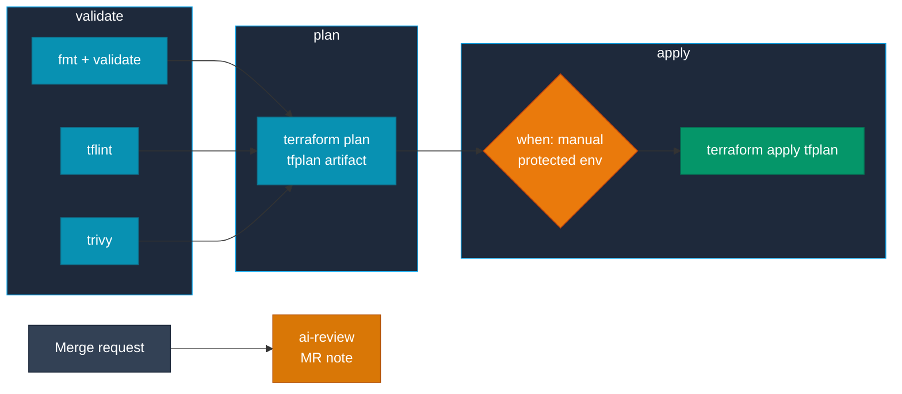

# GitLab CI

Set `image:` on a job, or once in `default:`, and every `script:` line runs inside the DevOps image. The images are also published to the GitLab registry at `registry.gitlab.com/jinal-shah/devops/images/<image>`, which is handy if your runners only reach GitLab.

## The pipeline at a glance



## Validate → plan → apply

```yaml title=".gitlab-ci.yml"
default:
  image: registry.gitlab.com/jinal-shah/devops/images/aws-devops:1.0.abc1234

stages: [validate, plan, apply]

variables:
  TF_ROOT: terraform
  TF_PLUGIN_CACHE_DIR: $CI_PROJECT_DIR/.terraform-plugin-cache

cache:
  key:
    files: [terraform/.terraform.lock.hcl]
  paths: [.terraform-plugin-cache/]

# Short-lived AWS credentials from GitLab's OIDC token (see "Cloud credentials")
.aws-oidc:
  id_tokens:
    AWS_ID_TOKEN:
      aud: sts.amazonaws.com
  variables:
    AWS_ROLE_ARN: arn:aws:iam::123456789012:role/gitlab-terraform
    AWS_REGION: eu-west-2
  before_script:
    - echo "$AWS_ID_TOKEN" > /tmp/web-identity-token
    - export AWS_WEB_IDENTITY_TOKEN_FILE=/tmp/web-identity-token

.tf:
  extends: .aws-oidc
  before_script:
    - !reference [.aws-oidc, before_script]
    - mkdir -p "$TF_PLUGIN_CACHE_DIR"
    - cd "$TF_ROOT"
    - terraform init -input=false

fmt-validate:
  extends: .tf
  stage: validate
  script:
    - terraform fmt -check -recursive
    - terraform validate

tflint:
  stage: validate
  script:
    - cd "$TF_ROOT"
    - tflint --init
    - tflint --recursive

trivy:
  stage: validate
  script:
    - trivy config --severity HIGH,CRITICAL --exit-code 1 "$TF_ROOT"

plan:
  extends: .tf
  stage: plan
  script:
    - terraform plan -input=false -out=tfplan
    - >
      terraform show -json tfplan | jq -r
      '([.resource_changes[]?.change.actions?]|flatten)|{"create":(map(select(.=="create"))|length),"update":(map(select(.=="update"))|length),"delete":(map(select(.=="delete"))|length)}'
      > plan-summary.json
  artifacts:
    paths: [$TF_ROOT/tfplan]
    reports:
      terraform: terraform/plan-summary.json
    expire_in: 1 week

apply:
  extends: .tf
  stage: apply
  needs: [plan]
  script:
    - terraform apply -input=false tfplan
  environment:
    name: production
  rules:
    - if: $CI_COMMIT_BRANCH == $CI_DEFAULT_BRANCH
      when: manual
```

The three `validate` jobs have no dependencies on each other, so they run in parallel. The `terraform` report shows a create/update/delete summary on the merge request.

!!! tip "Pinning"
    `1.0.abc1234` is a per-commit tag: stable for that commit, but refreshed by the scheduled rebuilds with newer tool versions. For strict reproducibility, pin `registry.gitlab.com/jinal-shah/devops/images/aws-devops@sha256:<digest>`.

!!! warning "Plan files can contain secrets"
    `tfplan` includes variable values and sometimes sensitive attributes. Keep `expire_in` short and restrict who can download job artifacts on protected branches.

## Cloud credentials

=== ":fontawesome-brands-aws: AWS (OIDC)"

    The `.aws-oidc` template in the pipeline above does this. GitLab issues an ID token for the job, the template writes it to a file, and the AWS CLI and Terraform exchange it for the role in `AWS_ROLE_ARN` through the standard web-identity variables. No long-lived keys are stored.

    Your IAM role needs a trust policy for GitLab's OIDC provider (`https://gitlab.com`, or your self-managed URL), limited to your project and protected branches.

=== ":simple-googlecloud: Google Cloud"

    Store the service-account key as a **File** type CI/CD variable called `GCP_SA_KEY`.

    ```yaml
    deploy-gcp:
      image: registry.gitlab.com/jinal-shah/devops/images/gcp-devops:1.0.abc1234
      script:
        - export GOOGLE_APPLICATION_CREDENTIALS="$GCP_SA_KEY"   # for Terraform
        - gcloud auth activate-service-account --key-file="$GCP_SA_KEY"   # for gcloud
        - gcloud config set project my-project
        - cd terraform/gcp && terraform init -input=false && terraform apply -input=false -auto-approve
    ```

    `gcloud` ignores `GOOGLE_APPLICATION_CREDENTIALS` for its own auth, which is why both lines are needed.

=== ":lucide-key-round: Static keys"

    Add `AWS_ACCESS_KEY_ID` and `AWS_SECRET_ACCESS_KEY` as masked, protected CI/CD variables. The AWS CLI and Terraform pick them up automatically; you don't need to repeat them under `variables:`.

## Many environments with `parallel:matrix`

```yaml
plan-all:
  stage: plan
  parallel:
    matrix:
      - CLOUD: aws
        ENV: [dev, staging, production]
      - CLOUD: gcp
        ENV: [dev, staging, production]
  image: registry.gitlab.com/jinal-shah/devops/images/all-devops:1.0.abc1234
  script:
    - cd "terraform/$CLOUD/$ENV"
    - terraform init -input=false
    - terraform plan -input=false -out=tfplan
  artifacts:
    paths: [terraform/$CLOUD/$ENV/tfplan]
```

Use <span class="di-pill di-pill--all">all-devops</span> when one job definition covers both clouds.

## Security scanning

```yaml
security-scan:
  stage: validate
  script:
    - trivy fs --scanners vuln,secret,misconfig --format json --output trivy.json .
    - trivy fs --scanners vuln,secret,misconfig --severity HIGH,CRITICAL --exit-code 1 .
    - tflint --init && tflint --recursive
    - if [ -d ansible ]; then ansible-lint ansible/; fi
  artifacts:
    when: always
    paths: [trivy.json]
```

!!! info "Plain artifact, not a GitLab security report"
    Trivy's JSON does not match GitLab's `container_scanning` report schema, so it's published as a plain artifact to download. If you want findings in GitLab's security dashboard, use GitLab's own scanning templates alongside this job.

!!! warning "No Docker in the image"
    You can't `docker build` or `docker run` inside these jobs, and a `docker:dind` service doesn't help because there is no `docker` CLI to talk to it. Build images in a separate job that uses `image: docker` with the `docker:dind` service. Scan the pushed image by reference from the DevOps image; Trivy pulls it from the registry itself:

    ```yaml
    scan-image:
      variables:
        TRIVY_USERNAME: $CI_REGISTRY_USER
        TRIVY_PASSWORD: $CI_REGISTRY_PASSWORD
      script:
        - trivy image --severity HIGH,CRITICAL --exit-code 1 "$CI_REGISTRY_IMAGE:$CI_COMMIT_SHORT_SHA"
    ```

## Deploy to Kubernetes

=== "EKS"

    ```yaml
    deploy-eks:
      extends: .aws-oidc
      stage: apply
      script:
        - aws eks update-kubeconfig --region "$AWS_REGION" --name my-cluster
        - helm upgrade --install myapp ./charts/myapp -n production --create-namespace --wait
        - kubectl rollout status deployment/myapp -n production
      environment: { name: production }
    ```

=== "GKE"

    ```yaml
    deploy-gke:
      image: registry.gitlab.com/jinal-shah/devops/images/gcp-devops:1.0.abc1234
      stage: apply
      script:
        - gcloud auth activate-service-account --key-file="$GCP_SA_KEY"
        - gcloud container clusters get-credentials my-cluster --region europe-west2 --project my-project
        - helm upgrade --install myapp ./charts/myapp -n production --create-namespace --wait
        - kubectl rollout status deployment/myapp -n production
      environment: { name: production }
    ```

## AI review as a merge request note

`CI_JOB_TOKEN` can't create merge request notes, so create a **project access token** with the `api` scope (Reporter role or higher). On GitLab.com, project access tokens need a Premium or Ultimate subscription. Store it as a masked variable called `GITLAB_REVIEW_TOKEN`, and your Anthropic key as `ANTHROPIC_API_KEY`.

```yaml
ai-review:
  stage: validate
  image: registry.gitlab.com/jinal-shah/devops/images/all-devops:1.0.abc1234
  variables:
    GIT_DEPTH: 0
  rules:
    - if: $CI_PIPELINE_SOURCE == "merge_request_event"
  script:
    - git fetch origin "$CI_MERGE_REQUEST_TARGET_BRANCH_NAME"
    - >
      git diff "origin/$CI_MERGE_REQUEST_TARGET_BRANCH_NAME...HEAD" -- terraform/ ansible/
      | claude -p "Review this infrastructure diff for security issues and risky changes. Reply in Markdown."
      > review.md
    - >
      jq -Rs '{body: .}' review.md
      | curl --fail -sS -X POST
      -H "PRIVATE-TOKEN: $GITLAB_REVIEW_TOKEN" -H "Content-Type: application/json"
      --data @- "$CI_API_V4_URL/projects/$CI_PROJECT_ID/merge_requests/$CI_MERGE_REQUEST_IID/notes"
  allow_failure: true
```

To use another agent, swap the `claude -p` line for `codex exec "..."` (with `CODEX_API_KEY`) or `agy -p "..."`. [AI-assisted DevOps](ai-assisted-devops.md) covers the auth for each one.

## Child pipelines

Split a monorepo into one pipeline per stack, and only run the stacks that changed:

```yaml
network:
  trigger:
    include: stacks/network/.gitlab-ci.yml
    strategy: depend
  rules:
    - changes: [stacks/network/**/*]

app:
  trigger:
    include: stacks/app/.gitlab-ci.yml
    strategy: depend
  rules:
    - changes: [stacks/app/**/*]
```

## Troubleshooting

??? question "Two pipelines collide on the state lock"
    Add `resource_group: terraform-production` to the `plan` and `apply` jobs. GitLab then runs jobs in the same group one at a time, which serialises access to the state.

??? question "`git diff` finds no merge base"
    Shallow clones don't include the target branch. Set `GIT_DEPTH: 0` on the job and `git fetch` the target branch first, as in the AI review job above.

??? question "`terraform: command not found` after overriding `image:`"
    Check that the job's `image:` points at a DevOps image and not at a service or helper image, and that the tag exists. There is no `1.0` tag; use `latest` or `1.0.<sha>`.

## Next steps

- [GitHub Actions](ci-cd-github.md) · [Jenkins](ci-cd-jenkins.md) · [CircleCI](ci-cd-circleci.md)
- [Terraform workflows](terraform-workflows.md)
- [AI-assisted DevOps](ai-assisted-devops.md)
