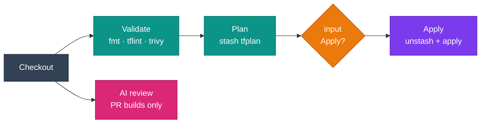

# Jenkins

Jenkins runs the DevOps image as the build agent: a Docker agent on a node that has Docker, or a pod on Kubernetes. Every `sh` step then runs with Terraform, kubectl, Helm, Trivy, the cloud CLIs and the AI CLIs on `PATH`.

## The pipeline at a glance



## Choose an agent

=== ":simple-docker: Docker agent"

    Needs the Docker Pipeline plugin, and Docker on the Jenkins node (not in the image).

    ```groovy
    agent {
      docker {
        image 'ghcr.io/jinalshah/devops/images/aws-devops:1.0.abc1234'
        args  '-u 0:0'
      }
    }
    ```

=== ":simple-kubernetes: Kubernetes agent"

    Needs the Kubernetes plugin.

    ```groovy
    agent {
      kubernetes {
        defaultContainer 'devops'
        yaml '''
    apiVersion: v1
    kind: Pod
    spec:
      containers:
        - name: devops
          image: ghcr.io/jinalshah/devops/images/aws-devops:1.0.abc1234
          command: ["sleep"]
          args: ["infinity"]
    '''
      }
    }
    ```

!!! warning "Run the Docker agent as root"
    By default the Docker Pipeline plugin runs the container as the Jenkins user's UID. The image is built for root: `HOME` is `/root`, and some tools, such as `claude` in `/root/.local/bin`, live under it. Pass `args '-u 0:0'`. Files the build creates in the workspace are then owned by root, so add `cleanWs()` in `post { always { ... } }` if later builds on the node run as another user.

!!! tip "Pinning"
    `1.0.abc1234` is a per-commit tag: stable for that commit, but refreshed by the scheduled rebuilds with newer tool versions. For strict reproducibility, use `image 'ghcr.io/jinalshah/devops/images/aws-devops@sha256:<digest>'`.

## Validate → plan → approve → apply

```groovy title="Jenkinsfile"
pipeline {
  agent {
    docker {
      image 'ghcr.io/jinalshah/devops/images/aws-devops:1.0.abc1234'
      args  '-u 0:0'
    }
  }

  options {
    disableConcurrentBuilds()
    timeout(time: 1, unit: 'HOURS')
  }

  environment {
    AWS_REGION = 'eu-west-2'
    TF_IN_AUTOMATION = 'true'
  }

  stages {
    stage('Validate') {
      parallel {
        stage('fmt') {
          steps { sh 'terraform fmt -check -recursive terraform/' }
        }
        stage('tflint') {
          steps { sh 'cd terraform && tflint --init && tflint --recursive' }
        }
        stage('trivy') {
          steps { sh 'trivy config --severity HIGH,CRITICAL --exit-code 1 terraform/' }
        }
      }
    }

    stage('Plan') {
      steps {
        withCredentials([aws(credentialsId: 'aws-terraform',
                             accessKeyVariable: 'AWS_ACCESS_KEY_ID',
                             secretKeyVariable: 'AWS_SECRET_ACCESS_KEY')]) {
          sh '''
            cd terraform
            terraform init -input=false
            terraform plan -input=false -out=tfplan
          '''
        }
        stash name: 'tfplan', includes: 'terraform/tfplan'
      }
    }

    stage('Apply') {
      when { branch 'main' }
      input {
        message 'Apply this plan to production?'
        ok 'Apply'
      }
      steps {
        unstash 'tfplan'
        withCredentials([aws(credentialsId: 'aws-terraform',
                             accessKeyVariable: 'AWS_ACCESS_KEY_ID',
                             secretKeyVariable: 'AWS_SECRET_ACCESS_KEY')]) {
          sh '''
            cd terraform
            terraform init -input=false
            terraform apply -input=false tfplan
          '''
        }
      }
    }
  }

  post {
    always { cleanWs() }
  }
}
```

## Credentials

The `aws(...)` binding comes from the AWS Credentials plugin and sets the two variables the AWS CLI and Terraform expect.

=== ":fontawesome-brands-aws: AWS"

    ```groovy
    withCredentials([aws(credentialsId: 'aws-terraform',
                         accessKeyVariable: 'AWS_ACCESS_KEY_ID',
                         secretKeyVariable: 'AWS_SECRET_ACCESS_KEY')]) {
      sh 'aws sts get-caller-identity'
    }
    ```

    !!! danger "`credentials()` on AWS keys doesn't do this"
        `environment { AWS = credentials('aws-terraform') }` on a username/password credential gives you `AWS_USR` and `AWS_PSW`. The AWS CLI ignores those. Use the `aws(...)` binding, or two **Secret text** credentials mapped explicitly:

        ```groovy
        environment {
          AWS_ACCESS_KEY_ID     = credentials('aws-access-key-id')
          AWS_SECRET_ACCESS_KEY = credentials('aws-secret-access-key')
        }
        ```

=== ":simple-googlecloud: Google Cloud"

    Store the service-account key as a **Secret file** credential.

    ```groovy
    withCredentials([file(credentialsId: 'gcp-sa-key', variable: 'GOOGLE_APPLICATION_CREDENTIALS')]) {
      sh '''
        gcloud auth activate-service-account --key-file="$GOOGLE_APPLICATION_CREDENTIALS"
        gcloud config set project my-project
        terraform -chdir=terraform/gcp apply -input=false -auto-approve
      '''
    }
    ```

    `gcloud` ignores `GOOGLE_APPLICATION_CREDENTIALS` for its own auth, so activate the service account explicitly; Terraform reads the variable directly. Use <span class="di-pill di-pill--gcp">gcp-devops</span> or <span class="di-pill di-pill--all">all-devops</span>.

=== ":lucide-sparkles: AI CLIs"

    Store API keys as **Secret text** credentials.

    ```groovy
    environment {
      ANTHROPIC_API_KEY = credentials('anthropic-api-key')
      CODEX_API_KEY     = credentials('codex-api-key')
    }
    ```

!!! info "Each `sh` step is a new shell"
    `sh 'export FOO=bar'` followed by `sh 'echo $FOO'` prints nothing, because the export dies with the first shell. Either put the commands in one `sh '''...'''` block, or set the value for several steps with `withEnv(["FOO=bar"]) { ... }` or the `environment {}` directive.

## Multi-cloud and multi-environment

Use a `matrix` to fan out across environments with <span class="di-pill di-pill--all">all-devops</span>:

```groovy
stage('Plan all') {
  matrix {
    axes {
      axis { name 'CLOUD'; values 'aws', 'gcp' }
      axis { name 'ENV';   values 'dev', 'staging', 'production' }
    }
    stages {
      stage('plan') {
        steps {
          sh '''
            cd "terraform/${CLOUD}/${ENV}"
            terraform init -input=false
            terraform plan -input=false -out=tfplan
          '''
        }
      }
    }
  }
}
```

Wrap the steps in the matching `withCredentials` block for each cloud, as shown under [Credentials](#credentials).

## Deploy to Kubernetes

```groovy
stage('Deploy') {
  steps {
    withCredentials([aws(credentialsId: 'aws-deploy',
                         accessKeyVariable: 'AWS_ACCESS_KEY_ID',
                         secretKeyVariable: 'AWS_SECRET_ACCESS_KEY')]) {
      sh '''
        aws eks update-kubeconfig --region "$AWS_REGION" --name my-cluster
        helm upgrade --install myapp ./charts/myapp \
          --namespace production --create-namespace --wait --timeout 5m
        kubectl rollout status deployment/myapp -n production
      '''
    }
  }
}
```

For GKE, replace the kubeconfig line with `gcloud container clusters get-credentials my-cluster --region europe-west2`. `gke-gcloud-auth-plugin` is included in the image.

## Security scanning

```groovy
stage('Security') {
  steps {
    sh '''
      trivy fs --scanners vuln,secret,misconfig --format json --output trivy.json .
      trivy fs --scanners vuln,secret,misconfig --severity HIGH,CRITICAL --exit-code 1 .
      if [ -d ansible ]; then ansible-lint ansible/; fi
    '''
  }
  post {
    always { archiveArtifacts artifacts: 'trivy.json', allowEmptyArchive: true }
  }
}
```

!!! warning "No Docker inside the image"
    The image has no `docker` CLI, so `docker build` and `trivy image <local-image>` won't work in these stages. Build images in a stage that runs on the node itself (`agent any` with the Docker Pipeline `docker.build(...)` step), push them, then scan the pushed reference with `trivy image registry.example.com/app:tag`. Trivy pulls it from the registry without Docker.

## AI review on pull requests

In a multibranch pipeline, PR builds set `CHANGE_ID` and `CHANGE_TARGET`. This stage reviews the diff with Claude Code and comments on the GitHub PR with `gh`.

```groovy
stage('AI review') {
  when { changeRequest() }
  environment {
    ANTHROPIC_API_KEY = credentials('anthropic-api-key')
    GH_TOKEN          = credentials('github-token')
  }
  steps {
    sh '''
      git config --global --add safe.directory "$WORKSPACE"
      git fetch origin "$CHANGE_TARGET"
      git diff "origin/$CHANGE_TARGET...HEAD" -- terraform/ ansible/ \
        | claude -p "Review this infrastructure diff for security issues and risky changes. Reply in Markdown." \
        > review.md
      gh pr comment "$CHANGE_ID" --repo my-org/my-repo --body-file review.md
    '''
  }
}
```

Swap in `codex exec "..."` or `agy -p "..."` for a different agent; see [AI-assisted DevOps](ai-assisted-devops.md).

## Shared library step

Keep the Terraform boilerplate in one place:

```groovy title="vars/terraformPlan.groovy"
def call(String dir) {
  sh """
    cd '${dir}'
    terraform init -input=false
    terraform plan -input=false -out=tfplan
  """
  stash name: "tfplan-${dir.replace('/', '-')}", includes: "${dir}/tfplan"
}
```

```groovy title="Jenkinsfile"
@Library('platform-lib') _
// ...
steps { terraformPlan('terraform/production') }
```

## Troubleshooting

??? question "`permission denied` or `command not found` for tools under `/root`"
    The Docker agent is running as a non-root UID. Add `args '-u 0:0'` to the `docker` agent.

??? question "The build hangs at the `input` step and holds an executor"
    A top-level `agent` keeps the container and executor while waiting. Add a `timeout` option, or give the pipeline `agent none` and set an agent per stage, so the approval stage doesn't hold one.

??? question "`fatal: detected dubious ownership in repository`"
    Add `git config --global --add safe.directory "$WORKSPACE"` before your own `git` commands.

## Next steps

- [GitHub Actions](ci-cd-github.md) · [GitLab CI](ci-cd-gitlab.md) · [CircleCI](ci-cd-circleci.md)
- [Terraform workflows](terraform-workflows.md)
- [Multi-tool patterns](multi-tool-patterns.md)
