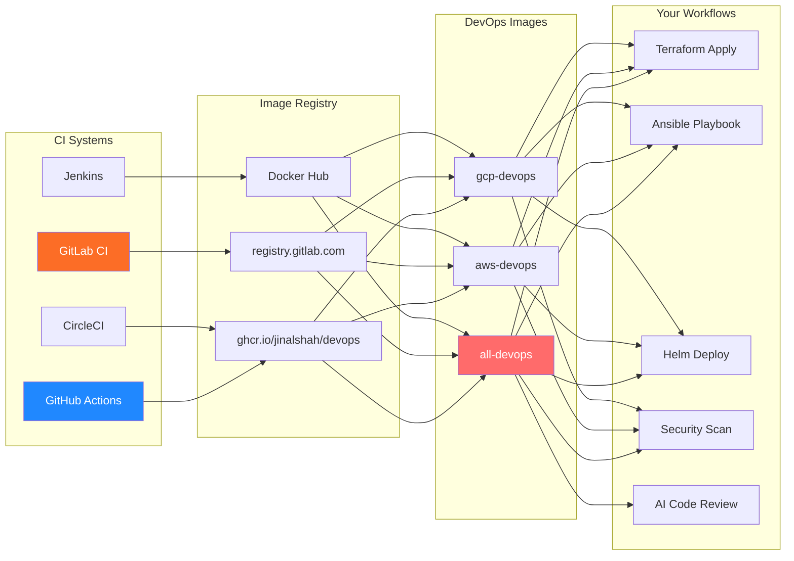

# Workflows & Patterns

Real-world examples of using DevOps Images in CI/CD pipelines and development workflows.

## Overview

The DevOps Images integrate seamlessly with popular CI/CD platforms, providing a consistent toolset across your entire deployment pipeline.

## CI/CD Integration Flow



## Available CI/CD Guides

### Platform-Specific Examples

| Platform | Guide | Key Features |
|----------|-------|--------------|
| **GitHub Actions** | [ci-cd-github.md](ci-cd-github.md) | Matrix builds, caching, secrets management |
| **GitLab CI** | [ci-cd-gitlab.md](ci-cd-gitlab.md) | Multi-stage pipelines, artifacts, environments |
| **Jenkins** | [ci-cd-jenkins.md](ci-cd-jenkins.md) | Declarative & scripted pipelines, credentials |
| **CircleCI** | [ci-cd-circleci.md](ci-cd-circleci.md) | Executors, workflows, caching optimisation |

### Workflow Patterns

| Pattern | Guide | Description |
|---------|-------|-------------|
| **Terraform Workflows** | [terraform-workflows.md](terraform-workflows.md) | Terragrunt, state management, module testing |
| **Multi-Tool Patterns** | [multi-tool-patterns.md](multi-tool-patterns.md) | Terraform+Helm+Ansible, security scanning |
| **AI-Assisted DevOps** | [ai-assisted-devops.md](ai-assisted-devops.md) | Code review, generation, troubleshooting with AI CLIs |

## Common Workflow Scenarios

### Scenario 1: Infrastructure Deployment

**Typical Flow**: Plan → Review → Apply → Configure

```bash
# 1. Plan infrastructure changes
terraform init && terraform plan -out=plan.tfplan

# 2. Apply infrastructure
terraform apply plan.tfplan

# 3. Configure instances with Ansible
ansible-playbook -i inventory.yml site.yml

# 4. Deploy application with Helm
helm upgrade --install myapp ./charts/myapp
```

**Best Image**: `all-devops` or cloud-specific variant

**See**: [Terraform Workflows](terraform-workflows.md), [Multi-Tool Patterns](multi-tool-patterns.md)

### Scenario 2: Security-First Pipeline

**Typical Flow**: Scan → Lint → Validate → Deploy

```bash
# 1. Scan for vulnerabilities
trivy fs .
trivy config .

# 2. Lint infrastructure code
tflint --recursive
ansible-lint

# 3. Validate configurations
terraform validate

# 4. Deploy if all checks pass
terraform apply -auto-approve
```

**Best Image**: Any variant (all include Trivy, TFLint, ansible-lint)

**See**: [Multi-Tool Patterns > Security Workflows](multi-tool-patterns.md#security-first-workflow)

### Scenario 3: AI-Assisted Code Review

**Typical Flow**: Generate → Review → Fix → Deploy

```bash
# 1. Generate Terraform module with AI
codex "create terraform module for AWS ECS cluster"

# 2. Review with Claude CLI
claude "review this terraform code for security issues" --file main.tf

# 3. Lint and validate
tflint
terraform validate

# 4. Apply infrastructure
terraform apply
```

**Best Image**: Any variant (all include AI CLI tools)

**See**: [AI-Assisted DevOps](ai-assisted-devops.md)

### Scenario 4: Kubernetes Deployment

**Typical Flow**: Build → Push → Deploy → Verify

```bash
# 1. Package Helm chart
helm package ./charts/myapp

# 2. Deploy to cluster
helm upgrade --install myapp ./myapp-1.0.0.tgz \
  --namespace production \
  --values values-prod.yaml

# 3. Verify deployment
kubectl rollout status deployment/myapp -n production

# 4. Monitor with k9s
k9s -n production
```

**Best Image**: Any variant (all include kubectl, Helm, k9s)

**See**: [Multi-Tool Patterns](multi-tool-patterns.md)

## Workflow Best Practices

### 1. Version Pinning in CI/CD

!!! tip "Use Immutable Tags"
    Always pin specific image versions in CI/CD pipelines:

    ```yaml
    # Good - immutable tag
    image: ghcr.io/jinalshah/devops/images/all-devops:1.0.abc1234

    # Avoid - mutable tag (can change)
    image: ghcr.io/jinalshah/devops/images/all-devops:latest
    ```

### 2. Credential Management

!!! warning "Never Commit Credentials"
    Use volume mounts (local) or CI secrets (pipelines):

    === "Local Development"

        ```bash
        docker run --rm \
          -v ~/.aws:/root/.aws \
          -v ~/.config/gcloud:/root/.config/gcloud \
          ghcr.io/jinalshah/devops/images/all-devops:latest
        ```

    === "GitHub Actions"

        ```yaml
        - name: Deploy Infrastructure
          run: terraform apply -auto-approve
          env:
            AWS_ACCESS_KEY_ID: ${{ secrets.AWS_ACCESS_KEY_ID }}
            AWS_SECRET_ACCESS_KEY: ${{ secrets.AWS_SECRET_ACCESS_KEY }}
        ```

    === "GitLab CI"

        ```yaml
        deploy:
          image: registry.gitlab.com/jinal-shah/devops/images/all-devops:latest
          script:
            - terraform apply -auto-approve
          variables:
            AWS_ACCESS_KEY_ID: $AWS_ACCESS_KEY_ID
            AWS_SECRET_ACCESS_KEY: $AWS_SECRET_ACCESS_KEY
        ```

### 3. Caching for Performance

!!! tip "Leverage Docker Layer Caching"
    Use the same image version across pipeline jobs:

    ```yaml
    # GitHub Actions example
    jobs:
      plan:
        container:
          image: ghcr.io/jinalshah/devops/images/all-devops:1.0.abc1234
      apply:
        container:
          image: ghcr.io/jinalshah/devops/images/all-devops:1.0.abc1234
        # Both jobs use the same cached image
    ```

### 4. Parallel Execution

Run independent tasks in parallel for faster pipelines:

```yaml
# GitLab CI example
stages:
  - validate

tflint:
  stage: validate
  script: [tflint]

ansible-lint:
  stage: validate
  script: [ansible-lint]

trivy-scan:
  stage: validate
  script: [trivy fs .]

# All run in parallel
```

### 5. Artifact Management

Share state files, plans, and reports between jobs:

```yaml
# Example: Share Terraform plan
plan:
  script:
    - terraform plan -out=plan.tfplan
  artifacts:
    paths:
      - plan.tfplan

apply:
  script:
    - terraform apply plan.tfplan
  dependencies:
    - plan
```

## Integration Examples

### Docker Compose for Local Development

```yaml
version: '3.8'

services:
  devops:
    image: ghcr.io/jinalshah/devops/images/all-devops:latest
    volumes:
      - .:/workspace
      - ~/.aws:/root/.aws
      - ~/.config/gcloud:/root/.config/gcloud
      - ~/.ssh:/root/.ssh
      - ~/.claude:/root/.claude
    working_dir: /workspace
    command: zsh
    stdin_open: true
    tty: true

  postgres:
    image: postgres:17
    environment:
      POSTGRES_PASSWORD: devpassword
    ports:
      - "5432:5432"
```

Run with:
```bash
docker-compose run --rm devops
```

### VS Code Dev Container

```json
{
  "name": "DevOps Environment",
  "image": "ghcr.io/jinalshah/devops/images/all-devops:latest",
  "mounts": [
    "source=${localEnv:HOME}/.aws,target=/root/.aws,type=bind",
    "source=${localEnv:HOME}/.config/gcloud,target=/root/.config/gcloud,type=bind",
    "source=${localEnv:HOME}/.ssh,target=/root/.ssh,type=bind"
  ],
  "extensions": [
    "hashicorp.terraform",
    "redhat.ansible",
    "ms-kubernetes-tools.vscode-kubernetes-tools"
  ]
}
```

## Monitoring and Debugging

### Common Troubleshooting Commands

```bash
# Check tool versions
terraform version
kubectl version
helm version
aws --version
gcloud version

# Test cloud authentication
aws sts get-caller-identity
gcloud auth list

# Verify Kubernetes connectivity
kubectl cluster-info
kubectl get nodes

# Test Ansible connectivity
ansible all -i inventory.yml -m ping
```

### Debugging CI/CD Issues

!!! tip "Debug Container Locally"
    Reproduce CI failures locally using the same image:

    ```bash
    # Pull the exact version from CI
    docker pull ghcr.io/jinalshah/devops/images/all-devops:1.0.abc1234

    # Run interactively
    docker run -it --rm \
      -v $PWD:/workspace \
      -w /workspace \
      ghcr.io/jinalshah/devops/images/all-devops:1.0.abc1234 \
      zsh

    # Run the failing command
    terraform apply -auto-approve
    ```

## Performance Optimisation

### Image Pull Optimisation

1. **Use GHCR** - Fastest global CDN, no rate limits
2. **Pin versions** - Enable Docker layer caching
3. **Pre-pull images** - In CI, pull during setup phase
4. **Use smaller images** - aws-devops/gcp-devops vs all-devops

### Pipeline Optimisation

1. **Parallel jobs** - Run independent tasks concurrently
2. **Cache dependencies** - Terraform plugins, Helm charts
3. **Skip unchanged** - Use `git diff` to skip unchanged infrastructure
4. **Workspace cleanup** - Remove old workspaces and plans

## Next Steps

**By Platform**:

- [GitHub Actions Examples](ci-cd-github.md)
- [GitLab CI Examples](ci-cd-gitlab.md)
- [Jenkins Examples](ci-cd-jenkins.md)
- [CircleCI Examples](ci-cd-circleci.md)

**By Pattern**:

- [Terraform Workflows](terraform-workflows.md)
- [Multi-Tool Patterns](multi-tool-patterns.md)
- [AI-Assisted DevOps](ai-assisted-devops.md)

**Other Resources**:

- [Authentication Setup](../use-images/authentication.md)
- [Tool Basics](../tool-basics/index.md)
- [Troubleshooting](../troubleshooting/index.md)
