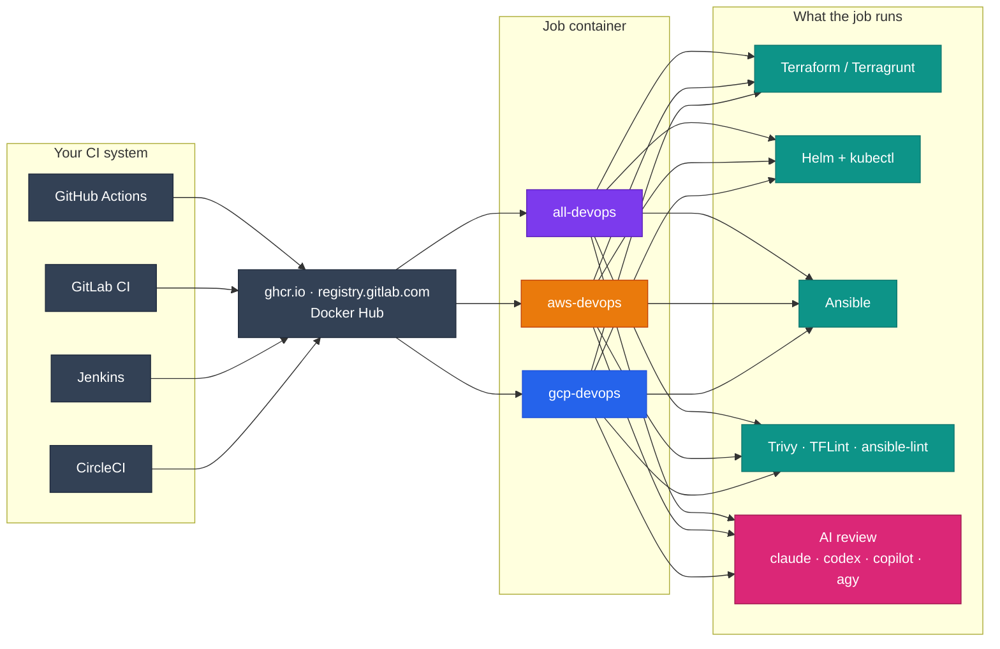

# Workflows & Patterns

Every DevOps image works as a CI job container. Your pipeline gets Terraform, Terragrunt, kubectl, Helm, Ansible, Trivy, the cloud CLIs and four AI coding agents without an install step. These pages show how to wire the images into the common CI systems, and how to chain the tools together.

## How it fits together


```mermaid
flowchart LR
  subgraph CI["Your CI system"]
    GHA["GitHub Actions"]
    GLC["GitLab CI"]
    JNK["Jenkins"]
    CCI["CircleCI"]
  end
  REG["ghcr.io · registry.gitlab.com<br/>Docker Hub"]
  subgraph IMG["Job container"]
    ALL["all-devops"]
    AWS["aws-devops"]
    GCP["gcp-devops"]
  end
  subgraph JOBS["What the job runs"]
    TF["Terraform / Terragrunt"]
    K8S["Helm + kubectl"]
    ANS["Ansible"]
    SEC["Trivy · TFLint · ansible-lint"]
    AI["AI review<br/>claude · codex · copilot · agy"]
  end
  GHA & GLC & JNK & CCI --> REG
  REG --> ALL & AWS & GCP
  ALL & AWS & GCP --> TF & K8S & ANS & SEC & AI

  classDef all fill:#7c3aed,stroke:#5b21b6,color:#fff
  classDef aws fill:#ea7a0c,stroke:#c2410c,color:#fff
  classDef gcp fill:#2563eb,stroke:#1d4ed8,color:#fff
  classDef base fill:#0d9488,stroke:#0f766e,color:#fff
  classDef ai fill:#db2777,stroke:#9d174d,color:#fff
  classDef neutral fill:#334155,stroke:#1e293b,color:#fff
  class GHA,GLC,JNK,CCI,REG neutral
  class ALL all
  class AWS aws
  class GCP gcp
  class TF,K8S,ANS,SEC base
  class AI ai
```

All three images share the same base, so every job can run the same Terraform, Kubernetes, Ansible, security and AI tools. The only difference is the cloud CLI: <span class="di-pill di-pill--all">all-devops</span> has AWS and Google Cloud, <span class="di-pill di-pill--aws">aws-devops</span> has AWS only and <span class="di-pill di-pill--gcp">gcp-devops</span> has Google Cloud only.

## CI system guides

<div class="grid cards" markdown>

-   :simple-githubactions:{ .lg .middle } __GitHub Actions__

    ---

    `container:` jobs, OIDC to AWS and GCP, SARIF upload to code scanning, reusable workflows and AI review comments with `gh`.

    [:octicons-arrow-right-24: GitHub Actions guide](ci-cd-github.md)

-   :simple-gitlab:{ .lg .middle } __GitLab CI__

    ---

    `image:` per job, validate → plan → apply stages, OIDC with `id_tokens`, manual gates and merge request notes.

    [:octicons-arrow-right-24: GitLab CI guide](ci-cd-gitlab.md)

-   :simple-jenkins:{ .lg .middle } __Jenkins__

    ---

    Docker and Kubernetes agents, credentials bindings, `input` approval gates and multibranch pipelines.

    [:octicons-arrow-right-24: Jenkins guide](ci-cd-jenkins.md)

-   :simple-circleci:{ .lg .middle } __CircleCI__

    ---

    Parameterised executors, workspaces for plan files, approval jobs, contexts and OIDC.

    [:octicons-arrow-right-24: CircleCI guide](ci-cd-circleci.md)

</div>

## Pattern guides

<div class="grid cards" markdown>

-   :simple-terraform:{ .lg .middle } __Terraform workflows__

    ---

    Plan and apply, S3 state with native locking, Terragrunt `run --all`, drift detection and plan summaries.

    [:octicons-arrow-right-24: Terraform workflows](terraform-workflows.md)

-   :lucide-workflow:{ .lg .middle } __Multi-tool patterns__

    ---

    Terraform → Helm → Ansible, a security-first gate, pre-commit and Kubernetes validation, all in one container.

    [:octicons-arrow-right-24: Multi-tool patterns](multi-tool-patterns.md)

-   :simple-claude:{ .lg .middle } __AI-assisted DevOps__

    ---

    Using Claude Code, Codex, Copilot and Antigravity to review diffs, explain plans and troubleshoot.

    [:octicons-arrow-right-24: AI-assisted DevOps](ai-assisted-devops.md)

</div>

## Common scenarios

=== ":simple-terraform: Infrastructure"

    Plan → apply → configure → deploy.

    ```bash
    terraform init && terraform plan -out=tfplan
    terraform apply tfplan
    ansible-playbook -i inventory.yml site.yml
    helm upgrade --install myapp ./charts/myapp
    ```

    More in [Terraform workflows](terraform-workflows.md) and [Multi-tool patterns](multi-tool-patterns.md).

=== ":lucide-shield-check: Security gate"

    Scan → lint → validate, and stop the pipeline on anything serious.

    ```bash
    trivy fs --scanners vuln,secret,misconfig --severity HIGH,CRITICAL --exit-code 1 .
    tflint --recursive
    ansible-lint
    terraform validate
    ```

    More in [the security-first pattern](multi-tool-patterns.md#pattern-2-security-first-workflow).

=== ":lucide-sparkles: AI review"

    Pipe a diff or a plan into an AI CLI in non-interactive mode.

    ```bash
    git diff origin/main...HEAD -- terraform/ \
      | claude -p "Review this Terraform diff for security issues and risky changes"

    terraform show -no-color tfplan \
      | codex exec "Summarise this Terraform plan and flag anything destructive"
    ```

    Always use `claude -p`, `codex exec`, `copilot -p ... --allow-all-tools` or `agy -p` in scripts. Without them, the CLIs start their interactive UI. See [AI-assisted DevOps](ai-assisted-devops.md).

=== ":simple-kubernetes: Kubernetes"

    Render → deploy → verify.

    ```bash
    helm lint ./charts/myapp
    helm upgrade --install myapp ./charts/myapp \
      --namespace production --create-namespace \
      --values values-prod.yaml --wait
    kubectl rollout status deployment/myapp -n production
    ```

## Best practices

!!! tip "Pin the image, and know what the pin means"
    `latest` moves with every build of `main`. A `1.0.<sha>` tag is a **per-commit tag**: it stays tied to one commit of this repo, but the weekly and daily scheduled rebuilds refresh it with newer tool versions. For strictly reproducible pipelines, pin by digest.

    ```yaml
    # Good: per-commit tag, refreshed by scheduled rebuilds
    image: ghcr.io/jinalshah/devops/images/all-devops:1.0.abc1234

    # Strict: exact image bytes, never changes
    image: ghcr.io/jinalshah/devops/images/all-devops@sha256:<digest>
    ```

    Find the digest with `docker buildx imagetools inspect ghcr.io/jinalshah/devops/images/all-devops:1.0.abc1234`.

!!! warning "No Docker inside the image"
    The images have no `docker` CLI and no Docker daemon, so you cannot `docker build` or `docker run` from inside a job. Build container images in a separate job that uses your CI system's own Docker support. Trivy can still scan a pushed image by reference (`trivy image ghcr.io/org/app:tag`) because it pulls from the registry itself.

!!! info "Credentials come from the CI system"
    Prefer short-lived OIDC credentials over static keys, and keep any secrets in the CI system's secret store. Each CI guide shows the pattern for that platform, and [Authentication](../use-images/authentication.md) covers the cloud CLIs in detail.

Other habits that pay off:

- **Save the plan and apply that exact file.** Pass `tfplan` between jobs as an artifact, so what was reviewed is what gets applied.
- **Run independent checks in parallel.** Linting, scanning and `terraform validate` don't depend on each other.
- **Cache Terraform providers.** Set `TF_PLUGIN_CACHE_DIR` and cache that directory; the image doesn't set it for you.
- **Expect a large pull.** The images are about 1.5 to 1.6 GB compressed. Hosted runners start clean, so each job pulls the image again; self-hosted runners keep it between jobs.

## Reproduce a CI failure locally

Run the same image your pipeline used, with your project mounted:

```bash
docker run -it --rm \
  -v "$PWD":/srv -w /srv \
  -v ~/.aws:/root/.aws:ro \
  ghcr.io/jinalshah/devops/images/all-devops:1.0.abc1234
```

Then run the failing command. For a longer-lived local setup, see [Docker Compose](../use-images/docker-compose.md).

## Next steps

- [Authentication setup](../use-images/authentication.md)
- [Tool basics](../tool-basics/index.md)
- [Troubleshooting](../troubleshooting/index.md)
