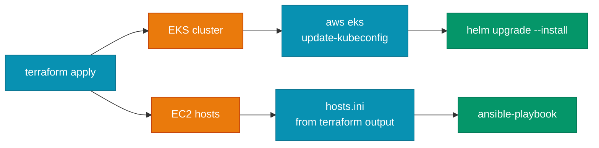
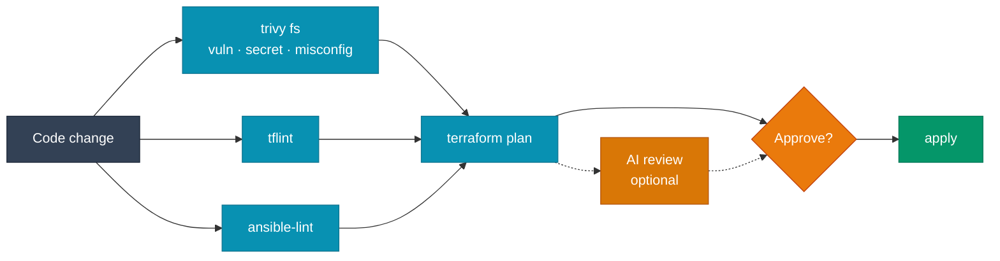
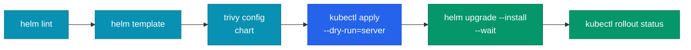

# Multi-tool patterns

The point of a single image is that one job, or one shell, can chain tools that would otherwise need several installs. These patterns work the same on a laptop and in any CI system.

<div class="grid cards" markdown>

-   :simple-terraform:{ .lg .middle } __1. Terraform → Helm → Ansible__

    ---

    Provision a cluster and VMs, deploy apps, then configure the hosts.

    [:octicons-arrow-right-24: Jump to pattern](#pattern-1-terraform-helm-ansible)

-   :lucide-shield-check:{ .lg .middle } __2. Security-first__

    ---

    Trivy, TFLint and ansible-lint as a gate, with an optional AI review.

    [:octicons-arrow-right-24: Jump to pattern](#pattern-2-security-first-workflow)

-   :simple-precommit:{ .lg .middle } __3. Pre-commit__

    ---

    Run the same checks before code leaves your machine.

    [:octicons-arrow-right-24: Jump to pattern](#pattern-3-pre-commit-checks)

-   :simple-kubernetes:{ .lg .middle } __4. Validated Kubernetes deploys__

    ---

    Lint, render, scan and dry-run a Helm chart before you install it.

    [:octicons-arrow-right-24: Jump to pattern](#pattern-4-validated-kubernetes-deploys)

</div>

## Pattern 1: Terraform → Helm → Ansible


```mermaid
flowchart LR
  TF["terraform apply"] --> EKS["EKS cluster"]
  TF --> VM["EC2 hosts"]
  EKS --> KC["aws eks<br/>update-kubeconfig"]
  KC --> HELM["helm upgrade --install"]
  VM --> INV["hosts.ini<br/>from terraform output"]
  INV --> ANS["ansible-playbook"]

  classDef base fill:#0891b2,stroke:#0e7490,color:#fff
  classDef aws fill:#ea7a0c,stroke:#c2410c,color:#fff
  classDef all fill:#059669,stroke:#047857,color:#fff
  class TF,KC,INV base
  class EKS,VM aws
  class HELM,ANS all
```

```bash title="deploy.sh"
#!/usr/bin/env bash
set -euo pipefail

# 1. Infrastructure
terraform -chdir=terraform init -input=false
terraform -chdir=terraform plan -input=false -out=tfplan
terraform -chdir=terraform apply -input=false tfplan

# 2. Kubernetes apps
aws eks update-kubeconfig \
  --region eu-west-2 \
  --name "$(terraform -chdir=terraform output -raw cluster_name)"
helm dependency update ./charts/my-app
helm upgrade --install my-app ./charts/my-app \
  --namespace production --create-namespace \
  --values ./charts/my-app/values-prod.yaml \
  --wait --timeout 10m

# 3. Host configuration
{ echo "[web]"; terraform -chdir=terraform output -json web_ips | jq -r '.[]'; } > ansible/hosts.ini
ansible-playbook -i ansible/hosts.ini ansible/site.yml -e env=production
```

Run it in one container, with AWS config and SSH keys mounted read-only:

```bash
docker run --rm -it \
  -v "$PWD":/srv -w /srv \
  -v ~/.aws:/root/.aws:ro \
  -v ~/.ssh:/root/.ssh:ro \
  ghcr.io/jinalshah/devops/images/aws-devops:latest \
  bash deploy.sh
```

!!! tip "Dynamic inventory instead of a generated file"
    The `ansible` package includes the `amazon.aws` and `google.cloud` collections. In <span class="di-pill di-pill--aws">aws-devops</span> and <span class="di-pill di-pill--all">all-devops</span>, `boto3` is installed too, so an `aws_ec2` inventory plugin file (`inventory.aws_ec2.yml`) can find the hosts by tag instead of reading Terraform outputs.

On GKE, swap step 2's kubeconfig command for `gcloud container clusters get-credentials <name> --region <region>` and use <span class="di-pill di-pill--gcp">gcp-devops</span>.

## Pattern 2: Security-first workflow

Every check runs before anything is planned or applied, and any HIGH or CRITICAL finding stops the run.


```mermaid
flowchart LR
  C["Code change"] --> T["trivy fs<br/>vuln · secret · misconfig"]
  C --> L["tflint"]
  C --> A["ansible-lint"]
  T & L & A --> P["terraform plan"]
  P -.-> AI["AI review<br/>optional"]
  P --> G{"Approve?"}
  AI -.-> G
  G --> D["apply"]

  classDef neutral fill:#334155,stroke:#1e293b,color:#fff
  classDef base fill:#0891b2,stroke:#0e7490,color:#fff
  classDef ai fill:#d97706,stroke:#b45309,color:#fff
  classDef aws fill:#ea7a0c,stroke:#c2410c,color:#fff
  classDef all fill:#059669,stroke:#047857,color:#fff
  class C neutral
  class T,L,A,P base
  class AI ai
  class G aws
  class D all
```

```bash title="security-gate.sh"
#!/usr/bin/env bash
set -uo pipefail
status=0

echo "==> Trivy: dependencies, secrets and IaC misconfigurations"
trivy fs --scanners vuln,secret,misconfig --severity HIGH,CRITICAL --exit-code 1 . || status=1

echo "==> TFLint"
(cd terraform && tflint --init && tflint --recursive) || status=1

echo "==> terraform validate"
terraform -chdir=terraform init -backend=false -input=false >/dev/null && \
  terraform -chdir=terraform validate || status=1

if [ -d ansible ]; then
  echo "==> ansible-lint"
  ansible-lint ansible/ || status=1
fi

exit $status
```

Add an AI review on top if you like. It advises; it doesn't replace the gate:

```bash
git diff origin/main...HEAD -- terraform/ ansible/ \
  | claude -p "Review this diff for security issues: public exposure, missing encryption, over-broad IAM. Reply in Markdown." \
  > ai-review.md
```

!!! info "Scanning container images"
    The image has no Docker, so it can't build your app image or scan a local one. Build and push the image in a separate CI job, then scan it by reference; Trivy pulls it from the registry itself:
    `trivy image --severity HIGH,CRITICAL --exit-code 1 ghcr.io/my-org/app:1.2.3`.
    Trivy downloads its vulnerability database on the first scan, so cache `~/.cache/trivy` in CI to save time.

To wire this into a pipeline, see [GitHub Actions](ci-cd-github.md#security-scanning-with-code-scanning-alerts), [GitLab CI](ci-cd-gitlab.md#security-scanning), [Jenkins](ci-cd-jenkins.md#security-scanning) or [CircleCI](ci-cd-circleci.md#security-scanning).

## Pattern 3: Pre-commit checks

`pre-commit` is installed in every image, along with Terraform and TFLint, which the Terraform hooks call.

```yaml title=".pre-commit-config.yaml"
repos:
  - repo: https://github.com/antonbabenko/pre-commit-terraform
    rev: v1.109.1
    hooks:
      - id: terraform_fmt
      - id: terraform_validate
      - id: terraform_tflint

  - repo: https://github.com/ansible/ansible-lint
    rev: v26.9.0
    hooks:
      - id: ansible-lint

  - repo: https://github.com/pre-commit/pre-commit-hooks
    rev: v6.0.0
    hooks:
      - id: trailing-whitespace
      - id: end-of-file-fixer
      - id: check-yaml
      - id: detect-private-key
```

Run `pre-commit autoupdate` to move these `rev`s to the latest releases.

=== "Run in the container"

    ```bash
    docker run --rm \
      -v "$PWD":/srv -w /srv \
      ghcr.io/jinalshah/devops/images/all-devops:latest \
      bash -c 'git config --global --add safe.directory /srv && pre-commit run --all-files'
    ```

    Use the same command as a CI step, so local and CI results match.

=== "As a git hook on your machine"

    Don't run `pre-commit install` **inside** the container. The hook it writes into `.git/hooks/` points at the container's Python, which doesn't exist on your host. Either install `pre-commit` on the host and run `pre-commit install` there, or add a small hook that calls the container:

    ```bash title=".git/hooks/pre-commit"
    #!/bin/sh
    exec docker run --rm -v "$PWD":/srv -w /srv \
      ghcr.io/jinalshah/devops/images/all-devops:latest \
      bash -c 'git config --global --add safe.directory /srv && pre-commit run'
    ```

    Then make it executable with `chmod +x .git/hooks/pre-commit`.

!!! warning "Hooks that need tools the image doesn't have"
    `terraform_docs` needs the `terraform-docs` binary, which isn't in the image, so it's left out above. Install it yourself (for example in an image built `FROM` a DevOps image) before you enable that hook.

## Pattern 4: Validated Kubernetes deploys


```mermaid
flowchart LR
  L["helm lint"] --> R["helm template"]
  R --> S["trivy config<br/>chart"]
  S --> D["kubectl apply<br/>--dry-run=server"]
  D --> I["helm upgrade --install<br/>--wait"]
  I --> V["kubectl rollout status"]

  classDef base fill:#0891b2,stroke:#0e7490,color:#fff
  classDef gcp fill:#2563eb,stroke:#1d4ed8,color:#fff
  classDef all fill:#059669,stroke:#047857,color:#fff
  class L,R,S base
  class D gcp
  class I,V all
```

```bash title="k8s-deploy.sh"
#!/usr/bin/env bash
set -euo pipefail
CHART=./charts/my-app
VALUES=$CHART/values-prod.yaml
NS=production

helm lint "$CHART" -f "$VALUES"
helm template my-app "$CHART" -f "$VALUES" -n "$NS" > rendered.yaml
trivy config --severity HIGH,CRITICAL --exit-code 1 "$CHART"

kubectl cluster-info
kubectl apply --dry-run=server -n "$NS" -f rendered.yaml

helm upgrade --install my-app "$CHART" -f "$VALUES" \
  -n "$NS" --create-namespace --wait --timeout 10m
kubectl rollout status deployment/my-app -n "$NS"
```

Kustomize overlays work too, through kubectl's built-in support: `kubectl kustomize overlays/prod` or `kubectl apply -k overlays/prod`. The standalone `kustomize` binary isn't installed.

## More patterns

- **Terragrunt across many accounts:** `terragrunt run --all plan` from an environment folder. See [Terraform workflows](terraform-workflows.md#terragrunt).
- **Module tests:** `terraform test` needs only Terraform. Terratest needs Go, which isn't in the image. See [Testing](terraform-workflows.md#testing).
- **AI review in a pipeline:** see [AI-assisted DevOps](ai-assisted-devops.md) and the AI review section of each CI guide.

## Next steps

- [Terraform workflows](terraform-workflows.md)
- [GitHub Actions](ci-cd-github.md) · [GitLab CI](ci-cd-gitlab.md) · [Jenkins](ci-cd-jenkins.md) · [CircleCI](ci-cd-circleci.md)
- [Tool basics](../tool-basics/index.md)
