```mermaid
sequenceDiagram
    participant Dev as Developer
    participant Git as Git (pre-commit)
    participant Hooks as Pre-commit Hooks
    participant Remote as Remote Repo

    Dev->>Git: git commit -m "msg"
    Git->>Hooks: Trigger hooks

    Hooks->>Hooks: terraform fmt
    Hooks->>Hooks: terraform validate
    Hooks->>Hooks: tflint
    Hooks->>Hooks: ansible-lint
    Hooks->>Hooks: check secrets

    alt Checks Pass
        Hooks-->>Git: ✅ Success
        Git->>Remote: Push allowed
        Remote-->>Dev: Commit successful
    else Checks Fail
        Hooks-->>Git: ❌ Failure
        Git-->>Dev: Fix issues and retry
    end
```

# Multi-Tool Workflow Patterns

Learn how to combine multiple DevOps tools for powerful, automated workflows.

## Pattern 1: Terraform → Helm → Ansible

Deploy infrastructure, then Kubernetes apps, then configure VMs - all in sequence.

### Workflow Diagram


### Complete Example

```bash
#!/bin/bash
set -e

echo "🚀 Starting full-stack deployment..."

# Step 1: Initialize and apply Terraform
echo "📦 Provisioning infrastructure with Terraform..."
cd terraform/
terraform init
terraform plan -out=plan.tfplan
terraform apply plan.tfplan

# Export cluster config for kubectl
export KUBECONFIG=$(terraform output -raw kubeconfig_path)

# Step 2: Deploy applications with Helm
echo "☸️  Deploying applications to Kubernetes..."
cd ../helm/
helm dependency update ./my-app
helm upgrade --install my-app ./my-app \
  --namespace production \
  --create-namespace \
  --values values-prod.yaml \
  --wait \
  --timeout 10m

# Step 3: Configure VMs with Ansible
echo "⚙️  Configuring VM instances with Ansible..."
cd ../ansible/
# Get inventory from Terraform outputs
terraform -chdir=../terraform output -json vm_ips > inventory.json

ansible-playbook -i inventory.json site.yml \
  --extra-vars "environment=production"

echo "✅ Deployment complete!"
```

### Docker Run Equivalent

```bash
docker run --rm -it \
  -v $PWD:/workspace \
  -v ~/.aws:/root/.aws \
  -v ~/.ssh:/root/.ssh \
  -w /workspace \
  ghcr.io/jinalshah/devops/images/all-devops:latest \
  bash deploy.sh
```

### Use Cases

- ✅ **Full-stack cloud deployment**: Infrastructure + apps + configuration
- ✅ **Disaster recovery**: Rebuild entire environment from code
- ✅ **Multi-environment setup**: Deploy to dev/staging/prod sequentially
- ✅ **Hybrid cloud**: Mix cloud-managed K8s with self-managed VMs

---

## Pattern 2: Security-First Workflow

Scan everything before deployment to catch vulnerabilities early.

### Workflow Diagram


### Complete Example

```bash
#!/bin/bash
set -e

EXIT_CODE=0

echo "🔒 Starting security validation pipeline..."

# Step 1: Scan Dockerfile
echo "🔍 Scanning Dockerfile..."
trivy config Dockerfile || EXIT_CODE=$?

# Step 2: Scan filesystem for secrets
echo "🔍 Scanning for secrets..."
trivy fs . --scanners secret || EXIT_CODE=$?

# Step 3: Lint Terraform
echo "📋 Linting Terraform code..."
cd terraform/
tflint --recursive || EXIT_CODE=$?

# Step 4: Validate Terraform
echo "✅ Validating Terraform..."
terraform init -backend=false
terraform validate || EXIT_CODE=$?

# Step 5: Lint Ansible playbooks
echo "📋 Linting Ansible playbooks..."
cd ../ansible/
ansible-lint *.yml || EXIT_CODE=$?

# Step 6: AI code review (optional but recommended)
echo "🤖 AI code review..."
if [ -f ~/.claude/config.json ]; then
  cd ../terraform/
  claude "Review this Terraform code for security issues and best practices" \
    --file main.tf \
    > ../reports/ai-review.txt || EXIT_CODE=$?
  echo "AI review saved to reports/ai-review.txt"
fi

# Final result
if [ $EXIT_CODE -eq 0 ]; then
  echo "✅ All security checks passed!"
else
  echo "❌ Security checks failed with exit code: $EXIT_CODE"
  exit $EXIT_CODE
fi
```

### CI/CD Integration

=== "GitHub Actions"

    ```yaml
    name: Security Validation

    on: [push, pull_request]

    jobs:
      security-scan:
        runs-on: ubuntu-latest
        container:
          image: ghcr.io/jinalshah/devops/images/all-devops:latest

        steps:
          - uses: actions/checkout@v4

          - name: Trivy Filesystem Scan
            run: trivy fs . --exit-code 1 --severity CRITICAL,HIGH

          - name: Trivy Config Scan
            run: trivy config . --exit-code 1

          - name: TFLint
            run: |
              cd terraform
              tflint --recursive

          - name: Ansible Lint
            run: |
              cd ansible
              ansible-lint

          - name: Terraform Validate
            run: |
              cd terraform
              terraform init -backend=false
              terraform validate
    ```

=== "GitLab CI"

    ```yaml
    stages:
      - security

    security:scan:
      stage: security
      image: registry.gitlab.com/jinal-shah/devops/images/all-devops:latest
      script:
        - trivy fs . --exit-code 1 --severity CRITICAL,HIGH
        - trivy config . --exit-code 1
        - cd terraform && tflint --recursive
        - cd ../ansible && ansible-lint
        - cd ../terraform && terraform init -backend=false && terraform validate
      allow_failure: false
    ```

### Use Cases

- ✅ **Pre-deployment validation**: Catch issues before production
- ✅ **Pull request checks**: Automated security gates
- ✅ **Compliance auditing**: Evidence of security scanning
- ✅ **Shift-left security**: Find vulnerabilities early

---

## Pattern 3: Pre-Commit Hooks for Infrastructure Code

Enforce code quality standards before commits reach the repository.

### Setup

```bash
# Install pre-commit hooks
cd your-project/
cat > .pre-commit-config.yaml <<'EOF'
repos:
  - repo: https://github.com/antonbabenko/pre-commit-terraform
    rev: v1.83.5
    hooks:
      - id: terraform_fmt
      - id: terraform_validate
      - id: terraform_tflint
      - id: terraform_docs

  - repo: https://github.com/ansible/ansible-lint
    rev: v6.20.0
    hooks:
      - id: ansible-lint

  - repo: https://github.com/pre-commit/pre-commit-hooks
    rev: v4.5.0
    hooks:
      - id: trailing-whitespace
      - id: end-of-file-fixer
      - id: check-yaml
      - id: check-added-large-files
      - id: detect-private-key
EOF

# Install hooks
docker run --rm -it \
  -v $PWD:/workspace \
  -w /workspace \
  ghcr.io/jinalshah/devops/images/all-devops:latest \
  pre-commit install

# Run on all files
docker run --rm \
  -v $PWD:/workspace \
  -w /workspace \
  ghcr.io/jinalshah/devops/images/all-devops:latest \
  pre-commit run --all-files
```

### Workflow



### Use Cases

- ✅ **Prevent bad commits**: Stop issues at development time
- ✅ **Enforce formatting**: Consistent code style
- ✅ **Catch secrets**: Prevent credential leaks
- ✅ **Documentation**: Auto-generate terraform-docs

---

## Pattern 4: Terragrunt Multi-Account AWS Workflow

Manage infrastructure across multiple AWS accounts with DRY configurations.

### Directory Structure

```
infrastructure/
├── terragrunt.hcl                 # Root config
├── _envcommon/                    # Shared configurations
│   ├── vpc.hcl
│   ├── eks.hcl
│   └── rds.hcl
├── dev/
│   ├── account.hcl                # AWS account: 111111111111
│   ├── us-east-1/
│   │   ├── region.hcl
│   │   ├── vpc/
│   │   │   └── terragrunt.hcl
│   │   └── eks/
│   │       └── terragrunt.hcl
│   └── us-west-2/
│       └── vpc/
│           └── terragrunt.hcl
├── staging/
│   ├── account.hcl                # AWS account: 222222222222
│   └── us-east-1/
│       ├── vpc/terragrunt.hcl
│       └── eks/terragrunt.hcl
└── prod/
    ├── account.hcl                # AWS account: 333333333333
    └── us-east-1/
        ├── vpc/terragrunt.hcl
        └── eks/terragrunt.hcl
```

### Commands

```bash
# Run all for specific environment
docker run --rm -it \
  -v $PWD:/workspace \
  -v ~/.aws:/root/.aws \
  -w /workspace/infrastructure/dev/us-east-1 \
  ghcr.io/jinalshah/devops/images/aws-devops:latest \
  terragrunt run-all plan

# Apply to specific component
docker run --rm -it \
  -v $PWD:/workspace \
  -v ~/.aws:/root/.aws \
  -w /workspace/infrastructure/prod/us-east-1/vpc \
  ghcr.io/jinalshah/devops/images/aws-devops:latest \
  terragrunt apply

# Plan everything across all environments (dry-run)
docker run --rm \
  -v $PWD:/workspace \
  -v ~/.aws:/root/.aws \
  -w /workspace/infrastructure \
  ghcr.io/jinalshah/devops/images/aws-devops:latest \
  terragrunt run-all plan --terragrunt-non-interactive
```

### Use Cases

- ✅ **Multi-account AWS**: Separate dev/staging/prod accounts
- ✅ **DRY configurations**: Reuse common patterns
- ✅ **Multi-region**: Deploy to multiple regions consistently
- ✅ **State management**: Automatic remote state configuration

---

## Pattern 5: Kubernetes Deployment with Validation

Deploy to Kubernetes with pre-deployment validation and post-deployment verification.

### Workflow

```bash
#!/bin/bash
set -e

NAMESPACE="production"
RELEASE="my-app"
CHART="./charts/my-app"

echo "☸️  Starting Kubernetes deployment..."

# Step 1: Validate Helm chart
echo "📋 Validating Helm chart..."
helm lint $CHART
helm template $RELEASE $CHART --namespace $NAMESPACE > /tmp/rendered.yaml

# Step 2: Validate rendered YAML
echo "✅ Validating Kubernetes manifests..."
kubectl apply --dry-run=client -f /tmp/rendered.yaml
kubectl apply --dry-run=server -f /tmp/rendered.yaml

# Step 3: Check cluster connectivity
echo "🔌 Checking cluster connectivity..."
kubectl cluster-info
kubectl get nodes

# Step 4: Deploy with Helm
echo "🚀 Deploying to $NAMESPACE..."
helm upgrade --install $RELEASE $CHART \
  --namespace $NAMESPACE \
  --create-namespace \
  --values values-prod.yaml \
  --wait \
  --timeout 10m \
  --atomic

# Step 5: Verify deployment
echo "🔍 Verifying deployment..."
kubectl rollout status deployment/$RELEASE -n $NAMESPACE
kubectl get pods -n $NAMESPACE -l app=$RELEASE

# Step 6: Run smoke tests
echo "🧪 Running smoke tests..."
POD=$(kubectl get pod -n $NAMESPACE -l app=$RELEASE -o jsonpath='{.items[0].metadata.name}')
kubectl exec -n $NAMESPACE $POD -- curl -f http://localhost:8080/health

echo "✅ Deployment successful!"
```

### Docker Run

```bash
docker run --rm -it \
  -v $PWD:/workspace \
  -v ~/.kube:/root/.kube \
  -w /workspace \
  ghcr.io/jinalshah/devops/images/all-devops:latest \
  bash deploy-k8s.sh
```

### Use Cases

- ✅ **Safe deployments**: Validate before deploying
- ✅ **Atomic rollbacks**: Automatic rollback on failure
- ✅ **Smoke testing**: Verify health after deployment
- ✅ **Blue-green deployments**: Zero-downtime updates

---

## Pattern 6: Infrastructure Testing with Terratest

Test Terraform modules before deploying to production.

### Test Script

```bash
#!/bin/bash
set -e

echo "🧪 Testing Terraform modules..."

# Step 1: Run Go-based Terratest (if available)
if [ -d "test/" ]; then
  cd test/
  go test -v -timeout 30m
  cd ..
fi

# Step 2: Alternative: Simple validation test
echo "📋 Running validation tests..."

# Initialize in test directory
cd examples/complete/
terraform init

# Validate syntax
terraform validate

# Plan (don't apply)
terraform plan -out=test.tfplan

# Check plan output
terraform show -json test.tfplan | jq '.resource_changes | length'

# Cleanup
rm test.tfplan

echo "✅ Tests passed!"
```

### Use Cases

- ✅ **Module testing**: Validate reusable Terraform modules
- ✅ **Integration testing**: Test complete infrastructure stacks
- ✅ **Regression prevention**: Catch breaking changes
- ✅ **CI/CD validation**: Automated testing in pipelines

---

## Pattern 7: GitOps with AI Code Review

Automate infrastructure changes with AI-powered review gates.

### Workflow


### GitHub Actions Implementation

```yaml
name: AI Code Review

on:
  pull_request:
    paths:
      - 'terraform/**'
      - 'ansible/**'

jobs:
  ai-review:
    runs-on: ubuntu-latest
    container:
      image: ghcr.io/jinalshah/devops/images/all-devops:latest

    steps:
      - uses: actions/checkout@v4

      - name: AI Code Review with Claude
        env:
          CLAUDE_API_KEY: ${{ secrets.CLAUDE_API_KEY }}
        run: |
          # Review Terraform files
          for file in $(git diff --name-only origin/main...HEAD | grep '\.tf$'); do
            echo "Reviewing $file..."
            claude "Review this Terraform code for security, best practices, and potential issues" \
              --file "$file" \
              >> ai-review-report.md
          done

          # Review Ansible files
          for file in $(git diff --name-only origin/main...HEAD | grep '\.yml$'); do
            echo "Reviewing $file..."
            claude "Review this Ansible playbook for security and best practices" \
              --file "$file" \
              >> ai-review-report.md
          done

      - name: Post AI Review
        uses: actions/github-script@v7
        with:
          script: |
            const fs = require('fs');
            const review = fs.readFileSync('ai-review-report.md', 'utf8');
            github.rest.issues.createComment({
              issue_number: context.issue.number,
              owner: context.repo.owner,
              repo: context.repo.repo,
              body: `## 🤖 AI Code Review\n\n${review}`
            });
```

### Use Cases

- ✅ **Automated reviews**: AI reviews every PR
- ✅ **Security suggestions**: Catch security issues early
- ✅ **Best practices**: Enforce standards automatically
- ✅ **Knowledge sharing**: AI explains complex changes

---

## Combining Multiple Patterns

### Ultimate DevOps Pipeline

Combine all patterns for a comprehensive workflow:

1. **Pre-commit hooks** → Catch issues before commit
2. **AI code review** → Automated PR feedback
3. **Security scanning** → Trivy + TFLint + ansible-lint
4. **Infrastructure testing** → Validate Terraform modules
5. **Multi-tool deployment** → Terraform + Helm + Ansible
6. **Post-deployment verification** → Smoke tests and monitoring

```bash
# Complete pipeline in one container
docker run --rm -it \
  -v $PWD:/workspace \
  -v ~/.aws:/root/.aws \
  -v ~/.kube:/root/.kube \
  -v ~/.claude:/root/.claude \
  -w /workspace \
  ghcr.io/jinalshah/devops/images/all-devops:latest \
  bash -c "
    # Security scan
    trivy fs . --exit-code 1 --severity HIGH,CRITICAL &&
    tflint --recursive &&

    # Deploy infrastructure
    cd terraform && terraform init && terraform apply -auto-approve &&

    # Deploy apps
    cd ../helm && helm upgrade --install myapp ./myapp --wait &&

    # Configure VMs
    cd ../ansible && ansible-playbook site.yml
  "
```

## Next Steps

- [AI-Assisted DevOps Guide](ai-assisted-devops.md) - Deep dive into AI CLI usage
- [GitHub Actions Examples](ci-cd-github.md) - Complete CI/CD configurations
- [Terraform Workflows](terraform-workflows.md) - Advanced Terraform patterns
- [Tool Basics](../tool-basics/index.md) - Individual tool references
