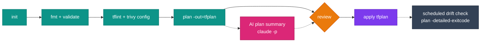

# Terraform workflows

Every image ships Terraform (latest at build time, with `tfswitch` to change it), Terragrunt, TFLint and Trivy. This page covers the day-to-day loop, remote state, Terragrunt, testing and drift detection. The examples use <span class="di-pill di-pill--aws">aws-devops</span>, but they work the same in <span class="di-pill di-pill--all">all-devops</span>, and in <span class="di-pill di-pill--gcp">gcp-devops</span> with a GCS backend.

## The loop



Start a shell with your project and AWS config mounted:

```bash
docker run -it --rm \
  -v "$PWD":/srv -w /srv \
  -v ~/.aws:/root/.aws \
  ghcr.io/jinalshah/devops/images/aws-devops:latest
```

Then, inside the container:

```bash
terraform init
terraform fmt -recursive
terraform validate
tflint --init && tflint --recursive
trivy config --severity HIGH,CRITICAL .
terraform plan -out=tfplan
terraform apply tfplan
```

The zsh config also has short `tf*` aliases for these; see [Tool basics](../tool-basics/index.md).

## Remote state

=== ":fontawesome-brands-aws: S3"

    ```hcl title="backend.tf"
    terraform {
      backend "s3" {
        bucket       = "my-terraform-state"
        key          = "production/terraform.tfstate"
        region       = "eu-west-2"
        encrypt      = true
        use_lockfile = true
      }
    }
    ```

    !!! tip "No DynamoDB table needed"
        `use_lockfile = true` uses S3's native locking. The old `dynamodb_table` argument is deprecated. When migrating, you can set both for a while, then remove `dynamodb_table`.

=== ":simple-googlecloud: GCS"

    ```hcl title="backend.tf"
    terraform {
      backend "gcs" {
        bucket = "my-terraform-state"
        prefix = "production"
      }
    }
    ```

    GCS locks state automatically.

Useful state commands:

```bash
terraform state list
terraform state show aws_instance.web
terraform state mv aws_instance.old aws_instance.new
terraform force-unlock <LOCK_ID>   # only if a crashed run left a lock behind
```

## Multiple environments

A directory per environment, with shared modules, keeps state and blast radius separate:

```text
terraform/
├── modules/
│   ├── vpc/
│   └── eks/
└── environments/
    ├── dev/
    ├── staging/
    └── production/
```

Plan every environment in one container:

```bash
docker run --rm \
  -v "$PWD":/srv -w /srv \
  -v ~/.aws:/root/.aws \
  ghcr.io/jinalshah/devops/images/aws-devops:latest \
  bash -c 'for env in dev staging production; do
    echo "==> $env"
    terraform -chdir=terraform/environments/$env init -input=false
    terraform -chdir=terraform/environments/$env plan -input=false -out=tfplan || exit 1
  done'
```

Workspaces (`terraform workspace new staging` / `select staging`) also work, but they share one backend configuration and one set of credentials. That usually makes separate directories the safer choice for production.

## Terragrunt

Terragrunt keeps backend and provider config DRY across many stacks.

```text
infrastructure/
├── root.hcl
├── dev/
│   ├── vpc/terragrunt.hcl
│   └── eks/terragrunt.hcl
└── production/
    ├── vpc/terragrunt.hcl
    └── eks/terragrunt.hcl
```

=== "root.hcl"

    ```hcl
    remote_state {
      backend = "s3"
      generate = {
        path      = "backend.tf"
        if_exists = "overwrite_terragrunt"
      }
      config = {
        bucket       = "my-terraform-state-${get_aws_account_id()}"
        key          = "${path_relative_to_include()}/terraform.tfstate"
        region       = "eu-west-2"
        encrypt      = true
        use_lockfile = true
      }
    }
    ```

=== "dev/eks/terragrunt.hcl"

    ```hcl
    include "root" {
      path = find_in_parent_folders("root.hcl")
    }

    terraform {
      source = "../../../modules/eks"
    }

    dependency "vpc" {
      config_path = "../vpc"
    }

    inputs = {
      vpc_id     = dependency.vpc.outputs.vpc_id
      subnet_ids = dependency.vpc.outputs.private_subnet_ids
    }
    ```

Run it:

```bash
cd infrastructure/dev
terragrunt run --all plan
terragrunt run --all --non-interactive apply
terragrunt dag graph            # dependency graph in DOT format

cd eks && terragrunt plan       # a single stack
```

!!! warning "Old Terragrunt commands"
    Terragrunt's CLI was redesigned, and the image ships a recent release that is bumped automatically. Update older scripts:

    | Old | New |
    |-----|-----|
    | `terragrunt run-all plan` | `terragrunt run --all plan` |
    | `--terragrunt-non-interactive` | `--non-interactive` |
    | `terragrunt graph-dependencies` | `terragrunt dag graph` |
    | `--terragrunt-include-external-dependencies` | `--queue-include-external` |

## Terraform versions with tfswitch

The image has the latest Terraform at build time. If a project needs a different version, `tfswitch` reads `required_version` from your `.tf` files (or a `.terraform-version` file) and installs a match:

```bash
tfswitch                 # pick the version from required_version / .terraform-version
tfswitch 1.9.8           # or name it explicitly
terraform version
```

If `terraform version` doesn't change, write over the binary on `PATH` with `tfswitch -b "$(command -v terraform)" 1.9.8`. The switch only lasts for the life of the container, so put it at the start of each CI job.

## Testing

=== ":material-check: terraform test"

    Native tests (`*.tftest.hcl`) need nothing beyond Terraform:

    ```hcl title="tests/vpc.tftest.hcl"
    run "plan_has_three_private_subnets" {
      command = plan

      assert {
        condition     = length(aws_subnet.private) == 3
        error_message = "Expected three private subnets"
      }
    }
    ```

    ```bash
    terraform init -backend=false
    terraform test
    ```

=== ":lucide-shield-check: Static checks"

    ```bash
    terraform fmt -check -recursive
    terraform init -backend=false && terraform validate
    tflint --init && tflint --recursive
    trivy config --severity HIGH,CRITICAL --exit-code 1 .
    ```

=== ":lucide-bug: Terratest"

    Terratest is written in Go, and Go isn't in the image. Run Terratest from a Go toolchain image, or build your own image `FROM` a DevOps image and add Go.

## Import existing resources

Use `import` blocks and let Terraform write the config for you:

```hcl title="imports.tf"
import {
  to = aws_s3_bucket.logs
  id = "my-existing-log-bucket"
}
```

```bash
terraform plan -generate-config-out=generated.tf
# review and tidy generated.tf, then:
terraform apply
```

## Drift detection

`-detailed-exitcode` returns 0 for no changes, 2 for changes and 1 for an error:

```bash title="detect-drift.sh"
#!/usr/bin/env bash
set -uo pipefail

terraform init -input=false >/dev/null
terraform plan -input=false -detailed-exitcode -out=drift.tfplan
case $? in
  0) echo "No drift" ;;
  2) echo "Drift detected"; terraform show -no-color drift.tfplan > drift.txt; exit 2 ;;
  *) echo "terraform plan failed"; exit 1 ;;
esac
```

Run it on a schedule from your CI system (a `schedule:` trigger in GitHub Actions, a pipeline schedule in GitLab, a `cron` trigger in Jenkins or a scheduled pipeline in CircleCI), so it runs in the same image as your deploys.

## AI help with plans and code

All four AI CLIs are in every image. In scripts, always use their non-interactive modes.

=== "Summarise a plan"

    ```bash
    terraform show -no-color tfplan \
      | claude -p "Summarise this Terraform plan for a reviewer. List anything destroyed or replaced first."
    ```

=== "Review the code"

    ```bash
    git diff origin/main...HEAD -- '*.tf' \
      | claude -p "Review this Terraform change for security issues, missing tags and risky defaults."
    ```

=== "Draft a module"

    ```bash
    mkdir -p modules/vpc
    claude -p "Write Terraform HCL for an AWS VPC with three public and three private subnets across three AZs. Output only HCL, with no commentary or code fences." \
      > modules/vpc/main.tf
    terraform -chdir=modules/vpc init -backend=false
    terraform -chdir=modules/vpc validate
    ```

    Always review generated code, then run `validate`, `tflint` and `trivy config` on it.

=== "Codex / Copilot / Antigravity"

    ```bash
    terraform show -no-color tfplan | codex exec "Summarise this plan"
    terraform show -no-color tfplan | copilot -p "Summarise this plan" --allow-all-tools
    terraform show -no-color tfplan | agy -p "Summarise this plan"
    ```

!!! danger "Plans can contain secrets"
    A plan can include sensitive values. Check your organisation's policy before sending one to an external AI service, and prefer sending the diff of your `.tf` files instead.

Authentication for each CLI is covered in [AI-assisted DevOps](ai-assisted-devops.md).

## Troubleshooting

??? question "`Error acquiring the state lock`"
    Another run holds the lock. Wait for it to finish, or, if a run crashed, use `terraform force-unlock <LOCK_ID>` with the ID from the error message. In CI, serialise runs per state (for example a `concurrency` group in GitHub Actions or a `resource_group` in GitLab).

??? question "Providers download on every run"
    The image doesn't set a provider cache. Set `TF_PLUGIN_CACHE_DIR` to a directory you mount or cache:

    ```bash
    docker run --rm -v "$PWD":/srv -w /srv \
      -v ~/.terraform.d/plugin-cache:/root/.terraform.d/plugin-cache \
      -e TF_PLUGIN_CACHE_DIR=/root/.terraform.d/plugin-cache \
      ghcr.io/jinalshah/devops/images/aws-devops:latest terraform init
    ```

??? question "`Unsupported Terraform Core version`"
    Your `required_version` excludes the image's Terraform. Run `tfswitch` first (see [Terraform versions with tfswitch](#terraform-versions-with-tfswitch)).

## Next steps

- [Multi-tool patterns](multi-tool-patterns.md)
- [GitHub Actions](ci-cd-github.md) · [GitLab CI](ci-cd-gitlab.md) · [Jenkins](ci-cd-jenkins.md) · [CircleCI](ci-cd-circleci.md)
- [AI-assisted DevOps](ai-assisted-devops.md)
